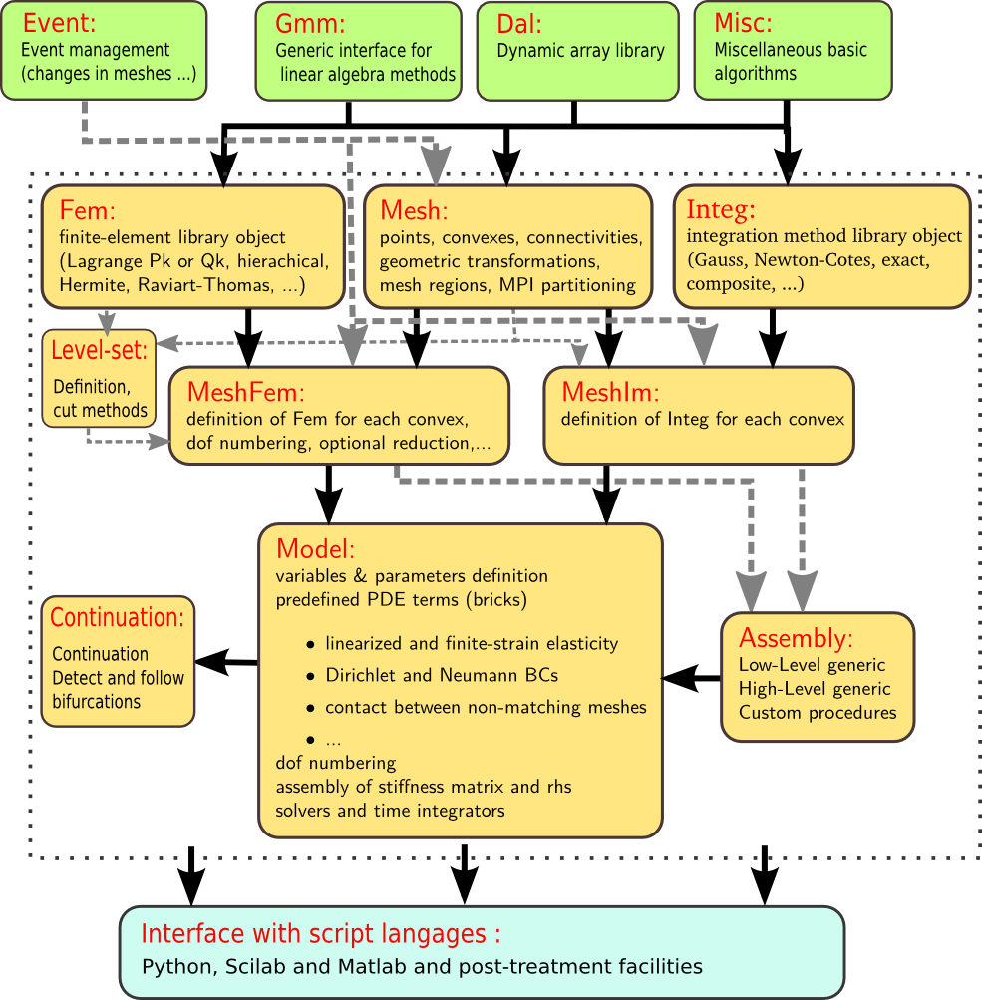

.. $Id$

.. include:: ../replaces.txt

.. highlight:: c++

.. _dp-libdesc:

Description of the different parts of the library
=================================================

Figure :ref:`dp-fig-diagram` describes the diagram of the different modules of
the |gf| library. The current state and perspective for each module is
described in section :ref:`dp-libdesc`.

.. _dp-fig-diagram:

   Diagram of |gf| library

.. toctree::
   :maxdepth: 2

   libdesc_gmm
   libdesc_dal
   libdesc_misc
   libdesc_event
   libdesc_mesh
   libdesc_fem
   libdesc_im
   libdesc_meshfem
   libdesc_mim
   libdesc_levelset
   libdesc_high_gen_assemb
   libdesc_low_gen_assemb
   libdesc_model
   libdesc_cont
   libdesc_interface

