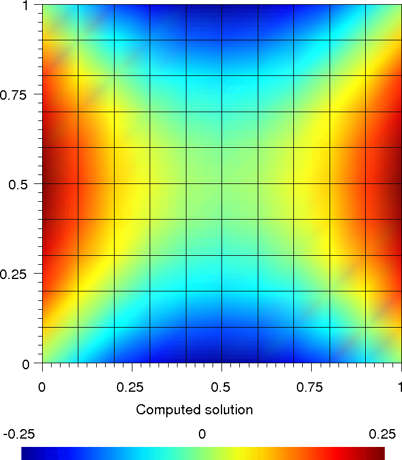
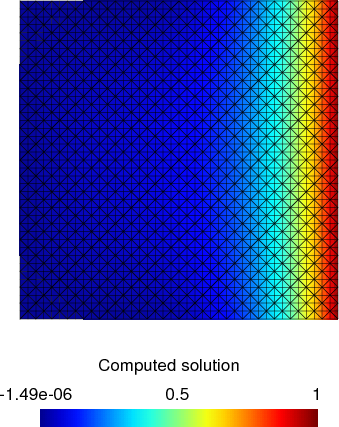
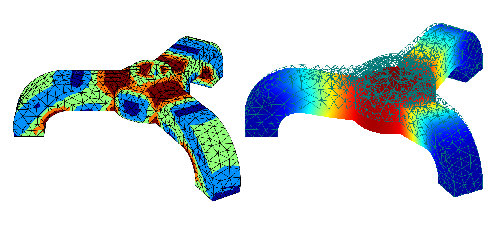

.. $Id$

.. include:: ../replaces.txt

.. highlightlang:: python

.. _py-examples:

Examples
========

.. _py-laplacianexample:

A step-by-step basic example
----------------------------

This example shows the basic usage of getfem, on the über-canonical problem above
all others: solving the :envvar:`Laplacian`, :math:`-\Delta u = f` on a square,
with the Dirichlet condition :math:`u = g(x)` on the domain boundary. You can find
the **py-file** of this example under the name **demo_step_by_step.py** in the
directory ``interface/tests/python/`` of the |gf| distribution.

The first step is to **create a Mesh object**. It is possible to create simple structured meshes or unstructured meshes for simple geometries (see ``getfem.Mesh('generate', mesher_object mo, scalar h))``) or to rely on an external mesher (see ``getfem.Mesh('import',
string FORMAT, string FILENAME)``), or use very simple meshes. For this example,
we just consider a regular mesh\index{cartesian mesh} whose nodes are
:math:`\{x_{i=0\ldots10,j=0..10}=(i/10,j/10)\}`

.. literalinclude:: code_samples/demo_step_by_step.py
   :linenos:
   :lines: 4-9

The next step is to **create a MeshFem object**. This one links a mesh with a set
of FEM

.. literalinclude:: code_samples/demo_step_by_step.py
   :linenos:
   :lines: 11-14

The first instruction builds a new |py_mf| object, the second argument specifies
that this object will be used to interpolate scalar fields (since the unknown
:math:`u` is a scalar field). The second instruction assigns the :math:`Q^2` FEM
to every convex (each basis function is a polynomial of degree 4, remember that
:math:`P^k\Rightarrow` polynomials of degree :math:`k`, while
:math:`Q^k\Rightarrow` polynomials of degree :math:`2k`). As :math:`Q^2` is a
polynomial FEM, you can view the expression of its basis functions on the
reference convex:

.. literalinclude:: code_samples/demo_step_by_step.py
   :linenos:
   :lines: 16-17

Now, in order to perform numerical integrations on ``mf``, we need to **build a
MeshIm object**

.. literalinclude:: code_samples/demo_step_by_step.py
   :linenos:
   :lines: 19-20

The integration method will be used to compute the various integrals on each
element: here we choose to perform exact computations (no :envvar:`quadrature
formula`), which is possible since the geometric transformation of these convexes
from the reference convex is linear (this is true for all simplices, and this is
also true for the parallelepipeds of our regular mesh, but it is not true for
general quadrangles), and the chosen FEM is polynomial. Hence it is possible to
analytically integrate every basis function/product of basis
functions/gradients/etc. There are many alternative FEM methods and integration
methods (see :ref:`ud`).

Note however that in the general case, approximate integration methods are a
better choice than exact integration methods.

Now we have to **find the** <:envvar:`boundary`> **of the domain**, in order to
set a Dirichlet condition. A mesh object has the ability to store some sets of
convexes and convex faces. These sets (called <regions>) are accessed via an
integer *#id*

.. literalinclude:: code_samples/demo_step_by_step.py
   :linenos:
   :lines: 22-25

Here we find the faces of the convexes which are on the boundary of the mesh (i.e.
the faces which are not shared by two convexes).

The array ``border`` has two rows, on the first row is a convex number, on the
second row is a face number (which is local to the convex, there is no global
numbering of faces). Then this set of faces is assigned to the region number 42.

At this point, we just have to describe the model and run the solver to get the
solution! The ":envvar:`model`" is created with the |py_md| constructor. A model
is basically an object which build a global linear system (tangent matrix for
non-linear problems) and its associated right hand side. Typical modifications are
insertion of the stiffness matrix for the problem considered (linear elasticity,
laplacian, etc), handling of a set of constraints, Dirichlet condition, addition of
a source term to the right hand side etc. The global tangent matrix and its right
hand side are stored in the ":envvar:`model`" structure.

Let us build a problem with an easy solution: :math:`u = x(x-1)-y(y-1)`, then
we have :math:`-\Delta u = 0` (the FEM won't be able to catch the exact
solution since we use a :math:`Q^2` method).

We start with an empty real model

.. literalinclude:: code_samples/demo_step_by_step.py
   :linenos:
   :lines: 27-28

(a model is either ``'real'`` or ``'complex'``). And we declare that ``u`` is an
unknown of the system on the finite element method `mf` by

.. literalinclude:: code_samples/demo_step_by_step.py
   :linenos:
   :lines: 30-32

Now, we add a `generic elliptic` brick, which handles :math:`-\nabla\cdot(A:\nabla
u) = \ldots` problems, where :math:`A` can be a scalar field, a matrix field, or
an order 4 tensor field. By default, :math:`A=1`. We add it on our main variable
``u`` with

.. literalinclude:: code_samples/demo_step_by_step.py
   :linenos:
   :lines: 34-35

Next we add a Dirichlet condition on the domain boundary

.. literalinclude:: code_samples/demo_step_by_step.py
   :linenos:
   :lines: 37-40

The two first lines defines a data of the model which represents the value of the
Dirichlet condition. The third one add a Dirichlet condition to the variable ``u``
on the boundary number ``42``. The dirichlet condition is imposed with lagrange
multipliers. Another possibility is to use a penalization. A |py_mf| argument is
also required, as the Dirichlet condition :math:`u=g` is imposed in a weak form
:math:`\int_\Gamma u(x)v(x) = \int_\Gamma g(x)v(x)\ \forall v` where :math:`v` is
taken in the space of multipliers given by here by ``mf``.

.. topic:: Remark:

   the polynomial expression was interpolated on ``mf``. It is possible only if
   ``mf`` is of Lagrange type. In this first example we use the same |py_mf| for
   the unknown and for the data such as ``g``, but in the general case, ``mf``
   won't be Lagrangian and another (Lagrangian) |py_mf| will be used for the
   description of Dirichlet conditions, source terms etc.

A source term can be added with (uncommented) the following lines

.. literalinclude:: code_samples/demo_step_by_step.py
   :linenos:
   :lines: 42-45

It only remains now to launch the solver. The linear system is assembled and solve
with the instruction

.. literalinclude:: code_samples/demo_step_by_step.py
   :linenos:
   :lines: 47-48

The model now contains the solution (as well as other things, such as the linear
system which was solved). It is extracted

.. literalinclude:: code_samples/demo_step_by_step.py
   :linenos:
   :lines: 50-51

Then export solution

.. literalinclude:: code_samples/demo_step_by_step.py
   :linenos:
   :lines: 53-54

and view with ``gmsh u.pos``, see figure :ref:`py-fig-sbs`.

.. _py-fig-sbs:

   Computed solution

Another Laplacian with exact solution (source term)
---------------------------------------------------

This example shows the basic usage of getfem, on the canonical problem: solving
the Laplacian, :math:`-\Delta u = f` on a square, with the Dirichlet condition
:math:`u = g(x)` on the domain boundary :math:`\Gamma_D` and the Neumann condition
:math:`\frac{\partial u}{\partial\eta} = h(x)` on the domain boundary
:math:`\Gamma_N`. You can find the **py-file** of this example under the name
**demo_laplacian.py** in the directory ``interface/tests/python/`` of the |gf|
distribution.

We create Mesh, MeshFem, MeshIm object and find the boundary of the domain in
the same way as the previous example

.. literalinclude:: code_samples/demo_laplacian.py
   :linenos:
   :lines: 24-68

then, we interpolate the exact solution and source terms

.. literalinclude:: code_samples/demo_laplacian.py
   :linenos:
   :lines: 70-75

and we bricked the problem as in the previous example

.. literalinclude:: code_samples/demo_laplacian.py
   :linenos:
   :lines: 77-102

the only change is the add of `source term` bricks. Finally the solution of the
problem is extracted and exported

.. literalinclude:: code_samples/demo_laplacian.py
   :linenos:
   :lines: 107-122

view with ``gmsh sol.pos``:

   Differences

Linear and non-linear elasticity
--------------------------------

This example uses a mesh that was generated with `GiD`_. The object is meshed
with quadratic tetrahedrons. You can find the **py-file** of this example under
the name :file:`demo_tripod.py` in the directory :file:`interface/tests/python/`
of the |gf| distribution.

.. literalinclude:: code_samples/demo_tripod.py
   :linenos:
   :lines: 3-89

Here is the final figure, displaying the :envvar:`Von Mises` stress and
displacements norms:

   \(a\) Tripod Von Mises, \(b\) Tripod displacements norms.

Avoiding the model framework
----------------------------

The model bricks are very convenient, as they hide most of the details of the
assembly of the final linear systems. However it is also possible to stay at a
lower level, and handle the assembly of linear systems, and their resolution,
directly in |py|. For example, the demonstration :file:`demo_tripod_alt.py` is
very similar to the :file:`demo_tripod.py` except that the assembly is explicit

.. literalinclude:: code_samples/demo_tripod_alt.py
   :lines: 21,23,25,27,49-51,53,58,62-64,70,73-81,83,85-99,113,118-

In |gfi|, the assembly of vectors, and matrices is done via the ``gf.asm_*``
functions. The Dirichlet condition :math:`h(x)u(x) = r(x)` is handled in the
weak form :math:`\int (h(x)u(x)).v(x) = \int r(x).v(x)\quad\forall v` (where
:math:`h(x)` is a :math:`3\times 3` matrix field -- here it is constant and
equal to the identity). The reduced system ``KK UU = FF`` is then built via the
elimination of Dirichlet constraints from the original system. Note that it
might be more efficient (and simpler) to deal with Dirichlet condition via a
penalization technique.

Other examples
--------------

* the :file:`demo_refine.py` script shows a simple 2D or 3D bar whose extremity
  is clamped. An adaptative refinement is used to obtain a better approximation
  in the area where the stress is singular (the transition between the clamped
  area and the neumann boundary).

* the :file:`demo_nonlinear_elasticity.py` script shows a 3D bar which is is
  bended and twisted. This is a quasi-static problem as the deformation is
  applied in many steps. At each step, a non-linear (large deformations)
  elasticity problem is solved.

* the :file:`demo_stokes_3D_tank.py` script shows a Stokes (viscous fluid)
  problem in a tank. The :file:`demo_stokes_3D_tank_draw.py` shows how to draw
  a nice plot of the solution, with mesh slices and stream lines. Note that the
  :file:`demo_stokes_3D_tank_alt.py` is the old example, which uses the
  deprecated ``gf_solve`` function.

* the :file:`demo_bilaplacian.py` script is just an adaption of the |gf|
  example :file:`tests/bilaplacian.cc`. Solve the bilaplacian (or a
  Kirchhoff-Love plate model) on a square.

* the :file:`demo_plasticity.py` script is an adaptation of the |gf| example
  :file:`tests/plasticity.cc`: a 2D or 3D bar is bended in many steps, and the
  plasticity of the material is taken into account (plastification occurs when
  the material's Von Mises exceeds a given threshold).

* the :file:`demo_wave2D.py` is a 2D scalar wave equation example (diffraction
  of a plane wave by a cylinder), with high order geometric transformations and
  high order FEMs.
