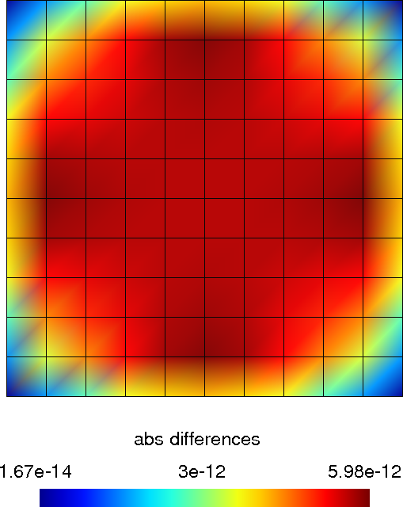
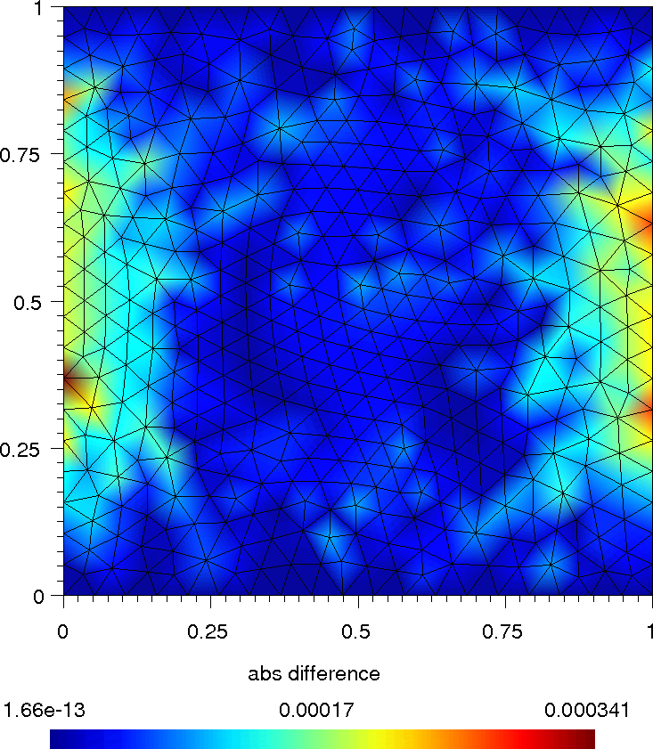

.. include:: ../replaces.txt

Examples
========

A step-by-step basic example
----------------------------

This example shows the basic usage of getfem, on the über-canonical problem
above all others: solving the Laplacian, :math:`-\Delta u = 0` on a square,
with the Dirichlet condition :math:`u = g(x)` on the domain boundary.

The first step is to `create a Mesh object`. Since |gf| does not come with
its own mesher, one has to rely on an external mesher (see
``getfem.Mesh('import', string FORMAT, string FILENAME)``), or use very simple
meshes. For this example, we just consider a regular mesh whose nodes are
:math:`\{x_{i=0\ldots10,j=0..10}=(i/10,j/10)\}`

.. literalinclude:: code_samples/demo_step_by_step.py
   :lines: 4-9

The next step is to `create a MeshFem object`. This one links a mesh with a set
of FEM

.. literalinclude:: code_samples/demo_step_by_step.py
   :lines: 11-14

The first instruction builds a new |py_mf| object, the second argument
specifies that this object will be used to interpolate scalar fields (since the
unknown :math:`u` is a scalar field). The second instruction assigns the
:math:`Q^2` FEM to every convex (each basis function is a polynomial of degree
4, remember that :math:`P^k\Rightarrow` polynomials of degree :math:`k`, while
:math:`Q^k\Rightarrow` polynomials of degree :math:`2k`). As :math:`Q^2` is a
polynomial FEM, you can view the expression of its basis functions on the
reference convex

.. literalinclude:: code_samples/demo_step_by_step.py
   :lines: 16-17

Now, in order to perform numerical integrations on |py_mf|, we need to `build a
MeshIm object`

.. literalinclude:: code_samples/demo_step_by_step.py
   :lines: 19-20

The integration method will be used to compute the various integrals on each
element: here we choose to perform exact computations (no quadrature formula),
which is possible since the geometric transformation of these convexes from the
reference convex is linear (this is true for all simplices, and this is also
true for the parallelepipeds of our regular mesh, but it is not true for
general quadrangles), and the chosen FEM is polynomial. Hence it is possible to
analytically integrate every basis function/product of basis
functions/gradients/etc. There are many alternative FEM methods and integration
methods (see `the description of finite element and integration methods
<http://home.gna.org/getfem/doc>`_).

Note however that in the general case, approximate integration methods are a
better choice than exact integration methods.

Now we have to `find the <boundary> of the domain`, in order to set a
Dirichlet condition. A mesh object has the ability to store some sets of
convexes and convex faces. These sets (called <regions>) are accessed via an
integer *id*

.. literalinclude:: code_samples/demo_step_by_step.py
   :lines: 22-25

Here we find the faces of the convexes which are on the boundary of the mesh
(i.e. the faces which are not shared by two convexes). The array ``border`` has
two rows, on the first row is a *convex ids*, on the second row is a *face ids*
(which is local to the convex, there is no global numbering of faces). Then
this set of faces is assigned to the region number ``42``.

At this point, we just have to stack some model bricks and run the solver to
get the solution! The `model bricks` are created with the |py_mbr| constructor.
A model brick is basically an object which modifies a global linear system
(tangent matrix for non-linear problems) and its associated right hand side.
Typical modifications are insertion of the stiffness matrix for the problem
considered (linear elasticity, laplacian, etc), handling of a set of
contraints, Dirichlet condition, addition of a source term to the right hand
side etc. The global tangent matrix and its right hand side are stored in a
"model state" structure, created with the |py_ms| constructor.

Let us build a problem with an easy solution: :math:`u = x(x-1)-y(y-1)`, then
we have :math:`-\Delta u = 0` (the FEM won't be able to catch the exact
solution since we use a :math:`Q^2` method).

We start with a `generic elliptic` brick, which handles
:math:`-\nabla\cdot(A:\nabla u) = \ldots` problems, where :math:`A` can be a
scalar field, a matrix field, or an order 4 tensor field. By default,
:math:`A = 1`

.. literalinclude:: code_samples/demo_step_by_step.py
   :lines: 27-28

Each brick embeds a number of parameter fields. In the case of the generic
elliptic brick, there is only one parameter field, the :math:`A(x)` coefficient
in :math:`-\nabla\cdot(A:\nabla u) = \ldots` It is possible to view the list
of parameters of the brick with

.. literalinclude:: code_samples/demo_step_by_step.py
   :lines: 30-31

Next we add a Dirichlet condition on the domain boundary

.. literalinclude:: code_samples/demo_step_by_step.py
   :lines: 33-34

Here the number ``42`` is the region number to which the dirichlet condition is
applied. The ``'penalized'`` says that the Dirichlet condition should be
imposed via a penalization technique. Other ways are possible (``'augmented'``
and ``'eliminated'`` systems). A |py_mf| argument is also required, as the
Dirichlet condition :math:`u = r` is imposed in a weak form
:math:`\int_\Omega u(x)v(x) = \int_\Omega r(x)v(x)\ \forall v`, where :math:`v`
is taken in the space of multipliers given here by |py_mf|.

By default, the Dirichlet brick imposes :math:`u = 0` on the specified
boundary. We change this to :math:`u = x(x-1)-y(y-1)`

.. literalinclude:: code_samples/demo_step_by_step.py
   :lines: 36-38

.. note::
  the polynomial expression was interpolated on |py_mf|. It is possible only if
  |py_mf| is of Lagrange type. In this first example we use the same |py_mf|
  for the unknown and for the data such as ``R``, but in the general case,
  ``mf`` won't be Lagrangian and another (Lagrangian) |py_mf| will be used for
  the description of Dirichlet conditions, source terms etc.

A `model state` variable is created, and the solver is launched

.. literalinclude:: code_samples/demo_step_by_step.py
   :lines: 40-42

The model state now contains the solution (as well as other things, such as the
linear system which was solved). It is extracted

.. literalinclude:: code_samples/demo_step_by_step.py
   :lines: 44-45

Then export solution

.. literalinclude:: code_samples/demo_step_by_step.py
   :lines: 47-48

and view with ``gmsh sol.pos``

.. figure:: images/step_by_step.png
   :width: 250pt
   :align: center

   Computed solution

Another Laplacian with exact solution (source term)
---------------------------------------------------

This example shows the basic usage of getfem, on the canonical problem: solving
the Laplacian, :math:`-\Delta u = f` on a square, with the Dirichlet condition
:math:`u = g(x)` on the domain boundary :math:`\Gamma_D` and the Neumann condition
:math:`\frac{\partial u}{\partial\eta} = h(x)` on the domain boundary
:math:`\Gamma_N`.

We create Mesh, MeshFem, MeshIm object and find the boundary of the domain in
the same way as the previous example

.. literalinclude:: code_samples/demo_laplacian.py
   :lines: 24-68

then, we interpolate the exact solution and source terms

.. literalinclude:: code_samples/demo_laplacian.py
   :lines: 70-75

and we bricked the problem as in the previous example

.. literalinclude:: code_samples/demo_laplacian.py
   :lines: 77-101

the only change is the add of `source term` brick. Finally the solution of the
problem is extracted and exported

.. literalinclude:: code_samples/demo_laplacian.py
   :lines: 38-48

view differences with ``gmsh sol.pos``:

   Differences

Final Laplacian with exact solution (Neumann boundary condition)
----------------------------------------------------------------

This example uses a mesh that was generated with `Gmsh`_, as in the
:ref:`howtos`. This example shows the basic usage of getfem, on the final
canonical problem: solving the Laplacian, :math:`-\Delta u = f` on a square,
with the Dirichlet condition :math:`u = g(x)` on the domain boundary
:math:`\Gamma_D` and the Neumann condition
:math:`\frac{\partial u}{\partial\eta} = h(x)` on the domain boundary
:math:`\Gamma_N`.

.. literalinclude:: code_samples/demo_finallaplacian.py
   :linenos:

and view differences with ``gmsh sol.pos``:

   Differences

Linear and non-linear elasticity
--------------------------------

This example uses a mesh that was generated with
`GiD <http://gid.cimne.upc.es>`_. The object is meshed with quadratic
tetrahedrons. You can find the **py-file** of this example under the name
**demo_tripod.py** in the directory ``interface/tests/python/`` of the |gf|
distribution.

.. literalinclude:: code_samples/demo_tripod.py
   :linenos:

Here is the final figure, displaying the Von Mises stress and displacements
norms:

.. figure:: images/tripod.png
   :width: 400pt
   :align: center

   \(a\) Tripod Von Mises, \(b\) Tripod displacements norms.

.. texto
   and here is the final figure, displaying the displacements norms:
   .. figure:: images/tripod_displacements.png
   :width: 300pt
   :align: center

Avoiding the bricks framework
-----------------------------

The model bricks are very convenient, as they hide most of the details of the
assembly of the final linear systems. However it is also possible to stay at a
lower level, and handle the assembly of linear systems, and their resolution,
directly in |py|. For example, the demonstration **demo_tripod_alt.py** is very
similar to the **demo_tripod.py** except that the assembly is explicit

.. literalinclude:: code_samples/demo_tripod_alt.py
   :lines: 21,23,25,27,49-51,53,58,62-64,70,73-81,83,85-99,113,118-

The Dirichlet condition :math:`h(x)u(x) = r(x)` is handled in the weak form
:math:`\int (h(x)u(x)).v(x) = \int r(x).v(x)\quad\forall v` (where :math:`h(x)`
is a :math:`3\times 3` matrix field -- here it is constant and equal to the
identity). The reduced system ``KK UU = FF`` is then built via the elimination
of Dirichlet constraints from the original system. Note that it might be more
efficient (and simpler) to deal with Dirichlet condition via a penalization
technique.

Other examples
--------------

  * the **demo_stokes_3D_tank.py** script shows a Stokes (viscous fluid)
    problem in a tank. The **demo_stokes_3D_tank_draw.py** shows how to draw a
    nice plot of the solution, with mesh slices and stream lines.

  * the **demo_plasticity.py** script is an adaptation of the getfem++ example
    **tests/plasticity.cc**: a 2D or 3D bar is bended in many steps, and the
    plasticity of the material is taken into account (plastification occurs
    when the material's Von Mises exceeds a given threshold).
