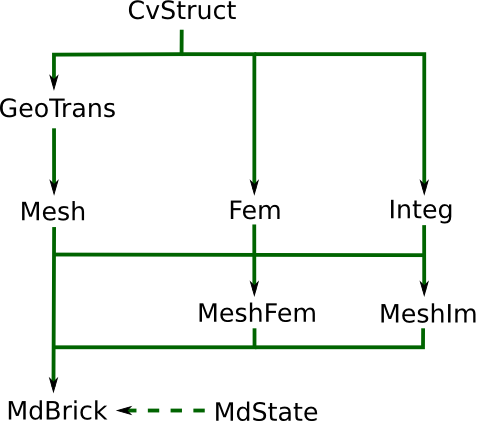

.. include:: ../replaces.txt

|py| |gf| interface
===================

Introduction
------------

|gf| provides an interface to the |py| scripting language. |py| is a nice,
cross-platform, and free language. With the addition of the numpy package,
python provides a subset of Matlab functionalities (i.e. dense arrays). The
`VTK`_ toolkit may provide visualization tools via its python interface (or
via `MayaVi`_), and data files for `OpenDX`_  may be exported. In this guide,
nevertheless, to visualize the results, we will export to `Gmsh`_
post-processing format. The sparse matrix routines are provided by the getfem
interface.

The python interface is available via a python module getfem.py. In order to
use the interface you have to load it with::

  import getfem
  m = getfem.Mesh('cartesian', range(0, 3), range(0,3))

or::

  from getfem import *
  m = Mesh('cartesian', range(0, 3), range(0,3))

If the getfem.py (and the internal \_getfem.so) module is not installed in a
standard location for python, you may have to set the ``PYTHONPATH``
environment variable to its location. For example with::

  import sys
  sys.path.append('.../getfem/getfem++/interface/src/python/')

Parallel version
----------------

The python interface is the only one for the moment to interface the mpi based parallel version of Getfem. See :ref:`ud-parallel`.

Memory Management
-----------------

A nice advantage over the Matlab interface is that you do not have to
explicitly delete objects that are not used any more, this is done
automagically. You can however inspect the content of the getfem workspace
with the function ``getfem.memstats()``.

Documentation
-------------

The `getfem` module is largely documented. This documentation has been
extracted into the :ref:`api`. The getfem-matlab user guide may also be used,
as 95% of its content translates quite directly into python (with the exception
of the plotting functions, which are specific to matlab).

|py| |gf| organization
----------------------

The general organization of the python-interface is the following:

  * Each class from the matlab interface has a corresponding class in the
    python interface: the gfMesh class becomes the getfem.Mesh class in python,
    the gfSlice becomes the getfem.Slice etc.
  * Each get and set method of the matlab interface has been translated into a
    method of the corresponding class in the python interface. For example::

      gf_mesh_get(m, 'outer faces');
      gf_mesh_get(m, 'pts');

    becomes::

      m.outer_faces();
      m.pts();

    Some methods have been renamed when there was ambiguity, for example
    ``gf_mesh_set(m, 'pts', P)`` is ``m.set_pts(P)``.
  * The other getfem-matlab function have a very simple mapping to their python
    equivalent:

    +----------------------------+-------------------------------+
    | gf_compute(mf,U,'foo',...) | getfem.compute_foo(mf,U) or   |
    |                            | getfem.compute('foo',...)     |
    +----------------------------+-------------------------------+
    | gf_asm('foobar',...)       | getfem.asm_foobar(...) or     |
    |                            | getfem.asm('foobar',...)      |
    +----------------------------+-------------------------------+
    | gf_linsolve('gmres',...)   | getfem.linsolve_gmres(...) or |
    |                            | getfem.linsolve('gmres',...)  |
    +----------------------------+-------------------------------+

   python-getfem interface main objects hierarchy.

.. class:: CvStruct(self, *args)

  Descriptor for a convex structure objects, stores formal information convex
  structures (nb. of points, nb. of faces which are themselves convex
  structures)

.. class:: GeoTrans(self, *args)

  Descriptor for geometric transformations objects (defines the shape/position
  of the convexes).

.. class:: Mesh(self, *args)

  Descriptor for mesh structure (nodes, convexes, geometric transformations for
  each convex).

.. class:: Fem(self, fem_name)

  Descriptor for FEM (Finite Element Method) objects (one per convex, can be
  PK, QK, HERMITE, etc...).

.. class:: Integ(self, *args)

  Descriptor for Integration Method objects (exact, quadrature formula\ldots).
  Although not linked directly to GeoTrans, an integration method is usually
  specific to a given convex structure.

.. class:: MeshFem(self, *args)

  Descriptor for object linked to a mesh, where each convex has been assigned
  a FEM.

.. class:: MeshIm(self, *args)

  Descriptor for object linked to a mesh, where each convex has been assigned
  an integration method.

.. class:: Model(self, *args)

  Descriptor for *model* object, holds the global data, variables and
  description of a model. Evolution of *model state* and *model brick*
  object for 4.0 version of |gf|.
