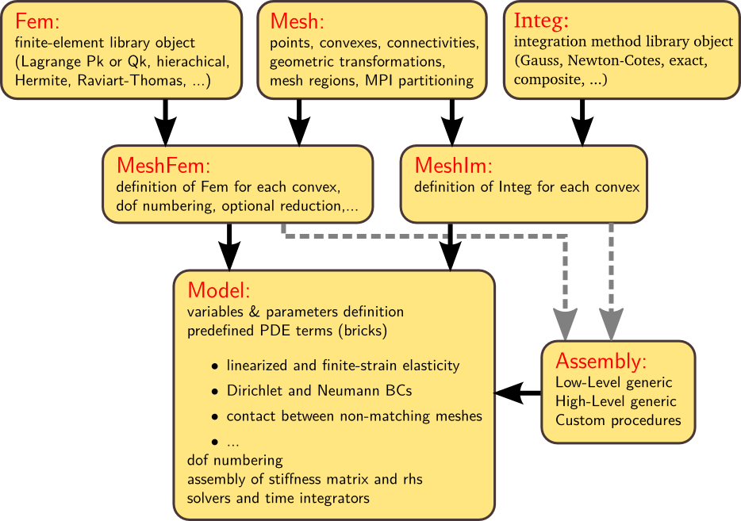

.. $Id: install.rst 4738 2014-07-27 12:25:54Z renard $

.. include:: ../replaces.txt

.. highlight:: python

.. _tut_bsic_usage:

Basic Usage of |gf|
===================

A |gf| structure can be summarized as follows

.. _tut-figstructget:

A program using getfem will often have the following structure ::

  ... define one or more Mesh

  ... define one or more MeshFem

  ... define one or more MeshIm

  ... define a Model and set it up:

      Model.add_fem_variable(MeshFem, "some variable name")

      Model.add_fem_variable(MeshFem, "another variable name")

      Model.add_fem_data(MeshFem, "some data name")

      Model.add_nonlinear_generic_assembly_brick(MeshIm,
                              "copy & paste your PDE weak formulation here", MeshRegion)
	
      Model.solve(...options)

Note that instead of defining your pde terms with GWFL, the generic weak form language (see :ref:`ud-gasm-high` for more details on the syntax of the weak form language), you can use predefined bricks for standard terms : generic elliptic term, linearized or finite strain elasticity, standard boundary conditions ...
