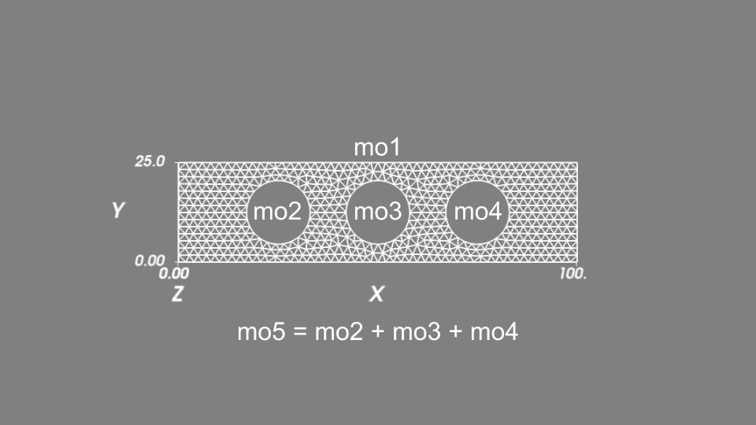
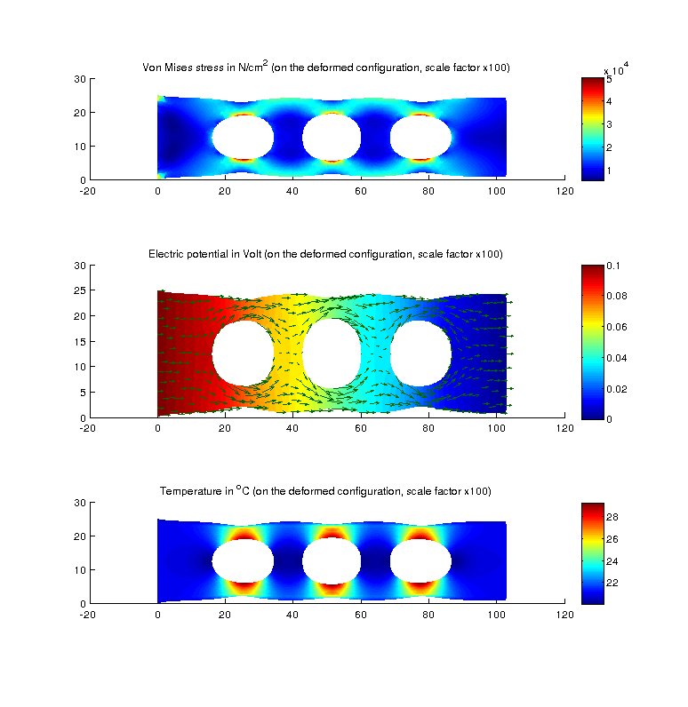

.. $Id: install.rst 4738 2014-07-27 12:25:54Z renard $

.. include:: ../replaces.txt

.. _tut-thermo_elec_coupling:

Example of Thermo-elastic and electrical coupling (simple nonlinear coupled problem, model object, generic assembly, solve and visualization)
=======================================================================================================================================================

This example aims to present a simple example of a multiphysics problem with a nonlinear coupling of a displacement field, a temperature field and an electric potential field. It also aims to compare the use of the C++ library and the different interfaces. The corresponding demo files are present in the test directories of |gf| (`tests/`, `interface/tests/python`, `interface/scr/scilab/demos` and `interface/tests/matlab`).

The problem setting
-------------------

Let :math:`\Omega \subset \R^2` be the reference configuration of a 2D plate (see the geometry :ref:`here <tut-fig-meshthermo>`) of thickness :math:`\varepsilon` submitted to external forces, electric potential and heating. We will denote by  :math:`\theta : \Omega \rightarrow \R` the temperature field (in |degreC|),  :math:`V : \Omega \rightarrow \R` the electric potential field and :math:`u : \Omega \rightarrow \R^2` the membrane displacement field.

Thermal problem
***************

The lateral faces of the plates are supposed to be in thermal insulation since the front and back faces of the plate are supposed to be in thermal exchange with the air (supposed at 20 |degreC|) with a heat transfer coefficient :math:`D`.

The equation on the temperature :math:`\theta` and boundary condition can be written as follows:

.. math::

  \left\{\begin{array}{l}
  -\mbox{div}(\varepsilon\kappa(\nabla \theta)) + 2D(\theta - T_0) - \varepsilon\sigma|\nabla V|^2 = 0 ~~ \mbox{ in } \Omega, \\
  \kappa\nabla \theta \cdot n = 0 ~~ \mbox{ on } \partial \Omega,
  \end{array} \right.

where the thermal conductivity is designed by :math:`\kappa`, :math:`T_0` is the temperature of the air, :math:`\partial \Omega` the boundary of the domain :math:`\Omega` and :math:`n` the outward unit normal vector to :math:`\Omega` on :math:`\partial \Omega`.

The term :math:`\sigma|\nabla V|^2` is a nonlinear coupling term corresponding to the Joule heating term, where :math:`\sigma` is the electrical conductivity.

Electric potential problem
**************************

We consider a potential difference of :math:`0.1V` between the right and left lateral face of the plate. The other faces are considered electrically insulated. The equation for the electric potential reads as

.. math::

   \left\{\begin{array}{l}
  -\mbox{div}(\varepsilon\sigma(\nabla V)) = 0 ~~ \mbox{ in } \Omega, \\
  \sigma\nabla V \cdot n = 0 ~~ \mbox{ on the top an bottom lateral faces}, \\
  V = 0 ~~ \mbox{ on the right lateral face}, \\
  V = 0.1 ~~ \mbox{ on the left lateral face}, \\
  \end{array} \right.

where :math:`\sigma` is still the electrical conductivity. Moreover, we consider that :math:`\sigma` depends on the temperature as follows:

.. math::

  \sigma = \Frac{1}{\rho_0(1+\alpha(\theta - T_0))},

where :math:`T_0` is a reference temperature (air temperature here), :math:`\rho_0` the resistance temperature coefficient at :math:`T_0` and :math:`\alpha` a second resistance temperature coefficient.

Deformation problem
*******************

We consider the membrane small deformation of the plate under a force applied on the right lateral face and influenced by the heating of the plate. The displacement :math:`u` will be solution of the following problem (linearized elasticity):

.. math::

   \left\{\begin{array}{l}
  -\mbox{div}(\bar{\sigma}(u)) = 0 ~~ \mbox{ in } \Omega, \\
  \bar{\sigma}\ n = 0 ~~ \mbox{ on the top an bottom lateral faces}, \\
  \bar{\sigma}\ n = F ~~ \mbox{ on the right lateral face}, \\
  u = 0 ~~ \mbox{ on the left lateral face},
  \end{array} \right.

where :math:`F` is the force density applied on the right lateral boundary and :math:`\bar{\sigma}(u)` is the Cauchy stress tensor defined by

.. math::

  \bar{\sigma}(u) = \lambda^* \mbox{div}(u) I + 2\mu \bar{\varepsilon}(u) + \beta(T_0-\theta) I,

:math:`\bar{\varepsilon}(u) = (\nabla u + (\nabla u)^T)/2` being the linearized strain tensor, :math:`I` the identity second order tensor and :math:`\lambda^*, \mu` being the |Lame| coefficients defined  by

.. math::

  &\lambda = \Frac{E\nu}{(1+\nu)(1-2\nu)}, \\
  &\mu = \Frac{E}{2(1+\nu)}, \\
  &\lambda^* = \Frac{2\lambda\mu}{\lambda+2*\mu},

from :math:`E` the Young modulus and :math:`\nu` the Poisson ratio of the material.

The term :math:`\beta(T_0-\theta) I` corresponds to the thermal expansion term, where :math:`\beta = \alpha_{th} E/(1-2\nu)`, :math:`\alpha_{th}` being the thermal expansion coefficient.

The weak formulation
--------------------

An important step is to obtain the weak formulation of the coupled system of equations. This is a crucial step since the finite element formulation is based on the weak formulation (Galerkin approximation) and the weak formulation is the only one which can give us the expression of the terms to be added.

Weak formulation of each partial differential equation is obtained by multiplying the equation with a test function corresponding to the main unknown satisfying homogeneous Dirichlet conditions where the main unknown satisfies a Dirichlet condition, then integrating over the domain :math:`\Omega` and performing some integrations by parts (using Green's formula). The weak formulation of the system of partial differential equations reads:

.. math::

  &\mbox{Find } \theta, V, u \mbox{ with } V = 0.1, u = 0 \mbox{ on the left face}, V = 0 \mbox{ on the right face}, \\
  &\ds \int_{\Omega} \varepsilon\kappa\nabla\theta\cdot\nabla\delta_{\theta} + 2D\theta\delta_{\theta}d\Omega = \int_{\Omega} (2DT_0 + \varepsilon\sigma|\nabla V|^2)\delta_{\theta} d\Omega ~~~\mbox{ for all } \delta_{\theta}, \\
  &\ds \int_{\Omega} \varepsilon\sigma\nabla V\cdot\nabla\delta_V = 0 d\Omega ~~~ \mbox{ for all } \delta_V \mbox{ satisfying } \delta_V = 0 \mbox{ on the left and right faces}, \\
  &\ds \int_{\Omega} \bar{\sigma}(u):\bar{\varepsilon}(\delta_u)d\Omega = \int_{\Gamma_N} F\cdot \delta_u d\Gamma ~~~ \mbox{ for all } \delta_{u} \mbox{ satisfying } \delta_u = 0 \mbox{ on the left face},

where :math:`\delta_{\theta}, \delta_V, \delta_u` are the test functions corresponding to :math:`\theta, V, u`, respectively, :math:`\Gamma_N` denotes the right boundary where the density of force :math:`F` is applied and :math:`\bar{\sigma}:\bar{\varepsilon}` is the Frobenius scalar product between second order tensors.

Implementation in C++ and with the interface
--------------------------------------------

Let us now make a detailed presentation of the use of |gf| to approximate the problem. We build simultaneously a C++, Python, Scilab and Matlab program. For Matlab and Scilab programs, we will not use the oriented object commands (see :ref:`mlab-oocmd` how to use them)

Initialization
**************

First, in C++, ones has to include a certain number of headers for the model object, the generic assembly, the linear algebra interface (Gmm++), the experimental mesher and the export facilities. For Python, this is simpler, |gf| can be imported globally (numpy has also to be imported). For Scilab, the library has first to be loaded in the Scilab console (this is not described here) and for Matlab, nothing is necessary, except a `gf_workspace('clear all')` which allows to clear all |gf| variables.

.. tabularcolumns:: |p{0.080\linewidth}|p{0.900\linewidth}|

========== ================================================
**C++**    .. code-block:: c++

             #include "getfem/getfem_model_solvers.h"
             #include "getfem/getfem_export.h"
             #include "gmm/gmm.h"
             #include "getfem/getfem_mesher.h"
             #include "getfem/getfem_generic_assembly.h"

             using bgeot::size_type;
             using bgeot::base_node;
             using bgeot::base_small_vector;
             typedef getfem::model_real_plain_vector plain_vector;

             int main(void) {
---------- ------------------------------------------------
**Python** .. code-block:: python

             import getfem as gf
             import numpy as np
---------- ------------------------------------------------
**Scilab** .. code-block:: matlab

             gf_workspace('clear all'); // In case of multiple runs
---------- ------------------------------------------------
**Matlab** .. code-block:: matlab

             gf_workspace('clear all'); % In case of multiple runs
========== ================================================

Parameters of the model
***********************

Let us now define the different physical and numerical parameters of the problem. For script languages (Python, Scilab and Matlab) there is no differences.

.. tabularcolumns:: |p{0.080\linewidth}|p{0.900\linewidth}|

=========== ================================================
**C++**     .. code-block:: c++

                double epsilon = 1.; // Thickness of the plate (cm)
                double E = 21E6;     // Young Modulus (N/cm^2)
                double nu = 0.3;     // Poisson ratio
                double clambda = E*nu/((1+nu)*(1-2*nu));
                double cmu = E/(2*(1+nu));
                double clambdastar = 2*clambda*cmu/(clambda+2*cmu);
                double F = 100E2;    // Force density at the right boundary (N/cm^2)
                double kappa = 4.;   // Thermal conductivity (W/(cm K))
                double D = 10.;      // Heat transfer coefficient (W/(K cm^2))
                double air_temp = 20;// Temperature of the air in oC.
                double alpha_th = 16.6E-6; // Thermal expansion coefficient (/K)
                double T0 = 20.;     // Reference temperature in oC
                double rho_0 = 1.754E-8; // Resistance temperature coefficient at T0
                double alpha = 0.0039; // Second resistance temperature coefficient

                double h = 2.        // Approximate mesh size
                bgeot::dim_type elements_degree = 2; // Degree of the finite element methods
----------- ------------------------------------------------
**Scripts** .. code-block:: python

                epsilon = 1.; E = 21E6; nu = 0.3;
                clambda = E*nu/((1+nu)*(1-2*nu));
                cmu = E/(2*(1+nu));
                clambdastar = 2*clambda*cmu/(clambda+2*cmu);
                F = 100E2; kappa = 4.; D = 10;
                air_temp = 20; alpha_th = 16.6E-6;
                T0 = 20; rho_0 = 1.754E-8;
                alpha = 0.0039;

                h = 2; elements_degree = 2;

=========== ================================================

Mesh generation
***************

|gf| has some limited meshing facilities which are described here. We are going to use them. However, there is no guaranty of the quality and conformity of the obtained mesh, so it is better to verify the mesh if you use |gf| meshing facilities. You can also use external meshers (GiD or Gmsh for instance) and import them (see :ref:`ud-load_save_mesh`).

The geometry of the domain is supposed to be a rectangle with three circular holes (see :ref:`tut-fig-meshthermo`). The geometry is described thanks to some geometrical primitives and union/setminus operations (see :file:`src/getfem/getfem_mesher.h` file). In the following, `h` stands for the mesh size and `2` is the degree of the mesh (this means that the transformation is of degree two, we used curved edges).

.. tabularcolumns:: |p{0.080\linewidth}|p{0.900\linewidth}|

========== ===========================================================================
**C++**    .. code-block:: c++

                getfem::mesh mesh;
		getfem::pmesher_signed_distance
		mo1 = getfem::new_mesher_rectangle(base_node(0., 0.), base_node(100., 25.)),
		mo2 = getfem::new_mesher_ball(base_node(25., 12.5), 8.),
		mo3 = getfem::new_mesher_ball(base_node(50., 12.5), 8.),
		mo4 = getfem::new_mesher_ball(base_node(75., 12.5), 8.),
		mo5 = getfem::new_mesher_union(mo2, mo3, mo4),
		mo = getfem::new_mesher_setminus(mo1, mo5);

                std::vector<getfem::base_node> fixed;
                getfem::build_mesh(mesh, mo, h, fixed, 2, -2);
---------- ---------------------------------------------------------------------------
**Python** .. code-block:: python

                mo1 = gf.MesherObject('rectangle', [0., 0.], [100., 25.])
                mo2 = gf.MesherObject('ball', [25., 12.5], 8.)
                mo3 = gf.MesherObject('ball', [50., 12.5], 8.)
                mo4 = gf.MesherObject('ball', [75., 12.5], 8.)
                mo5 = gf.MesherObject('union', mo2, mo3, mo4)
                mo  = gf.MesherObject('set minus', mo1, mo5)

                mesh = gf.Mesh('generate', mo, h, 2)
---------- ---------------------------------------------------------------------------
**Scilab** .. code-block:: matlab

                mo1 = gf_mesher_object('rectangle', [0 0], [100 25]);
                mo2 = gf_mesher_object('ball', [25 12.5], 8);
                mo3 = gf_mesher_object('ball', [50 12.5], 8);
                mo4 = gf_mesher_object('ball', [75 12.5], 8);
                mo5 = gf_mesher_object('union', mo2, mo3, mo4);
                mo  = gf_mesher_object('set minus', mo1, mo5);

                mesh = gf_mesh('generate', mo, h, 2);
---------- ---------------------------------------------------------------------------
**Matlab** .. code-block:: matlab

                mo1 = gf_mesher_object('rectangle', [0 0], [100 25]);
                mo2 = gf_mesher_object('ball', [25 12.5], 8);
                mo3 = gf_mesher_object('ball', [50 12.5], 8);
                mo4 = gf_mesher_object('ball', [75 12.5], 8);
                mo5 = gf_mesher_object('union', mo2, mo3, mo4);
                mo  = gf_mesher_object('set minus', mo1, mo5);

                mesh = gf_mesh('generate', mo, h, 2);
========== ===========================================================================

.. _tut-fig-meshthermo:

   The obtained mesh.

.. raw:: latex

   \clearpage

Boundary selection
******************

Since we have different boundary conditions on the different parts of the boundary, we have to number the different parts of the boundary (in the hole, thermal and electrical insulation together with a stress free boundary conditions are assumed). Thus, we have to select the element faces on the mesh and define mesh regions (see :ref:`ud-mesh_regions`) 1, 2, 3, 4 to be the right boundary, the left one, the top one and the bottom one respectively. These boundary numbers will be used in the model bricks.

.. tabularcolumns:: |p{0.080\linewidth}|p{0.900\linewidth}|

========== ===========================================================================
**C++**    .. code-block:: c++

                getfem::mesh_region border_faces;
                getfem::outer_faces_of_mesh(mesh, border_faces);
                getfem::mesh_region fb1
                  = getfem::select_faces_in_box(mesh, border_faces, base_node(1., 1.),
                                 base_node(99., 24.));
                getfem::mesh_region fb2
                  = getfem::select_faces_of_normal(mesh, border_faces,
                                     base_small_vector( 1., 0.), 0.01);
                getfem::mesh_region fb3
                  = getfem::select_faces_of_normal(mesh, border_faces,
                                     base_small_vector(-1., 0.), 0.01);
                getfem::mesh_region fb4
                  = getfem::select_faces_of_normal(mesh, border_faces,
                                     base_small_vector(0.,  1.), 0.01);
                getfem::mesh_region fb5
                  = getfem::select_faces_of_normal(mesh, border_faces,
                                     base_small_vector(0., -1.), 0.01);

                size_type RIGHT_BOUND=1, LEFT_BOUND=2, TOP_BOUND=3, BOTTOM_BOUND=4;
                mesh.region( RIGHT_BOUND) = getfem::mesh_region::subtract(fb2, fb1);
                mesh.region(  LEFT_BOUND) = getfem::mesh_region::subtract(fb3, fb1);
                mesh.region(   TOP_BOUND) = getfem::mesh_region::subtract(fb4, fb1);
                mesh.region(BOTTOM_BOUND) = getfem::mesh_region::subtract(fb5, fb1);
---------- ---------------------------------------------------------------------------
**Python** .. code-block:: python

                fb1 = mesh.outer_faces_in_box([1., 1.], [99., 24.])
                fb2 = mesh.outer_faces_with_direction([ 1., 0.], 0.01)
                fb3 = mesh.outer_faces_with_direction([-1., 0.], 0.01)
                fb4 = mesh.outer_faces_with_direction([0.,  1.], 0.01)
                fb5 = mesh.outer_faces_with_direction([0., -1.], 0.01)

                RIGHT_BOUND=1; LEFT_BOUND=2; TOP_BOUND=3; BOTTOM_BOUND=4; HOLE_BOUND=5;

                mesh.set_region( RIGHT_BOUND, fb2)
                mesh.set_region(  LEFT_BOUND, fb3)
                mesh.set_region(   TOP_BOUND, fb4)
                mesh.set_region(BOTTOM_BOUND, fb5)
                mesh.set_region(  HOLE_BOUND, fb1)
                mesh.region_subtract( RIGHT_BOUND, HOLE_BOUND)
                mesh.region_subtract(  LEFT_BOUND, HOLE_BOUND)
                mesh.region_subtract(   TOP_BOUND, HOLE_BOUND)
                mesh.region_subtract(BOTTOM_BOUND, HOLE_BOUND)
========== ===========================================================================

.. tabularcolumns:: |p{0.080\linewidth}|p{0.900\linewidth}|

========== ===========================================================================
**Scilab** .. code-block:: matlab

                fb1 = gf_mesh_get(mesh, 'outer faces in box', [1 1], [99 24]);
                fb2 = gf_mesh_get(mesh, 'outer faces with direction', [ 1 0], 0.01);
                fb3 = gf_mesh_get(mesh, 'outer faces with direction', [-1 0], 0.01);
                fb4 = gf_mesh_get(mesh, 'outer faces with direction', [0  1], 0.01);
                fb5 = gf_mesh_get(mesh, 'outer faces with direction', [0 -1], 0.01);

                RIGHT_BOUND=1; LEFT_BOUND=2; TOP_BOUND=3; BOTTOM_BOUND=4; HOLE_BOUND=5;
                gf_mesh_set(mesh, 'region',  RIGHT_BOUND, fb2);
                gf_mesh_set(mesh, 'region',   LEFT_BOUND, fb3);
                gf_mesh_set(mesh, 'region',    TOP_BOUND, fb4);
                gf_mesh_set(mesh, 'region', BOTTOM_BOUND, fb5);
                gf_mesh_set(mesh, 'region',   HOLE_BOUND, fb1);
                gf_mesh_set(mesh, 'region subtract',  RIGHT_BOUND, HOLE_BOUND);
                gf_mesh_set(mesh, 'region subtract',   LEFT_BOUND, HOLE_BOUND);
                gf_mesh_set(mesh, 'region subtract',    TOP_BOUND, HOLE_BOUND);
                gf_mesh_set(mesh, 'region subtract', BOTTOM_BOUND, HOLE_BOUND);
---------- ---------------------------------------------------------------------------
**Matlab** .. code-block:: matlab

                fb1 = gf_mesh_get(mesh, 'outer faces in box', [1 1], [99 24]);
                fb2 = gf_mesh_get(mesh, 'outer faces with direction', [ 1 0], 0.01);
                fb3 = gf_mesh_get(mesh, 'outer faces with direction', [-1 0], 0.01);
                fb4 = gf_mesh_get(mesh, 'outer faces with direction', [0  1], 0.01);
                fb5 = gf_mesh_get(mesh, 'outer faces with direction', [0 -1], 0.01);

                RIGHT_BOUND=1; LEFT_BOUND=2; TOP_BOUND=3; BOTTOM_BOUND=4; HOLE_BOUND=5;
                gf_mesh_set(mesh, 'region',  RIGHT_BOUND, fb2);
                gf_mesh_set(mesh, 'region',   LEFT_BOUND, fb3);
                gf_mesh_set(mesh, 'region',    TOP_BOUND, fb4);
                gf_mesh_set(mesh, 'region', BOTTOM_BOUND, fb5);
                gf_mesh_set(mesh, 'region',   HOLE_BOUND, fb1);
                gf_mesh_set(mesh, 'region subtract',  RIGHT_BOUND, HOLE_BOUND);
                gf_mesh_set(mesh, 'region subtract',   LEFT_BOUND, HOLE_BOUND);
                gf_mesh_set(mesh, 'region subtract',    TOP_BOUND, HOLE_BOUND);
                gf_mesh_set(mesh, 'region subtract', BOTTOM_BOUND, HOLE_BOUND);
========== ===========================================================================

Mesh draw
*********

In order to preview the mesh and to control its validity, the following instructions can be used:

.. tabularcolumns:: |p{0.080\linewidth}|p{0.900\linewidth}|

========== ===========================================================================
**C++**    .. code-block:: c++

                getfem::vtk_export exp("mesh.vtk", false);
                exp.exporting(mesh);
                exp.write_mesh();
                // You can view the mesh for instance with
                // mayavi2 -d mesh.vtk -f ExtractEdges -m Surface
---------- ---------------------------------------------------------------------------
**Python** .. code-block:: python

                mesh.export_to_vtk('mesh.vtk');
                # You can view the mesh for instance with
                # mayavi2 -d mesh.vtk -f ExtractEdges -m Surface
---------- ---------------------------------------------------------------------------
**Scilab** .. code-block:: matlab

                scf(1);
                gf_plot_mesh(mesh, 'refine', 8, 'curved', 'on', 'regions', ...
                             [RIGHT_BOUND LEFT_BOUND TOP_BOUND BOTTOM_BOUND]);
                title('Mesh');
                sleep(1000);
---------- ---------------------------------------------------------------------------
**Matlab** .. code-block:: matlab

                gf_plot_mesh(mesh, 'refine', 8, 'curved', 'on', 'regions', ...
                             [RIGHT_BOUND LEFT_BOUND TOP_BOUND BOTTOM_BOUND]);
                title('Mesh');
                pause(1);
========== ===========================================================================

In C++ and with the Python interface, an external graphical post-processor has to be used (for instance, gmsh, Mayavi2 or Paraview). With Scilab and Matlab interfaces, the internal plot facilities can be used (see the result :ref:`tut-fig-meshthermo`).

Definition of finite element methods and integration method
***********************************************************

We will define three finite element methods. The first one, `mfu` is to approximate the displacement field. This is a vector field. This is defined in C++ by

.. code-block:: c++

        getfem::mesh_fem mfu(mesh, 2);
        mfu.set_classical_finite_element(elements_degree);

where the `2` stands for the dimension of the vector field. The second line sets the finite element used. `classical_finite_element` means a continuous Lagrange element and remember that `elements_degree` has been set to `2` which means that we will use quadratic (isoparametric) elements.

There is a wide choice of pre-existing finite element methods in |gf|, see :ref:`ud-appendixa`. However, Lagrange finite element methods are the most used in practice.

The second finite element method is a scalar one, `mft` with which we will approximate both the temperature field and the electric potential field. A single finite element method can serve to approximate an arbitrary number of finite element variables.

The third finite element method is a discontinuous scalar Lagrange one which will allow us to interpolate the derivative of one of the variables (for instance to interpolate the Von Mises stress).

The last thing to define is an integration method `mim`. There is no default integration method in |gf| so this is mandatory to define an integration method. Of course, the order of the integration method have to be chosen sufficient to make a convenient integration of the selected finite element method. Here, the square of `elements_degree` is sufficient.

.. tabularcolumns:: |p{0.080\linewidth}|p{0.900\linewidth}|

========== ===========================================================================
**C++**    .. code-block:: c++

                getfem::mesh_fem mfu(mesh, 2);
                mfu.set_classical_finite_element(elements_degree);
                getfem::mesh_fem mft(mesh, 1);
                mft.set_classical_finite_element(elements_degree);
                getfem::mesh_fem mfvm(mesh, 1);
                mfvm.set_classical_discontinuous_finite_element(elements_degree);

                getfem::mesh_im  mim(mesh);
                mim.set_integration_method(bgeot::dim_type(gmm::sqr(elements_degree)));
---------- ---------------------------------------------------------------------------
**Python** .. code-block:: python

                mfu = gf.MeshFem(mesh, 2)
                mfu.set_classical_fem(elements_degree)
                mft = gf.MeshFem(mesh, 1)
                mft.set_classical_fem(elements_degree)
                mfvm = gf.MeshFem(mesh, 1)
                mfvm.set_classical_discontinuous_fem(elements_degree)
                mim = gf.MeshIm(mesh, pow(elements_degree,2))
---------- ---------------------------------------------------------------------------
**Scilab** .. code-block:: matlab

                mfu = gf_mesh_fem(mesh, 2);
                gf_mesh_fem_set(mfu, 'classical fem', elements_degree);
                mft = gf_mesh_fem(mesh, 1);
                gf_mesh_fem_set(mft, 'classical fem', elements_degree);
                mfvm = gf_mesh_fem(mesh, 1);
                gf_mesh_fem_set(mfvm, 'classical discontinuous fem', elements_degree-1);
                mim = gf_mesh_im(mesh, elements_degree^2);
---------- ---------------------------------------------------------------------------
**Matlab** .. code-block:: matlab

                mfu = gf_mesh_fem(mesh, 2);
                gf_mesh_fem_set(mfu, 'classical fem', elements_degree);
                mft = gf_mesh_fem(mesh, 1);
                gf_mesh_fem_set(mft, 'classical fem', elements_degree);
                mfvm = gf_mesh_fem(mesh, 1);
                gf_mesh_fem_set(mfvm, 'classical discontinuous fem', elements_degree-1);
                mim = gf_mesh_im(mesh, elements_degree^2);
========== ===========================================================================

Model definition
****************

The model object in |gf| gather the variables of the models (the unknowns), the data and what is called the model bricks. The model bricks are some parts of the model (linear or nonlinear terms) applied on a single variable or linking several variables. They are used to make the assembly of the (tangent) linear system (see :ref:`ud-model-object` for more details).

This is not strictly mandatory to use the model object since one may use directly the assembly procedures and build by it own the (tangent) linear system. The model object allows a rapid build of the model since most classical parts of a model are pre-programmed: standard boundary conditions, standard partial differential equations, use of multipliers to prescribe a constraint ... Moreover, some bricks are designed to extend the possibilities of the standard bricks (generic assembly bricks, explicit matrix brick ...). Thus, it is recommended to use the framework of the model object.

There are two versions of the model: the real one and the complex one. Complex models have to be reserved for special applications (some electromagnetism problems for instance) where it is advantageous to solve a complex linear system.

Let us declare a real model with the three variables corresponding to the three fields to be computed:

.. tabularcolumns:: |p{0.080\linewidth}|p{0.900\linewidth}|

========== ===========================================================================
**C++**    .. code-block:: c++

                getfem::model md;
                md.add_fem_variable("u", mfu);
                md.add_fem_variable("theta", mft);
                md.add_fem_variable("V", mft);
---------- ---------------------------------------------------------------------------
**Python** .. code-block:: python

                md=gf.Model('real');
                md.add_fem_variable('u', mfu)
                md.add_fem_variable('theta', mft)
                md.add_fem_variable('V', mft)
---------- ---------------------------------------------------------------------------
**Scilab** .. code-block:: matlab

                md=gf_model('real');
                gf_model_set(md, 'add fem variable', 'u', mfu);
                gf_model_set(md, 'add fem variable', 'theta', mft);
                gf_model_set(md, 'add fem variable', 'V', mft);
---------- ---------------------------------------------------------------------------
**Matlab** .. code-block:: matlab

                md=gf_model('real');
                gf_model_set(md, 'add fem variable', 'u', mfu);
                gf_model_set(md, 'add fem variable', 'theta', mft);
                gf_model_set(md, 'add fem variable', 'V', mft);
========== ===========================================================================

Membrane elastic deformation problem
************************************

Let us now begin by the elastic deformation problem. We will use the predefined brick added by `add_isotropic_linearized_elasticity_brick` below. Basically it adds the term corresponding to

.. math::

  \int_{\Omega} (\lambda^* \mbox{div}(u) I + 2\mu \bar{\varepsilon}(u)):\bar{\varepsilon}(\delta_u)dx,

to the tangent linear system. In order to use this model brick, the data corresponding to the |Lame| coefficient have to be added to the model first. Here, the |Lame| coefficients are constant over the domain. However, it it also possible to define some non-constant data. Note also that instead of using this predefined brick, one can use equivalently the weak form language term `add_linear_term(md mim, "lambda*(Div_u*Div_Test_u) + mu*((Grad_u + Grad_u'):Grad_Test_u)"`.

Concerning the coupling term

.. math::

   \int_{\Omega} (\beta\theta I) :\bar{\varepsilon}(\delta_u)dx,

there is no predefined brick and we use directly a weak form language term `add_linear_term(md mim, "beta*theta*Div_Test_u)"`. See :ref:`ud-gasm-high` for more details on the weak form language. Basically, the principle is that the assembly string is compiled into a list of optimized assembly instructions which are executed on each Gauss point.

The following program allows to take into account the whole elastic deformation equation. Note the use of specific brick to prescribe the Dirichlet condition on the left boundary. There is several option to prescribe a Dirichlet condition (see :ref:`ud-model-Dirichlet`).

.. tabularcolumns:: |p{0.080\linewidth}|p{0.900\linewidth}|

========== ================================================================================================================
**C++**    .. code-block:: c++

                md.add_initialized_scalar_data("cmu", cmu);
                md.add_initialized_scalar_data("clambdastar", clambdastar);
                md.add_initialized_scalar_data("T0", T0);
                getfem::add_isotropic_linearized_elasticity_brick
                  (md, mim, "u", "clambdastar", "cmu");
                getfem::add_Dirichlet_condition_with_multipliers
                  (md, mim, "u", bgeot::dim_type(elements_degree-1), LEFT_BOUND);
                md.add_initialized_fixed_size_data("Fdata", base_small_vector(F*epsilon,0.));
                getfem::add_source_term_brick(md, mim, "u", "Fdata", RIGHT_BOUND);

                md.add_initialized_scalar_data("beta", alpha_th*E/(1-2*nu));
                getfem::add_linear_term(md, mim, "beta*(T0-theta)*Div_Test_u");
---------- ----------------------------------------------------------------------------------------------------------------
**Python** .. code-block:: python

                md.add_initialized_data('cmu', [cmu])
                md.add_initialized_data('clambdastar', [clambdastar])
                md.add_initialized_data('T0', [T0])
                md.add_isotropic_linearized_elasticity_brick(mim, 'u', 'clambdastar', 'cmu')

                md.add_Dirichlet_condition_with_multipliers(mim, 'u', elements_degree-1, LEFT_BOUND)
                md.add_initialized_data('Fdata', [F*epsilon, 0])
                md.add_source_term_brick(mim, 'u', 'Fdata', RIGHT_BOUND)

                md.add_initialized_data('beta', [alpha_th*E/(1-2*nu)])
                md.add_linear_term(mim, 'beta*(T0-theta)*Div_Test_u')
---------- ----------------------------------------------------------------------------------------------------------------
**Scilab** .. code-block:: matlab

                gf_model_set(md, 'add initialized data', 'cmu', [cmu]);
                gf_model_set(md, 'add initialized data', 'clambdastar', [clambdastar]);
                gf_model_set(md, 'add initialized data', 'T0', [T0]);
                gf_model_set(md, 'add isotropic linearized elasticity brick', mim, 'u', 'clambdastar', 'cmu');

                gf_model_set(md, 'add Dirichlet condition with multipliers', mim, 'u', elements_degree-1, LEFT_BOUND);
                gf_model_set(md, 'add initialized data', 'Fdata', [F*epsilon, 0]);
                gf_model_set(md, 'add source term brick', mim, 'u', 'Fdata', RIGHT_BOUND);

                gf_model_set(md, 'add initialized data', 'beta', [alpha_th*E/(1-2*nu)]);
                gf_model_set(md, 'add linear term', mim, 'beta*(T0-theta)*Div_Test_u');
========== ================================================================================================================

.. tabularcolumns:: |p{0.080\linewidth}|p{0.900\linewidth}|

========== ================================================================================================================
**Matlab** .. code-block:: matlab

                gf_model_set(md, 'add initialized data', 'cmu', [cmu]);
                gf_model_set(md, 'add initialized data', 'clambdastar', [clambdastar]);
                gf_model_set(md, 'add initialized data', 'T0', [T0]);
                gf_model_set(md, 'add isotropic linearized elasticity brick', mim, 'u', 'clambdastar', 'cmu');

                gf_model_set(md, 'add Dirichlet condition with multipliers', mim, 'u', elements_degree-1, LEFT_BOUND);
                gf_model_set(md, 'add initialized data', 'Fdata', [F*epsilon, 0]);
                gf_model_set(md, 'add source term brick', mim, 'u', 'Fdata', RIGHT_BOUND);

                gf_model_set(md, 'add initialized data', 'beta', [alpha_th*E/(1-2*nu)]);
                gf_model_set(md, 'add linear term', mim, 'beta*(T0-theta)*Div_Test_u');
========== ================================================================================================================

.. raw:: latex

   \clearpage

Electric potential problem
**************************

Similarly, the following program take into account the electric potential equation. Note the definition of the  electrical conductivity :math:`\sigma` and again the use of weak form language terms.

.. tabularcolumns:: |p{0.080\linewidth}|p{0.900\linewidth}|

========== ===========================================================================
**C++**    .. code-block:: c++

                std::string sigmaeps = "(eps/(rho_0*(1+alpha*(theta-T0))))";
                md.add_initialized_scalar_data("eps", epsilon);
                md.add_initialized_scalar_data("rho_0", rho_0);
                md.add_initialized_scalar_data("alpha", alpha);
                getfem::add_nonlinear_term
                  (md, mim, sigmaeps+"*(Grad_V.Grad_Test_V)");
                getfem::add_Dirichlet_condition_with_multipliers
                  (md, mim, "V", bgeot::dim_type(elements_degree-1), RIGHT_BOUND);
                md.add_initialized_scalar_data("DdataV", 0.1);
                getfem::add_Dirichlet_condition_with_multipliers
                  (md, mim, "V", bgeot::dim_type(elements_degree-1), LEFT_BOUND, "DdataV");
---------- ---------------------------------------------------------------------------
**Python** .. code-block:: python

                sigmaeps = '(eps/(rho_0*(1+alpha*(theta-T0))))'
                md.add_initialized_data('eps', [epsilon])
                md.add_initialized_data('rho_0', [rho_0])
                md.add_initialized_data('alpha', [alpha])
                md.add_nonlinear_term(mim, sigmaeps+'*(Grad_V.Grad_Test_V)')
                md.add_Dirichlet_condition_with_multipliers(mim, 'V', elements_degree-1, RIGHT_BOUND)
                md.add_initialized_data('DdataV', [0.1])
                md.add_Dirichlet_condition_with_multipliers(mim, 'V', elements_degree-1, LEFT_BOUND, 'DdataV')
---------- ---------------------------------------------------------------------------
**Scilab** .. code-block:: matlab

                sigmaps = '(eps/(rho_0*(1+alpha*(theta-T0))))';
                gf_model_set(md, 'add initialized data', 'eps', [epsilon]);
                gf_model_set(md, 'add initialized data', 'rho_0', [rho_0]);
                gf_model_set(md, 'add initialized data', 'alpha', [alpha]);
                gf_model_set(md, 'add nonlinear term', mim, sigmaeps+'*(Grad_V.Grad_Test_V)');
                gf_model_set(md, 'add Dirichlet condition with multipliers', mim, 'V', elements_degree-1, RIGHT_BOUND);
                gf_model_set(md, 'add initialized data', 'DdataV', [0.1]);
                gf_model_set(md, 'add Dirichlet condition with multipliers', mim, 'V', elements_degree-1, LEFT_BOUND, 'DdataV');
---------- ---------------------------------------------------------------------------
**Matlab** .. code-block:: matlab

                sigmaps = '(eps/(rho_0*(1+alpha*(theta-T0))))';
                gf_model_set(md, 'add initialized data', 'eps', [epsilon]);
                gf_model_set(md, 'add initialized data', 'rho_0', [rho_0]);
                gf_model_set(md, 'add initialized data', 'alpha', [alpha]);
                gf_model_set(md, 'add nonlinear term', mim, [sigmaeps '*(Grad_V.Grad_Test_V)']);
                gf_model_set(md, 'add Dirichlet condition with multipliers', mim, 'V', elements_degree-1, RIGHT_BOUND);
                gf_model_set(md, 'add initialized data', 'DdataV', [0.1]);
                gf_model_set(md, 'add Dirichlet condition with multipliers', mim, 'V', elements_degree-1, LEFT_BOUND, 'DdataV');
========== ===========================================================================

Thermal problem
***************

Now, the program to take into account the thermal problem:

.. tabularcolumns:: |p{0.080\linewidth}|p{0.900\linewidth}|

========== ===========================================================================
**C++**    .. code-block:: c++

                md.add_initialized_scalar_data("kaeps", kappa*epsilon);
                getfem::add_generic_elliptic_brick(md, mim, "theta", "kaeps");
                md.add_initialized_scalar_data("D2", D*2);
                md.add_initialized_scalar_data("D2airt", air_temp*D*2);
                getfem::add_mass_brick(md, mim, "theta", "D2");
                getfem::add_source_term_brick(md, mim, "theta", "D2airt");

                getfem::add_nonlinear_term
                  (md, mim, "-"+sigmaeps+"*Norm_sqr(Grad_V)*Test_theta");
---------- ---------------------------------------------------------------------------
**Python** .. code-block:: python

                md.add_initialized_data('kaeps', [kappa*epsilon])
                md.add_generic_elliptic_brick(mim, 'theta', 'kaeps')
                md.add_initialized_data('D2', [D*2])
                md.add_initialized_data('D2airt', [air_temp*D*2])
                md.add_mass_brick(mim, 'theta', 'D2')
                md.add_source_term_brick(mim, 'theta', 'D2airt')

                md.add_nonlinear_term(mim, '-'+sigmaeps+'*Norm_sqr(Grad_V)*Test_theta')
---------- ---------------------------------------------------------------------------
**Scilab** .. code-block:: matlab

                gf_model_set(md, 'add initialized data', 'kaeps', [kappa*epsilon]);
                gf_model_set(md, 'add generic elliptic brick', mim, 'theta', 'kaeps');
                gf_model_set(md, 'add initialized data', 'D2', [D*2]);
                gf_model_set(md, 'add initialized data', 'D2airt', [air_temp*D*2]);
                gf_model_set(md, 'add mass brick', mim, 'theta', 'D2');
                gf_model_set(md, 'add source term brick', mim, 'theta', 'D2airt');

                gf_model_set(md, 'add nonlinear term', mim, '-'+sigmaeps+'*Norm_sqr(Grad_V)*Test_theta');
---------- ---------------------------------------------------------------------------
**Matlab** .. code-block:: matlab

                gf_model_set(md, 'add initialized data', 'kaeps', [kappa*epsilon]);
                gf_model_set(md, 'add generic elliptic brick', mim, 'theta', 'kaeps');
                gf_model_set(md, 'add initialized data', 'D2', [D*2]);
                gf_model_set(md, 'add initialized data', 'D2airt', [air_temp*D*2]);
                gf_model_set(md, 'add mass brick', mim, 'theta', 'D2');
                gf_model_set(md, 'add source term brick', mim, 'theta', 'D2airt');

                gf_model_set(md, 'add nonlinear term', mim, ['-' sigmaeps '*Norm_sqr(Grad_V)*Test_theta']);
========== ===========================================================================

Model solve
***********

Once the model is correctly defined, we can simply solve it by:

.. tabularcolumns:: |p{0.080\linewidth}|p{0.900\linewidth}|

========== ===========================================================================
**C++**    .. code-block:: c++

                gmm::iteration iter(1E-9, 1, 100);
                getfem::standard_solve(md, iter);
---------- ---------------------------------------------------------------------------
**Python** .. code-block:: python

                md.solve('max_res', 1E-9, 'max_iter', 100, 'noisy')
---------- ---------------------------------------------------------------------------
**Scilab** .. code-block:: matlab

                gf_model_get(md, 'solve', 'max_res', 1E-9, 'max_iter', 100, 'noisy');
---------- ---------------------------------------------------------------------------
**Matlab** .. code-block:: matlab

                gf_model_get(md, 'solve', 'max_res', 1E-9, 'max_iter', 100, 'noisy');
========== ===========================================================================

Since the problem is globally nonlinear, a Newton method is used to iteratively solve the problem. It needs a few iterations (about 4 in that case).

Model solve with two steps
**************************

Another option to solve the problem is to solve first the thermal and electric potential problems. Indeed, in our model, the thermal and  electric potential do not depend on the deformation. Once the  thermal and electric potential problem, we then solve the deformation problem. This can be done as follows:

.. tabularcolumns:: |p{0.080\linewidth}|p{0.900\linewidth}|

========== ===========================================================================
**C++**    .. code-block:: c++

                gmm::iteration iter(1E-9, 1, 100);
                md.disable_variable("u");
                getfem::standard_solve(md, iter);
                md.enable_variable("u");
                md.disable_variable("theta");
                md.disable_variable("V");
                iter.init();
                getfem::standard_solve(md, iter);
---------- ---------------------------------------------------------------------------
**Python** .. code-block:: python

                md.disable_variable('u')
                md.solve('max_res', 1E-9, 'max_iter', 100, 'noisy')
                md.enable_variable('u')
                md.disable_variable('theta')
                md.disable_variable('V')
                md.solve('max_res', 1E-9, 'max_iter', 100, 'noisy')
---------- ---------------------------------------------------------------------------
**Scilab** .. code-block:: matlab

                gf_model_set(md, 'disable variable', 'u');
                gf_model_get(md, 'solve', 'max_res', 1E-9, 'max_iter', 100, 'noisy');
                gf_model_set(md, 'enable variable', 'u');
                gf_model_set(md, 'disable variable', 'theta');
                gf_model_set(md, 'disable variable', 'V');
                gf_model_get(md, 'solve', 'max_res', 1E-9, 'max_iter', 100, 'noisy');
---------- ---------------------------------------------------------------------------
**Matlab** .. code-block:: matlab

                gf_model_set(md, 'disable variable', 'u');
                gf_model_get(md, 'solve', 'max_res', 1E-9, 'max_iter', 100, 'noisy');
                gf_model_set(md, 'enable variable', 'u');
                gf_model_set(md, 'disable variable', 'theta');
                gf_model_set(md, 'disable variable', 'V');
                gf_model_get(md, 'solve', 'max_res', 1E-9, 'max_iter', 100, 'noisy');
========== ===========================================================================

Export/visualization of the solution
************************************

The finite element problem is now solved. We can plot the solution as follows. Note that for the C++ and Python programs, it is necessary to use an external graphical post-processor. Note also that arbitrary quantities can be post-processed using the generic interpolation (see `ga_interpolation_Lagrange_fem` below). It is also possible to make complex exports and slices (see :ref:`ud-export`).

.. tabularcolumns:: |p{0.080\linewidth}|p{0.900\linewidth}|

========== =====================================================================================================================================================
**C++**    .. code-block:: c++

                plain_vector U(mfu.nb_dof()); gmm::copy(md.real_variable("u"), U);
                plain_vector V(mft.nb_dof()); gmm::copy(md.real_variable("V"), V);
                plain_vector THETA(mft.nb_dof()); gmm::copy(md.real_variable("theta"),THETA);
                plain_vector VM(mfvm.nb_dof());
                getfem::compute_isotropic_linearized_Von_Mises_or_Tresca
                  (md, "u", "clambdastar", "cmu", mfvm, VM, false);
                plain_vector CO(mfvm.nb_dof() * 2);
                getfem::ga_interpolation_Lagrange_fem(md, "-"+sigmaeps+"*Grad_V",  mfvm, CO);

                getfem::vtk_export exp("displacement_with_von_mises.vtk", false);
                exp.exporting(mfu);
                exp.write_point_data(mfu, U, "elastostatic displacement");
                exp.write_point_data(mfvm, VM, "Von Mises stress");
                cout << "\nYou can view solutions with for instance:\n\nmayavi2 "
                  "-d displacement_with_von_mises.vtk -f WarpVector -m Surface\n" << endl;

                getfem::vtk_export exp2("temperature.vtk", false);
                exp2.exporting(mft);
                exp2.write_point_data(mft, THETA, "Temperature");
                cout << "mayavi2 -d temperature.vtk -f WarpScalar -m Surface\n" << endl;

                getfem::vtk_export exp3("electric_potential.vtk", false);
                exp3.exporting(mft);
                exp3.write_point_data(mft, V, "Electric potential");
                cout << "mayavi2 -d electric_potential.vtk -f WarpScalar -m Surface\n"
                     << endl;
                }
---------- -----------------------------------------------------------------------------------------------------------------------------------------------------
**Python** .. code-block:: python

                U = md.variable('u')
                V = md.variable('V')
                THETA = md.variable('theta')
                VM = md.compute_isotropic_linearized_Von_Mises_or_Tresca('u', 'clambdastar', 'cmu', mfvm)
                CO = np.reshape(md.interpolation('-'+sigmaeps+'*Grad_V', mfvm), (2, mfvm.nbdof()), 'F')

                mfvm.export_to_vtk('displacement_with_von_mises.vtk', mfvm,
                                   VM, 'Von Mises Stresses', mfu, U, 'Displacements')
                print ('You can view solutions with for instance:')
                print ('mayavi2 -d displacement_with_von_mises.vtk -f WarpVector -m Surface')
                mft.export_to_vtk('temperature.vtk', mft, THETA, 'Temperature')
                print ('mayavi2 -d temperature.vtk -f WarpScalar -m Surface')
                mft.export_to_vtk('electric_potential.vtk', mft, V, 'Electric potential')
                print ('mayavi2 -d electric_potential.vtk -f WarpScalar -m Surface')
========== =====================================================================================================================================================

.. tabularcolumns:: |p{0.080\linewidth}|p{0.900\linewidth}|

========== =====================================================================================================================================================
**Scilab** .. code-block:: matlab

                U = gf_model_get(md, 'variable', 'u');
                V = gf_model_get(md, 'variable', 'V');
                THETA = gf_model_get(md, 'variable', 'theta');
                VM = gf_model_get(md, 'compute_isotropic_linearized_Von_Mises_or_Tresca', 'u', 'clambdastar', 'cmu', mfvm);
                CO = matrix(gf_model_get(md, 'interpolation', '-'+sigmaeps+'*Grad_V', mfvm), [2 gf_mesh_fem_get(mfvm, 'nbdof')]);

                hh = scf(2);
                hh.color_map = jetcolormap(255);
                subplot(3,1,1);
                gf_plot(mfvm, VM, 'mesh', 'off', 'deformed_mesh','off', 'deformation', U, 'deformation_mf', mfu, 'deformation_scale', 100, 'refine', 8);
                colorbar(min(VM),max(VM));
                title('Von Mises stress in N/cm^2 (on the deformed configuration, scale factor x100)');
                subplot(3,1,2);
                drawlater;
                gf_plot(mft, V, 'mesh', 'off', 'deformed_mesh','off', 'deformation', U, 'deformation_mf', mfu, 'deformation_scale', 100, 'refine', 8);
                colorbar(min(V),max(V));
                gf_plot(mfvm, CO, 'quiver', 'on', 'quiver_density', 0.1, 'mesh', 'off', 'deformed_mesh','off', 'deformation_mf', mfu, ...
                        'deformation', U, 'deformation_scale', 100, 'refine', 8);
                title('Electric potential in Volt (on the deformed configuration, scale factor x100)');
                drawnow;
                subplot(3,1,3);
                gf_plot(mft, THETA, 'mesh', 'off', 'deformed_mesh','off', 'deformation', U, 'deformation_mf', mfu, 'deformation_scale', 100, 'refine', 8);
                colorbar(min(THETA),max(THETA));
                title('Temperature in °C (on the deformed configuration, scale factor x100)');

========== =====================================================================================================================================================

.. tabularcolumns:: |p{0.080\linewidth}|p{0.900\linewidth}|

========== =====================================================================================================================================================
**Matlab** .. code-block:: matlab

                U = gf_model_get(md, 'variable', 'u');
                V = gf_model_get(md, 'variable', 'V');
                THETA = gf_model_get(md, 'variable', 'theta');
                VM = gf_model_get(md, 'compute_isotropic_linearized_Von_Mises_or_Tresca', 'u', 'clambdastar', 'cmu', mfvm);
                CO = reshape(gf_model_get(md, 'interpolation', ['-' sigmaeps '*Grad_V'], mfvm), [2 gf_mesh_fem_get(mfvm, 'nbdof')]);

                figure(2);
                subplot(3,1,1);
                gf_plot(mfvm, VM, 'mesh', 'off', 'deformed_mesh','off', 'deformation', U, 'deformation_mf', mfu, 'deformation_scale', 100, 'refine', 8);
                colorbar;
                title('Von Mises stress in N/cm^2 (on the deformed configuration, scale factor x100)');
                subplot(3,1,2);
                hold on;
                gf_plot(mft, V, 'mesh', 'off', 'deformed_mesh','off', 'deformation', U, 'deformation_mf', mfu, 'deformation_scale', 100, 'refine', 8);
                colorbar;
                gf_plot(mfvm, CO, 'quiver', 'on', 'quiver_density', 0.1, 'mesh', 'off', 'deformed_mesh','off', 'deformation', U, 'deformation_mf', ...
                        mfu, 'deformation_scale', 100, 'refine', 8);
                colorbar;
                title('Electric potential in Volt (on the deformed configuration, scale factor x100)');
                hold off;
                subplot(3,1,3);
                gf_plot(mft, THETA, 'mesh', 'off', 'deformed_mesh','off', 'deformation', U, 'deformation_mf', mfu, 'deformation_scale', 100, 'refine', 8);
                colorbar;
                title('Temperature in ?C (on the deformed configuration, scale factor x100)');

========== =====================================================================================================================================================

.. _tut-fig-solthermo:

   Plot of the solution.

