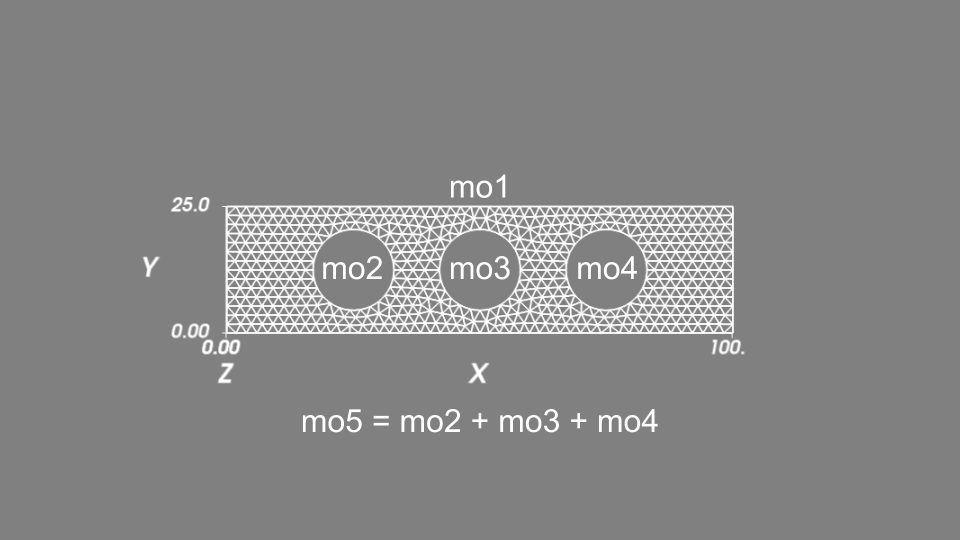
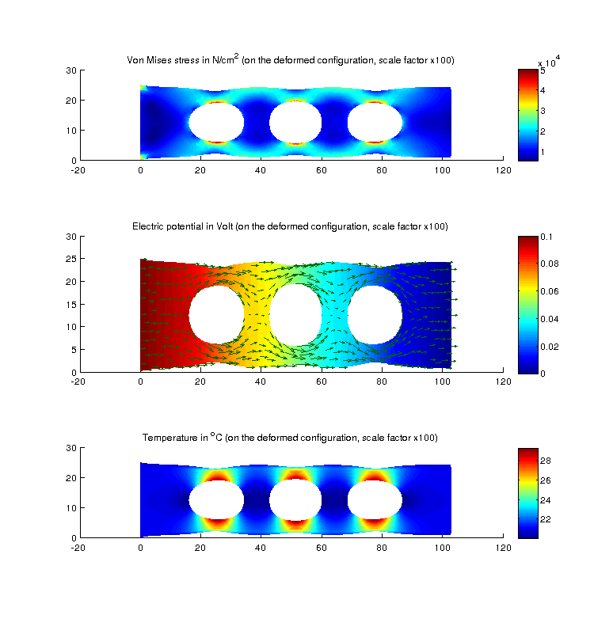

.. $Id: install.rst 4738 2014-07-27 12:25:54Z renard $

.. include:: ../replaces.txt

.. _tut-thermo_elec_coupling:

Example of Thermo-elastic and electrical coupling (simple nonlinear coupled problem, model object, generic assembly, solve and visualization)
=======================================================================================================================================================

This example aims to present a simple example of a multiphysics problem with a nonlinear coupling of a displacement field, a temperature field and an electric potential field. It also aims to compare the use of the GetFEM C++ API and the GetFEM scripting interfaces. The corresponding demo files are available in the test directories of |gf| (`tests/`, `interface/tests/python`, `interface/scr/scilab/demos` and `interface/tests/matlab`).

The problem setting
-------------------

Let :math:`\Omega \subset \rm I\hspace{-0.15em}R^2` be the reference configuration of a 2D plate (see the geometry :ref:`here <tut-fig-meshthermo>`) of thickness :math:`t` submitted to external forces, electric potential and heating. We will denote by :math:`T : \Omega \rightarrow \rm I\hspace{-0.15em}R` the temperature field (in |degreC|), :math:`V : \Omega \rightarrow \rm I\hspace{-0.15em}R` the electric potential field and :math:`u : \Omega \rightarrow \rm I\hspace{-0.15em}R^2` the in-plane displacement field.

Thermal problem
***************

The left and right sides of the plate as well as the hole surfaces, alltogether denoted with :math:`\Gamma_i`, are supposed to be in thermal insulation. The bottom and top sides, denoted with :math:`\Gamma_c`, as well as the front and back faces of the plate are supposed to be in thermal exchange with surrounding air at temperature :math:`T_{air} = 20` |degreC|) with a heat transfer coefficient :math:`D`.

The heat transfer equation for the temperature field :math:`T` including all relevant boundary conditions can be written as follows:

.. math::

  \left\{\begin{array}{l}
  -\mbox{div}(t\ \kappa\ \nabla T) + 2\ D\ (T - T_{air}) - \dfrac{t}{\rho}|\nabla V|^2 = 0 ~~ \mbox{ in } \Omega, \\
  \kappa\nabla T \cdot n = 0 ~~ \mbox{ on } \partial \Gamma_i,\\
  \kappa\nabla T \cdot n = D(T-T_{air}) ~~ \mbox{ on } \partial \Gamma_c,
  \end{array} \right.

where :math:`\kappa` is the thermal conductivity and :math:`n` the outward unit normal vector to :math:`\Omega` on :math:`\partial \Omega`.

The term :math:`1/\rho|\nabla V|^2` is a coupling term corresponding to Joule heating due to electric current, where :math:`\rho` is the electric resistivity, hence :math:`1/\rho` is the electric conductivity.

Electric potential problem
**************************

We consider a potential difference of :math:`0.1V` between the left and right lateral faces of the plate. All other faces are considered electrically insulated. The governing equation for the electric potential is

.. math::

   \left\{\begin{array}{l}
  -\mbox{div}(t/\rho\ \nabla V) = 0 ~~ \mbox{ in } \Omega, \\
  \nabla V \cdot n = 0 ~~ \mbox{ on the top, bottom, and hole faces}, \\
  V = 0.1 ~~ \mbox{ on the left lateral face}, \\
  V = 0 ~~ \mbox{ on the right lateral face}, \\
  \end{array} \right.

where :math:`\rho` is still the electric resistivity. Moreover, we consider that :math:`\rho` depends on the temperature as follows:

.. math::

  \rho(T) = \rho_0(1+\alpha(T - T_0)),

where :math:`T_0` is a reference temperature, :math:`\rho_0` the resistivity at :math:`T_0` and :math:`\alpha` is the resistivity-temperature coefficient.

Deformation problem
*******************

We consider the planar deformation of the plate under a force applied on the right lateral face and influenced by the heating of the plate, assuming plane stress conditions. For linearized elasticity the displacement field :math:`u` has to satisfy the following equations:

.. math::

   \left\{\begin{array}{l}
  -\mbox{div}(\sigma(u)) = 0 ~~ \mbox{ in } \Omega, \\
  u = 0 ~~ \mbox{ on the left lateral face},\\
  \sigma\ n = F ~~ \mbox{ on the right lateral face}, \\
  \sigma\ n = 0 ~~ \mbox{ on all remaining faces},
  \end{array} \right.

where :math:`F` is the force density applied on the right lateral boundary and :math:`\sigma(u)` is the Cauchy stress tensor defined by

.. math::

  \sigma(u) = \dfrac{E\nu}{1-\nu^2} (\mbox{div}(u) - 2\alpha_{th}(T\!-\!T_0)) I + \dfrac{E\nu}{1+\nu} (\varepsilon(u) - \alpha_{th}(T\!-\!T_0) I),

with :math:`\varepsilon(u) = (\nabla u + (\nabla u)^T)/2` being the linearized strain tensor, :math:`I` the identity second order tensor, :math:`E` and :math:`\nu` the Young modulus and Poisson ratio of the material, and :math:`\alpha_{th}` the thermal expansion coefficient.

The weak formulation
--------------------

An important step is to obtain the weak formulation of the coupled system of equations. This is a crucial step since representing PDEs using standard finite element theory relies on their weak formulation (Galerkin approximation).

Weak formulation of each partial differential equation is obtained by multiplying the equation with a test function corresponding to the main unknown. The test function needs to satisfy homogeneous Dirichlet conditions everywhere where the main unknown is prescribed by a Dirichlet condition. Then integrating over the domain :math:`\Omega` and performing some integrations by parts (using Green's formula) leads to the weak formulation of the system of partial differential in the form:

.. math::

  &\mbox{Find } T, V, u \mbox{ with } V = 0.1, u = 0 \mbox{ on the left face}, V = 0 \mbox{ on the right face}, \\
  & \int_{\Omega} t\ \kappa\ \nabla T\cdot\nabla\delta T + 2\ D\ (T - T_0)\ \delta T + \dfrac{t}{\rho(T)}||\nabla V||^2\ \delta T\ d\Omega = 0 ~~~\mbox{ for all } \delta T, \\
  & \int_{\Omega} \dfrac{t}{\rho(T)}\nabla V\cdot\nabla\delta V\ d\Omega = 0 ~~~ \mbox{ for all } \delta V \mbox{ satisfying } \delta V = 0 \mbox{ on the left and right faces}, \\
  & \int_{\Omega} t\ \sigma(u):\varepsilon(\delta u)\ d\Omega - \int_{\Gamma_N} t\ F\cdot \delta u\ d\Gamma = 0 ~~~ \mbox{ for all } \delta u \mbox{ satisfying } \delta u = 0 \mbox{ on the left face},

where :math:`\delta T, \delta V, \delta u` are the test functions corresponding to :math:`T, V, u`, respectively, :math:`\Gamma_N` denotes the right boundary where the density of force :math:`F` is applied and :math:`\sigma:\varepsilon` is the Frobenius scalar product between second order tensors.

Implementation in C++ and in script languages
---------------------------------------------

Let us now make a detailed presentation of the use of |gf| to approximate the problem.
We build simultaneously a C++, Python, Scilab and Matlab program.
In the scripts for Matlab/Octave we choose not to make use of the object oriented syntax (see :ref:`mlab-oocmd` on how to use the OO syntax and its computational overhead).

Initialization
**************

First, in C++, ones has to include a certain number of headers for the model object, the generic assembly, the experimental mesher, and the export functionality.
For Python, |gf| can just be imported globally, and typically numpy needs to be imported as well.
For Scilab, the library has first to be loaded in the Scilab console (this is not described here) and for Matlab/Octave, it is only recommended to call `gf_workspace('clear all')` to ensure there are no leftover |gf| variables in memory.

.. tabularcolumns:: |p{0.080\linewidth}|p{0.900\linewidth}|

.. list-table::
   :header-rows: 0
   :stub-columns: 1

   * - C++
     - .. code-block:: c++

         #include "getfem/getfem_model_solvers.h"
         #include "getfem/getfem_export.h"
         #include "getfem/getfem_mesher.h"
         #include "getfem/getfem_generic_assembly.h"

         using std::cout; using std::endl;
         using bgeot::dim_type;
         using bgeot::size_type;
         using bgeot::base_node;
         using bgeot::base_small_vector;

         int main() {

   * - Python
     - .. code-block:: python

         import getfem as gf
         import numpy as np

   * - .. raw:: html

         Matlab Octave Scilab

     - .. code-block:: matlab

         gf_workspace('clear all');

Parameters of the model
***********************

Let us now define the different physical and numerical parameters of the problem.
For script languages (Python, Matlab/Octave, and Scilab) exactly the same syntax can be used.

.. tabularcolumns:: |p{0.080\linewidth}|p{0.900\linewidth}|

=========== ================================================
**C++**     .. code-block:: c++

                double t = 1.,            // Thickness of the plate (cm)
                       E = 21E6,          // Young Modulus (N/cm^2)
                       nu = 0.3,          // Poisson ratio
                       F = 100E2,         // Force density at the right boundary (N/cm^2)
                       kappa = 4.,        // Thermal conductivity (W/(cm K))
                       D = 10.,           // Heat transfer coefficient (W/(K cm^2))
                       air_temp = 20,     // Temperature of the air in deg C.
                       alpha_th = 16.6E-6,// Thermal expansion coefficient (1/K)
                       T0 = 20.,          // Reference temperature in deg C
                       rho_0 = 1.754E-8,  // Resistivity at T0
                       alpha = 0.0039;    // Resistivity-temperature coefficient

                double h = 2.                 // Approximate mesh size
                dim_type elements_degree = 2; // Degree of the finite element methods
----------- ------------------------------------------------
**Scripts** .. code-block:: python

                t = 1.; E = 21E6; nu = 0.3; F = 100E2;
                kappa = 4.; D = 10.; air_temp = 20.; alpha_th = 16.6E-6;
                T0 = 20.; rho_0 = 1.754E-8; alpha = 0.0039;

                h = 2.; elements_degree = 2;

=========== ================================================

Mesh generation
***************

|gf| has some limited mesh generation capabilities which are described here.
However, GetFEM is not meant to be used as a general purpose mesher, there is no guaranty of the quality and conformity of the obtained mesh.
You should better always verify the quality of the generated mesh if you use |gf|'s built-in meshing tools.
You can also use external meshers like GMSH, ANSYS, or GiD, and import the generated meshes (see :ref:`ud-load_save_mesh`).

The geometry of the domain in the present example is a rectangle with three circular holes (see :ref:`tut-fig-meshthermo`).
The mesh for this geometry is produced by combining geometrical primitives with boolean operations (see :file:`src/getfem/getfem_mesher.h` file).
In the following, `h` stands for the mesh size and `2` is the degree of the mesh (this means that the transformation is of degree two, we used curved edges). In order to get isoparametric elements, the parameter `elements_degree`, used later in the definition of finite element spaces, needs also to be set equal to 2. Otherwise subparametric or superparametric elements will be produced.

.. tabularcolumns:: |p{0.080\linewidth}|p{0.900\linewidth}|

.. list-table::
   :header-rows: 0
   :stub-columns: 1

   * - C++
     - .. code-block:: c++

         getfem::mesh mesh;
         getfem::pmesher_signed_distance
           mo1 = getfem::new_mesher_rectangle(base_node(0., 0.), base_node(100., 25.)),
           mo2 = getfem::new_mesher_ball(base_node(25., 12.5), 8.),
           mo3 = getfem::new_mesher_ball(base_node(50., 12.5), 8.),
           mo4 = getfem::new_mesher_ball(base_node(75., 12.5), 8.),
           mo5 = getfem::new_mesher_union(mo2, mo3, mo4),
           mo = getfem::new_mesher_setminus(mo1, mo5);

         std::vector<getfem::base_node> fixed;
         getfem::build_mesh(mesh, mo, h, fixed, 2, -2);

   * - Python
     - .. code-block:: python

          mo1 = gf.MesherObject('rectangle', [0., 0.], [100., 25.])
          mo2 = gf.MesherObject('ball', [25., 12.5], 8.)
          mo3 = gf.MesherObject('ball', [50., 12.5], 8.)
          mo4 = gf.MesherObject('ball', [75., 12.5], 8.)
          mo5 = gf.MesherObject('union', mo2, mo3, mo4)
          mo  = gf.MesherObject('set_minus', mo1, mo5)

          mesh = gf.Mesh('generate', mo, h, 2)

   * - .. raw:: html

         Matlab Octave Scilab
     - .. code-block:: matlab

         mo1 = gf_mesher_object('rectangle', [0 0], [100 25]);
         mo2 = gf_mesher_object('ball', [25 12.5], 8);
         mo3 = gf_mesher_object('ball', [50 12.5], 8);
         mo4 = gf_mesher_object('ball', [75 12.5], 8);
         mo5 = gf_mesher_object('union', mo2, mo3, mo4);
         mo  = gf_mesher_object('set_minus', mo1, mo5);

         mesh = gf_mesh('generate', mo, h, 2);

.. _tut-fig-meshthermo:

   The obtained mesh.

.. raw:: latex

   \clearpage

Boundary selection
******************

Since we have different boundary conditions on the different parts of the boundary, we have to number different parts of the boundary accordingly.
Sets of elements or element faces on the mesh are defined in so called mesh regions (see :ref:`ud-mesh_regions`) with a unique integer identifier.
Regions with identifiers 1, 2, 3, and 4 are defined for the right, left, top and bottom sides, respectively.
These boundary numbers will be used in the definitions of different terms in the model equations.

.. tabularcolumns:: |p{0.080\linewidth}|p{0.900\linewidth}|

.. list-table::
   :header-rows: 0
   :stub-columns: 1

   * - C++
     - .. code-block:: c++

         getfem::mesh_region border_faces;
         getfem::outer_faces_of_mesh(mesh, border_faces);
         getfem::mesh_region
           fb1 = getfem::select_faces_in_box(mesh, border_faces,
                                             base_node(1., 1.), base_node(99., 24.)),
           fb2 = getfem::select_faces_of_normal(mesh, border_faces,
                                                base_small_vector( 1., 0.), 0.01),
           fb3 = getfem::select_faces_of_normal(mesh, border_faces,
                                                base_small_vector(-1., 0.), 0.01),
           fb4 = getfem::select_faces_of_normal(mesh, border_faces,
                                                base_small_vector(0.,  1.), 0.01),
           fb5 = getfem::select_faces_of_normal(mesh, border_faces,
                                                base_small_vector(0., -1.), 0.01);

         size_type RIGHT_BOUND=1, LEFT_BOUND=2, TOP_BOUND=3, BOTTOM_BOUND=4;
         mesh.region( RIGHT_BOUND) = getfem::mesh_region::subtract(fb2, fb1);
         mesh.region(  LEFT_BOUND) = getfem::mesh_region::subtract(fb3, fb1);
         mesh.region(   TOP_BOUND) = getfem::mesh_region::subtract(fb4, fb1);
         mesh.region(BOTTOM_BOUND) = getfem::mesh_region::subtract(fb5, fb1);

   * - Python
     - .. code-block:: python

         fb1 = mesh.outer_faces_in_box([1., 1.], [99., 24.])
         fb2 = mesh.outer_faces_with_direction([ 1., 0.], 0.01)
         fb3 = mesh.outer_faces_with_direction([-1., 0.], 0.01)
         fb4 = mesh.outer_faces_with_direction([0.,  1.], 0.01)
         fb5 = mesh.outer_faces_with_direction([0., -1.], 0.01)

         RIGHT_BOUND=1; LEFT_BOUND=2; TOP_BOUND=3; BOTTOM_BOUND=4; HOLE_BOUND=5;

         mesh.set_region( RIGHT_BOUND, fb2)
         mesh.set_region(  LEFT_BOUND, fb3)
         mesh.set_region(   TOP_BOUND, fb4)
         mesh.set_region(BOTTOM_BOUND, fb5)
         mesh.set_region(  HOLE_BOUND, fb1)
         mesh.region_subtract( RIGHT_BOUND, HOLE_BOUND)
         mesh.region_subtract(  LEFT_BOUND, HOLE_BOUND)
         mesh.region_subtract(   TOP_BOUND, HOLE_BOUND)
         mesh.region_subtract(BOTTOM_BOUND, HOLE_BOUND)

   * - .. raw:: html

         Matlab Octave Scilab
     - .. code-block:: matlab

         fb1 = gf_mesh_get(mesh, 'outer_faces_in_box', [1 1], [99 24]);
         fb2 = gf_mesh_get(mesh, 'outer_faces_with_direction', [ 1 0], 0.01);
         fb3 = gf_mesh_get(mesh, 'outer_faces_with_direction', [-1 0], 0.01);
         fb4 = gf_mesh_get(mesh, 'outer_faces_with_direction', [0  1], 0.01);
         fb5 = gf_mesh_get(mesh, 'outer_faces_with_direction', [0 -1], 0.01);

         RIGHT_BOUND=1; LEFT_BOUND=2; TOP_BOUND=3; BOTTOM_BOUND=4; HOLE_BOUND=5;
         gf_mesh_set(mesh, 'region',  RIGHT_BOUND, fb2);
         gf_mesh_set(mesh, 'region',   LEFT_BOUND, fb3);
         gf_mesh_set(mesh, 'region',    TOP_BOUND, fb4);
         gf_mesh_set(mesh, 'region', BOTTOM_BOUND, fb5);
         gf_mesh_set(mesh, 'region',   HOLE_BOUND, fb1);
         gf_mesh_set(mesh, 'region_subtract',  RIGHT_BOUND, HOLE_BOUND);
         gf_mesh_set(mesh, 'region_subtract',   LEFT_BOUND, HOLE_BOUND);
         gf_mesh_set(mesh, 'region_subtract',    TOP_BOUND, HOLE_BOUND);
         gf_mesh_set(mesh, 'region_subtract', BOTTOM_BOUND, HOLE_BOUND);

Mesh draw
*********

In order to preview the mesh and verify its quality, the following instructions can be used:

.. tabularcolumns:: |p{0.080\linewidth}|p{0.900\linewidth}|

.. list-table::
   :header-rows: 0
   :stub-columns: 1

   * - C++
     - .. code-block:: c++

         getfem::vtu_export exp("mesh.vtu", false);
         exp.exporting(mesh);
         exp.write_mesh();
         // You can view the mesh for instance with
         // mayavi2 -d mesh.vtu -f ExtractEdges -m Surface

   * - Python
     - .. code-block:: python

         mesh.export_to_vtu('mesh.vtu');
         # You can view the mesh for instance with
         # mayavi2 -d mesh.vtu -f ExtractEdges -m Surface

   * - .. raw:: html

         Matlab Octave Scilab
     - .. code-block:: matlab

         scf(1);
         gf_plot_mesh(mesh, 'refine', 8, 'curved', 'on', 'regions', ...
                      [RIGHT_BOUND LEFT_BOUND TOP_BOUND BOTTOM_BOUND]);
         title('Mesh');

For Matlab/Octave call `pause(1);` and for Scilab call `sleep(1000);` just after.

In C++ and with the Python interface, an external graphical post-processor has to be used (for instance, gmsh, Mayavi2, PyVista or Paraview).
With Scilab and Matlab/Octave interfaces, the internal plot facilities can be used (see the result :ref:`tut-fig-meshthermo`).

Definition of finite element methods and integration method
***********************************************************

We will define three finite element methods.
The first one, `mfu`, is to approximate the displacement field which is a vector field.
Its definition in C++ is

.. code-block:: c++

   getfem::mesh_fem mfu(mesh, 2);
   mfu.set_classical_finite_element(elements_degree);

where the argument `2` stands for the dimension of the vector field.
The second line sets the finite element used, where `classical_finite_element` means a continuous Lagrange element.
Remember that `elements_degree` has been set to `2` which means that we will use quadratic (isoparametric) elements.

There is a wide choice of pre-existing finite element methods in |gf|, see :ref:`ud-appendixa`.
However, Lagrange finite element methods are the most common in practice.

The second finite element method is a scalar one, `mft`, which will approximate both the temperature and the electric potential fields.
Several finite element variables can share the same finite element method if necessary.

The third finite element method, `mfvm`, is a discontinuous Lagrange one for a scalar field, which will allow us to post-process quantities which are discotinuous at element boundaries, such as the gradient of some approximated field variables, in particular the Von Mises stress field.

The last thing to define is an integration method `mim`.
There is no default integration method in |gf|, so it is mandatory to define an integration method.
Of course, the order of the integration method has to be chosen sufficient large to provide full integration of the relevant finite element terms.
In the present example, a polynomial order equal to the double of `elements_degree` is sufficient.

.. tabularcolumns:: |p{0.080\linewidth}|p{0.900\linewidth}|

.. list-table::
   :header-rows: 0
   :stub-columns: 1

   * - C++
     - .. code-block:: c++

         getfem::mesh_fem mfu(mesh, 2);
         mfu.set_classical_finite_element(elements_degree);
         getfem::mesh_fem mft(mesh, 1);
         mft.set_classical_finite_element(elements_degree);
         getfem::mesh_fem mfvm(mesh, 1);
         mfvm.set_classical_discontinuous_finite_element(elements_degree);

         getfem::mesh_im  mim(mesh);
         mim.set_integration_method(2*elements_degree);

   * - Python
     - .. code-block:: python

         mfu = gf.MeshFem(mesh, 2)
         mfu.set_classical_fem(elements_degree)
         mft = gf.MeshFem(mesh, 1)
         mft.set_classical_fem(elements_degree)
         mfvm = gf.MeshFem(mesh, 1)
         mfvm.set_classical_discontinuous_fem(elements_degree)
         mim = gf.MeshIm(mesh, elements_degree*2)

   * - .. raw:: html

         Matlab Octave Scilab
     - .. code-block:: matlab

         mfu = gf_mesh_fem(mesh, 2);
         gf_mesh_fem_set(mfu, 'classical_fem', elements_degree);
         mft = gf_mesh_fem(mesh, 1);
         gf_mesh_fem_set(mft, 'classical_fem', elements_degree);
         mfvm = gf_mesh_fem(mesh, 1);
         gf_mesh_fem_set(mfvm, 'classical_discontinuous_fem', elements_degree-1);
         mim = gf_mesh_im(mesh, elements_degree*2);

Model definition
****************

It is not strictly mandatory to use the model object in |gf|, but it is indeed a very powerful object.
It is used to gather all defined variables (unknowns) and data, whether these are defined in a finite element space, on integration points, or globally.
It also gathers all PDE terms that involve the various variables and data, numbers the degrees of freedom from all unknowns and combines all assembled terms in a global tangent system, consistently.

The user can either add predefined PDE terms, so called model bricks, or preferably add linear/nonlinear terms using symbolic expressions written in the generic weak form language (GWFL), see :ref:`ud-gasm-high-transf`.
The added terms can involve a single variable or several variables with arbitrary couplings.
The model object automates the assembly of the (tangent) linear system (see :ref:`ud-model-object` for more details).

The alternative to using the model object, is to use lower level assembly procedures directly and incorporate their results into the overall (tangent) linear system manually.
The model object allows a rapid implementation of a model, since all common boundary conditions, PDE terms, mutliplier enforced constrains, etc. can easily be provided in very compact form, as GWFL expressions.
Many common terms are predefined in so called bricks, however nowadays, these are somewhat obsolete, as the use of GWFL is as compact and at the same time more transparent.
There are a few specific model bricks that act directly on the discretized system, such as the explicit matrix brick and the explicit rhs brick, which provide operations that cannot be expressed in GWFL.
In general, it is highly recommended to use the framework of the model object.

When defining a model object, there are two options to choose among: real-number and complex-number model versions.
Complex-number models are reserved for special applications (some electromagnetism problems for instance) where it is advantageous to solve a complex-number linear system.
They support most but not all features available in the real-number model version.

Let us declare a real-number model with the three variables corresponding to the three unknown fields:

.. tabularcolumns:: |p{0.080\linewidth}|p{0.900\linewidth}|

.. list-table::
   :header-rows: 0
   :stub-columns: 1

   * - C++
     - .. code-block:: c++

         getfem::model md;
         md.add_fem_variable("u", mfu);
         md.add_fem_variable("T", mft);
         md.add_fem_variable("V", mft);

   * - Python
     - .. code-block:: python

         md=gf.Model('real');
         md.add_fem_variable('u', mfu)
         md.add_fem_variable('theta', mft)
         md.add_fem_variable('V', mft)

   * - .. raw:: html

         Matlab Octave Scilab
     - .. code-block:: matlab

         md=gf_model('real');
         gf_model_set(md, 'add_fem_variable', 'u', mfu);
         gf_model_set(md, 'add_fem_variable', 'T', mft);
         gf_model_set(md, 'add_fem_variable', 'V', mft);

Plane stress elastic deformation problem
****************************************

Let us now begin by the elastic deformation problem.
We will use the `add_linear_term` function of the model object to add a linear term to the model by means of a GWFL symbolic expression.
Specically for the plane stress problem we will add the term

.. math::

  \int_{\Omega} t \dfrac{E\nu}{1\!+\!\nu}\left(\dfrac{\nu}{1\!-\!\nu} (\mbox{div}(u) - 2\alpha_{th}(T\!-\!T_0)) I +  (\varepsilon(u) - \alpha_{th}(T\!-\!T_0) I)\right)\!\!:\!\varepsilon(\delta u)\ d\Omega

to the tangent linear system.
In order to add this term, global scalar data corresponding to the elastic constants :math:`E` and :math:`\nu`, as well as the constants :math:`t`, :math:`T_0`, and :math:`\alpha_{th}`, have to be added to the model first.
If any of these data were not constant, it is also possible to define them as a finite element field or at integration points directly (not shown here).
Note that this term, directly incorporated the thermomechanical coupling between the displacement and temperature field.
For the isothermal case, one could alternatively also use a predefined brick, a black-box term, added to the model with the `add_isotropic_linearized_elasticity_brick` function.

....

Concerning the coupling term

.. math::

   \int_{\Omega} (\betaT I) :\varepsilon(\delta_u)dx,

there is no predefined brick and we use directly a GWFL term `add_linear_term(md mim, "beta*theta*Div_Test_u)"`. See :ref:`ud-gasm-high` for more details on GWFL. Basically, the principle is that the assembly string is compiled into a list of optimized assembly instructions which are executed on each Gauss point.

.. math::

  - \int_{\Gamma_N} t\ F\cdot \delta u\ d\Gamma

The following program allows to take into account the whole elastic deformation equation. Note the use of specific brick to prescribe the Dirichlet condition on the left boundary. There is several option to prescribe a Dirichlet condition (see :ref:`ud-model-Dirichlet`).

.. tabularcolumns:: |p{0.080\linewidth}|p{0.900\linewidth}|

.. list-table::
   :header-rows: 0
   :stub-columns: 1

   * - C++
     - .. code-block:: c++

   * - Python
     - .. code-block:: python

   * - .. raw:: html

         Matlab Octave Scilab
     - .. code-block:: matlab

.. tabularcolumns:: |p{0.080\linewidth}|p{0.900\linewidth}|

========== ================================================================================================================
**C++**    .. code-block:: c++

                md.add_initialized_scalar_data("cmu", cmu);
                md.add_initialized_scalar_data("clambdastar", clambdastar);
                md.add_initialized_scalar_data("T0", T0);
                getfem::add_isotropic_linearized_elasticity_brick
                  (md, mim, "u", "clambdastar", "cmu");
                getfem::add_Dirichlet_condition_with_multipliers
                  (md, mim, "u", bgeot::dim_type(elements_degree-1), LEFT_BOUND);
                md.add_initialized_fixed_size_data("Fdata", base_small_vector(F*epsilon,0.));
                getfem::add_source_term_brick(md, mim, "u", "Fdata", RIGHT_BOUND);

                md.add_initialized_scalar_data("beta", alpha_th*E/(1-2*nu));
                getfem::add_linear_term(md, mim, "beta*(T0-theta)*Div_Test_u");
---------- ----------------------------------------------------------------------------------------------------------------
**Python** .. code-block:: python

                md.add_initialized_data('cmu', [cmu])
                md.add_initialized_data('clambdastar', [clambdastar])
                md.add_initialized_data('T0', [T0])
                md.add_isotropic_linearized_elasticity_brick(mim, 'u', 'clambdastar', 'cmu')

                md.add_Dirichlet_condition_with_multipliers(mim, 'u', elements_degree-1, LEFT_BOUND)
                md.add_initialized_data('Fdata', [F*epsilon, 0])
                md.add_source_term_brick(mim, 'u', 'Fdata', RIGHT_BOUND)

                md.add_initialized_data('beta', [alpha_th*E/(1-2*nu)])
                md.add_linear_term(mim, 'beta*(T0-theta)*Div_Test_u')
---------- ----------------------------------------------------------------------------------------------------------------
**Scilab** .. code-block:: matlab

                gf_model_set(md, 'add initialized data', 'cmu', [cmu]);
                gf_model_set(md, 'add initialized data', 'clambdastar', [clambdastar]);
                gf_model_set(md, 'add initialized data', 'T0', [T0]);
                gf_model_set(md, 'add isotropic linearized elasticity brick', mim, 'u', 'clambdastar', 'cmu');

                gf_model_set(md, 'add Dirichlet condition with multipliers', mim, 'u', elements_degree-1, LEFT_BOUND);
                gf_model_set(md, 'add initialized data', 'Fdata', [F*epsilon, 0]);
                gf_model_set(md, 'add source term brick', mim, 'u', 'Fdata', RIGHT_BOUND);

                gf_model_set(md, 'add initialized data', 'beta', [alpha_th*E/(1-2*nu)]);
                gf_model_set(md, 'add linear term', mim, 'beta*(T0-theta)*Div_Test_u');
========== ================================================================================================================

.. tabularcolumns:: |p{0.080\linewidth}|p{0.900\linewidth}|

========== ================================================================================================================
**Matlab** .. code-block:: matlab

                gf_model_set(md, 'add initialized data', 'cmu', [cmu]);
                gf_model_set(md, 'add initialized data', 'clambdastar', [clambdastar]);
                gf_model_set(md, 'add initialized data', 'T0', [T0]);
                gf_model_set(md, 'add isotropic linearized elasticity brick', mim, 'u', 'clambdastar', 'cmu');

                gf_model_set(md, 'add Dirichlet condition with multipliers', mim, 'u', elements_degree-1, LEFT_BOUND);
                gf_model_set(md, 'add initialized data', 'Fdata', [F*epsilon, 0]);
                gf_model_set(md, 'add source term brick', mim, 'u', 'Fdata', RIGHT_BOUND);

                gf_model_set(md, 'add initialized data', 'beta', [alpha_th*E/(1-2*nu)]);
                gf_model_set(md, 'add linear term', mim, 'beta*(T0-theta)*Div_Test_u');
========== ================================================================================================================

.. raw:: latex

   \clearpage

Electric potential problem
**************************

Similarly, the following program take into account the electric potential equation. Note the definition of the  electrical conductivity :math:`\sigma` and again the use of GWFL terms.

.. tabularcolumns:: |p{0.080\linewidth}|p{0.900\linewidth}|

========== ===========================================================================
**C++**    .. code-block:: c++

                std::string sigmaeps = "(eps/(rho_0*(1+alpha*(theta-T0))))";
                md.add_initialized_scalar_data("eps", epsilon);
                md.add_initialized_scalar_data("rho_0", rho_0);
                md.add_initialized_scalar_data("alpha", alpha);
                getfem::add_nonlinear_term
                  (md, mim, sigmaeps+"*(Grad_V.Grad_Test_V)");
                getfem::add_Dirichlet_condition_with_multipliers
                  (md, mim, "V", bgeot::dim_type(elements_degree-1), RIGHT_BOUND);
                md.add_initialized_scalar_data("DdataV", 0.1);
                getfem::add_Dirichlet_condition_with_multipliers
                  (md, mim, "V", bgeot::dim_type(elements_degree-1), LEFT_BOUND, "DdataV");
---------- ---------------------------------------------------------------------------
**Python** .. code-block:: python

                sigmaeps = '(eps/(rho_0*(1+alpha*(theta-T0))))'
                md.add_initialized_data('eps', [epsilon])
                md.add_initialized_data('rho_0', [rho_0])
                md.add_initialized_data('alpha', [alpha])
                md.add_nonlinear_term(mim, sigmaeps+'*(Grad_V.Grad_Test_V)')
                md.add_Dirichlet_condition_with_multipliers(mim, 'V', elements_degree-1, RIGHT_BOUND)
                md.add_initialized_data('DdataV', [0.1])
                md.add_Dirichlet_condition_with_multipliers(mim, 'V', elements_degree-1, LEFT_BOUND, 'DdataV')
---------- ---------------------------------------------------------------------------
**Scilab** .. code-block:: matlab

                sigmaps = '(eps/(rho_0*(1+alpha*(theta-T0))))';
                gf_model_set(md, 'add initialized data', 'eps', [epsilon]);
                gf_model_set(md, 'add initialized data', 'rho_0', [rho_0]);
                gf_model_set(md, 'add initialized data', 'alpha', [alpha]);
                gf_model_set(md, 'add nonlinear term', mim, sigmaeps+'*(Grad_V.Grad_Test_V)');
                gf_model_set(md, 'add Dirichlet condition with multipliers', mim, 'V', elements_degree-1, RIGHT_BOUND);
                gf_model_set(md, 'add initialized data', 'DdataV', [0.1]);
                gf_model_set(md, 'add Dirichlet condition with multipliers', mim, 'V', elements_degree-1, LEFT_BOUND, 'DdataV');
---------- ---------------------------------------------------------------------------
**Matlab** .. code-block:: matlab

                sigmaps = '(eps/(rho_0*(1+alpha*(theta-T0))))';
                gf_model_set(md, 'add initialized data', 'eps', [epsilon]);
                gf_model_set(md, 'add initialized data', 'rho_0', [rho_0]);
                gf_model_set(md, 'add initialized data', 'alpha', [alpha]);
                gf_model_set(md, 'add nonlinear term', mim, [sigmaeps '*(Grad_V.Grad_Test_V)']);
                gf_model_set(md, 'add Dirichlet condition with multipliers', mim, 'V', elements_degree-1, RIGHT_BOUND);
                gf_model_set(md, 'add initialized data', 'DdataV', [0.1]);
                gf_model_set(md, 'add Dirichlet condition with multipliers', mim, 'V', elements_degree-1, LEFT_BOUND, 'DdataV');
========== ===========================================================================

Thermal problem
***************

Now, the program to take into account the thermal problem:

.. tabularcolumns:: |p{0.080\linewidth}|p{0.900\linewidth}|

========== ===========================================================================
**C++**    .. code-block:: c++

                md.add_initialized_scalar_data("kaeps", kappa*epsilon);
                getfem::add_generic_elliptic_brick(md, mim, "theta", "kaeps");
                md.add_initialized_scalar_data("D2", D*2);
                md.add_initialized_scalar_data("D2airt", air_temp*D*2);
                getfem::add_mass_brick(md, mim, "theta", "D2");
                getfem::add_source_term_brick(md, mim, "theta", "D2airt");

                getfem::add_nonlinear_term
                  (md, mim, "-"+sigmaeps+"*Norm_sqr(Grad_V)*Test_theta");
---------- ---------------------------------------------------------------------------
**Python** .. code-block:: python

                md.add_initialized_data('kaeps', [kappa*epsilon])
                md.add_generic_elliptic_brick(mim, 'theta', 'kaeps')
                md.add_initialized_data('D2', [D*2])
                md.add_initialized_data('D2airt', [air_temp*D*2])
                md.add_mass_brick(mim, 'theta', 'D2')
                md.add_source_term_brick(mim, 'theta', 'D2airt')

                md.add_nonlinear_term(mim, '-'+sigmaeps+'*Norm_sqr(Grad_V)*Test_theta')
---------- ---------------------------------------------------------------------------
**Scilab** .. code-block:: matlab

                gf_model_set(md, 'add initialized data', 'kaeps', [kappa*epsilon]);
                gf_model_set(md, 'add generic elliptic brick', mim, 'theta', 'kaeps');
                gf_model_set(md, 'add initialized data', 'D2', [D*2]);
                gf_model_set(md, 'add initialized data', 'D2airt', [air_temp*D*2]);
                gf_model_set(md, 'add mass brick', mim, 'theta', 'D2');
                gf_model_set(md, 'add source term brick', mim, 'theta', 'D2airt');

                gf_model_set(md, 'add nonlinear term', mim, '-'+sigmaeps+'*Norm_sqr(Grad_V)*Test_theta');
---------- ---------------------------------------------------------------------------
**Matlab** .. code-block:: matlab

                gf_model_set(md, 'add initialized data', 'kaeps', [kappa*epsilon]);
                gf_model_set(md, 'add generic elliptic brick', mim, 'theta', 'kaeps');
                gf_model_set(md, 'add initialized data', 'D2', [D*2]);
                gf_model_set(md, 'add initialized data', 'D2airt', [air_temp*D*2]);
                gf_model_set(md, 'add mass brick', mim, 'theta', 'D2');
                gf_model_set(md, 'add source term brick', mim, 'theta', 'D2airt');

                gf_model_set(md, 'add nonlinear term', mim, ['-' sigmaeps '*Norm_sqr(Grad_V)*Test_theta']);
========== ===========================================================================

Model solve
***********

Once the model is correctly defined, we can simply solve it by:

.. tabularcolumns:: |p{0.080\linewidth}|p{0.900\linewidth}|

========== ===========================================================================
**C++**    .. code-block:: c++

                gmm::iteration iter(1E-9, 1, 100);
                getfem::standard_solve(md, iter);
---------- ---------------------------------------------------------------------------
**Python** .. code-block:: python

                md.solve('max_res', 1E-9, 'max_iter', 100, 'noisy')
---------- ---------------------------------------------------------------------------
**Scilab** .. code-block:: matlab

                gf_model_get(md, 'solve', 'max_res', 1E-9, 'max_iter', 100, 'noisy');
---------- ---------------------------------------------------------------------------
**Matlab** .. code-block:: matlab

                gf_model_get(md, 'solve', 'max_res', 1E-9, 'max_iter', 100, 'noisy');
========== ===========================================================================

Since the problem is globally nonlinear, a Newton method is used to iteratively solve the problem. It needs a few iterations (about 4 in that case).

Model solve with two steps
**************************

Another option to solve the problem is to solve first the thermal and electric potential problems. Indeed, in our model, the thermal and  electric potential do not depend on the deformation. Once the  thermal and electric potential problem, we then solve the deformation problem. This can be done as follows:

.. tabularcolumns:: |p{0.080\linewidth}|p{0.900\linewidth}|

========== ===========================================================================
**C++**    .. code-block:: c++

                gmm::iteration iter(1E-9, 1, 100);
                md.disable_variable("u");
                getfem::standard_solve(md, iter);
                md.enable_variable("u");
                md.disable_variable("theta");
                md.disable_variable("V");
                iter.init();
                getfem::standard_solve(md, iter);
---------- ---------------------------------------------------------------------------
**Python** .. code-block:: python

                md.disable_variable('u')
                md.solve('max_res', 1E-9, 'max_iter', 100, 'noisy')
                md.enable_variable('u')
                md.disable_variable('theta')
                md.disable_variable('V')
                md.solve('max_res', 1E-9, 'max_iter', 100, 'noisy')
---------- ---------------------------------------------------------------------------
**Scilab** .. code-block:: matlab

                gf_model_set(md, 'disable variable', 'u');
                gf_model_get(md, 'solve', 'max_res', 1E-9, 'max_iter', 100, 'noisy');
                gf_model_set(md, 'enable variable', 'u');
                gf_model_set(md, 'disable variable', 'theta');
                gf_model_set(md, 'disable variable', 'V');
                gf_model_get(md, 'solve', 'max_res', 1E-9, 'max_iter', 100, 'noisy');
---------- ---------------------------------------------------------------------------
**Matlab** .. code-block:: matlab

                gf_model_set(md, 'disable variable', 'u');
                gf_model_get(md, 'solve', 'max_res', 1E-9, 'max_iter', 100, 'noisy');
                gf_model_set(md, 'enable variable', 'u');
                gf_model_set(md, 'disable variable', 'theta');
                gf_model_set(md, 'disable variable', 'V');
                gf_model_get(md, 'solve', 'max_res', 1E-9, 'max_iter', 100, 'noisy');
========== ===========================================================================

Export/visualization of the solution
************************************

The finite element problem is now solved. We can plot the solution as follows. Note that for the C++ and Python programs, it is necessary to use an external graphical post-processor. Note also that arbitrary quantities can be post-processed using the generic interpolation (see `ga_interpolation_Lagrange_fem` below). It is also possible to make complex exports and slices (see :ref:`ud-export`).

.. tabularcolumns:: |p{0.080\linewidth}|p{0.900\linewidth}|

========== =====================================================================================================================================================
**C++**    .. code-block:: c++

                plain_vector U(mfu.nb_dof()); gmm::copy(md.real_variable("u"), U);
                plain_vector V(mft.nb_dof()); gmm::copy(md.real_variable("V"), V);
                plain_vector THETA(mft.nb_dof()); gmm::copy(md.real_variable("theta"),THETA);
                plain_vector VM(mfvm.nb_dof());
                getfem::compute_isotropic_linearized_Von_Mises_or_Tresca
                  (md, "u", "clambdastar", "cmu", mfvm, VM, false);
                plain_vector CO(mfvm.nb_dof() * 2);
                getfem::ga_interpolation_Lagrange_fem(md, "-"+sigmaeps+"*Grad_V",  mfvm, CO);

                getfem::vtu_export exp("displacement_with_von_mises.vtu", false);
                exp.exporting(mfu);
                exp.write_point_data(mfu, U, "elastostatic displacement");
                exp.write_point_data(mfvm, VM, "Von Mises stress");
                cout << "\nYou can view solutions with for instance:\n\nmayavi2 "
                  "-d displacement_with_von_mises.vtu -f WarpVector -m Surface\n" << endl;

                getfem::vtu_export exp2("temperature.vtu", false);
                exp2.exporting(mft);
                exp2.write_point_data(mft, THETA, "Temperature");
                cout << "mayavi2 -d temperature.vtu -f WarpScalar -m Surface\n" << endl;

                getfem::vtu_export exp3("electric_potential.vtu", false);
                exp3.exporting(mft);
                exp3.write_point_data(mft, V, "Electric potential");
                cout << "mayavi2 -d electric_potential.vtu -f WarpScalar -m Surface\n"
                     << endl;
                }
---------- -----------------------------------------------------------------------------------------------------------------------------------------------------
**Python** .. code-block:: python

                U = md.variable('u')
                V = md.variable('V')
                THETA = md.variable('theta')
                VM = md.compute_isotropic_linearized_Von_Mises_or_Tresca('u', 'clambdastar', 'cmu', mfvm)
                CO = np.reshape(md.interpolation('-'+sigmaeps+'*Grad_V', mfvm), (2, mfvm.nbdof()), 'F')

                mfvm.export_to_vtu('displacement_with_von_mises.vtu', mfvm,
                                   VM, 'Von Mises Stresses', mfu, U, 'Displacements')
                print ('You can view solutions with for instance:')
                print ('mayavi2 -d displacement_with_von_mises.vtu -f WarpVector -m Surface')
                mft.export_to_vtu('temperature.vtu', mft, THETA, 'Temperature')
                print ('mayavi2 -d temperature.vtu -f WarpScalar -m Surface')
                mft.export_to_vtu('electric_potential.vtu', mft, V, 'Electric potential')
                print ('mayavi2 -d electric_potential.vtu -f WarpScalar -m Surface')
========== =====================================================================================================================================================

.. tabularcolumns:: |p{0.080\linewidth}|p{0.900\linewidth}|

========== =====================================================================================================================================================
**Scilab** .. code-block:: matlab

                U = gf_model_get(md, 'variable', 'u');
                V = gf_model_get(md, 'variable', 'V');
                THETA = gf_model_get(md, 'variable', 'theta');
                VM = gf_model_get(md, 'compute_isotropic_linearized_Von_Mises_or_Tresca', 'u', 'clambdastar', 'cmu', mfvm);
                CO = matrix(gf_model_get(md, 'interpolation', '-'+sigmaeps+'*Grad_V', mfvm), [2 gf_mesh_fem_get(mfvm, 'nbdof')]);

                hh = scf(2);
                hh.color_map = jetcolormap(255);
                subplot(3,1,1);
                gf_plot(mfvm, VM, 'mesh', 'off', 'deformed_mesh','off', 'deformation', U, 'deformation_mf', mfu, 'deformation_scale', 100, 'refine', 8);
                colorbar(min(VM),max(VM));
                title('Von Mises stress in N/cm^2 (on the deformed configuration, scale factor x100)');
                subplot(3,1,2);
                drawlater;
                gf_plot(mft, V, 'mesh', 'off', 'deformed_mesh','off', 'deformation', U, 'deformation_mf', mfu, 'deformation_scale', 100, 'refine', 8);
                colorbar(min(V),max(V));
                gf_plot(mfvm, CO, 'quiver', 'on', 'quiver_density', 0.1, 'mesh', 'off', 'deformed_mesh','off', 'deformation_mf', mfu, ...
                        'deformation', U, 'deformation_scale', 100, 'refine', 8);
                title('Electric potential in Volt (on the deformed configuration, scale factor x100)');
                drawnow;
                subplot(3,1,3);
                gf_plot(mft, THETA, 'mesh', 'off', 'deformed_mesh','off', 'deformation', U, 'deformation_mf', mfu, 'deformation_scale', 100, 'refine', 8);
                colorbar(min(THETA),max(THETA));
                title('Temperature in °C (on the deformed configuration, scale factor x100)');

========== =====================================================================================================================================================

.. tabularcolumns:: |p{0.080\linewidth}|p{0.900\linewidth}|

========== =====================================================================================================================================================
**Matlab** .. code-block:: matlab

                U = gf_model_get(md, 'variable', 'u');
                V = gf_model_get(md, 'variable', 'V');
                THETA = gf_model_get(md, 'variable', 'theta');
                VM = gf_model_get(md, 'compute_isotropic_linearized_Von_Mises_or_Tresca', 'u', 'clambdastar', 'cmu', mfvm);
                CO = reshape(gf_model_get(md, 'interpolation', ['-' sigmaeps '*Grad_V'], mfvm), [2 gf_mesh_fem_get(mfvm, 'nbdof')]);

                figure(2);
                subplot(3,1,1);
                gf_plot(mfvm, VM, 'mesh', 'off', 'deformed_mesh','off', 'deformation', U, 'deformation_mf', mfu, 'deformation_scale', 100, 'refine', 8);
                colorbar;
                title('Von Mises stress in N/cm^2 (on the deformed configuration, scale factor x100)');
                subplot(3,1,2);
                hold on;
                gf_plot(mft, V, 'mesh', 'off', 'deformed_mesh','off', 'deformation', U, 'deformation_mf', mfu, 'deformation_scale', 100, 'refine', 8);
                colorbar;
                gf_plot(mfvm, CO, 'quiver', 'on', 'quiver_density', 0.1, 'mesh', 'off', 'deformed_mesh','off', 'deformation', U, 'deformation_mf', ...
                        mfu, 'deformation_scale', 100, 'refine', 8);
                colorbar;
                title('Electric potential in Volt (on the deformed configuration, scale factor x100)');
                hold off;
                subplot(3,1,3);
                gf_plot(mft, THETA, 'mesh', 'off', 'deformed_mesh','off', 'deformation', U, 'deformation_mf', mfu, 'deformation_scale', 100, 'refine', 8);
                colorbar;
                title('Temperature in ?C (on the deformed configuration, scale factor x100)');

========== =====================================================================================================================================================

.. _tut-fig-solthermo:

   Plot of the solution.

