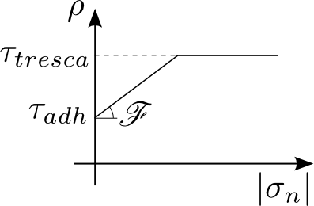

.. $Id: model.rst 3655 2010-07-17 20:42:08Z renard $

.. include:: ../replaces.txt

.. highlight:: c++

.. index:: models, model bricks

.. _ud-model-contact-friction:

Small sliding contact with friction bricks
------------------------------------------

The aim of these bricks is to take into account a contact condition with or without friction of an elastic structure on a rigid foundation or between two elastic structures. These bricks are restricted to small deformation approximation of contact (this may include large deformations on a flat obstacle).

Approximation of contact
++++++++++++++++++++++++

For small deformation problems submitted
a simple (compared to large deformation !) expression of the contact with friction condition is usually used where the tangential displacement do not influence the normal one. This is an approximation in the sense that if an obstacle is not perfectly flat, the tangential displacement of course influence the point where the contact holds. This will not be the case in small deformation where the contact condition can be considered to be described on the reference configuration.

There are mainly two largely used discretizations of the contact with friction condition in this framework: a direct nodal contact condition (usually prescribed on the displacement finite element nodes) or a weak nodal contact condition (usually prescribed on the multiplier finite element nodes). The two discretization leads to similar system. However, the interpretation of quantities is not the same. A third approach is developed on Getfem contact bricks: a weak integral contact condition. It needs the computation of a non-linear integral on the contact boundary at each iteration but the numerical resolution is potentially more scalable because it derives directly from continuous principles.

More details can be found for instance in [KI-OD1988]_, [KH-PO-RE2006]_ and [LA-RE2006]_.

Direct nodal contact condition
++++++++++++++++++++++++++++++

A nodal contact condition consists in a certain number of contact nodes :math:`a_i`, :math:`i=1..N_c` on which a contact with (or without) friction condition is applied. The contact condition reads

.. math::

  u_N(a_i)-\text{gap}_i \le 0, ~~ \lambda_N^i \le 0,  ~~ (u_N(a_i)-\text{gap}_i) \lambda_N^i = 0,

where :math:`\lambda_N^i` is the equivalent nodal contact force on :math:`a_i` and :math:`u_N(a_i)` is the normal relative displacement between the elastic solid and an obstacle or between two elastic solids. The term :math:`\text{gap}_i` represents the normal gap between the two solids in the reference configuration. The friction condition reads

.. math::

  \|\lambda_T^i\| \le -{\mathscr F} \lambda_N^i,

  \lambda_T^i = {\mathscr F} \lambda_N^i \frac{\dot{u}_T}{\|\dot{u}_T\|} ~~~ \text{ when } \dot{u}_T \ne 0,

where :math:`\dot{u}_T` is the relative slip velocity, :math:`{\mathscr F}` is the friction coefficient and :math:`\lambda_T^i` the equivalent nodal friction force on :math:`a_i`. The friction condition can be summarized by the inclusion

.. math::

  \lambda_T^i \in {\mathscr F} \lambda_N^i \text{Dir}(\dot{u}_T),

where :math:`\text{Dir}(\dot{u}_T)` is the multivalued map being the sub-differential of :math:`x \mapsto \|x_T\|` (i.e. :math:`\text{Dir}(x) = \frac{x}{\|x\|}` when :math:`x \ne 0` and :math:`\text{Dir}(0)` the closed unit ball). For two dimensional cases, :math:`\text{Dir}(\dot{u}_T)` reduces to :math:`\text{Sign}(\dot{u}_T)` where :math:`\text{Sign}` is the multivalued sign map.

A complete linearized elasticity problem with contact with friction reads as

Given an augmentation parameter :math:`r`, the contact and friction conditions can be equivalently expressed in term of projection as

.. math::

  \frac{1}{r}(\lambda_N^i - P_{]-\infty, 0]}(\lambda_N^i - r (u_N(a_i) - \text{gap}_i))) = 0,

  \frac{1}{r}(\lambda_T^i - P_{{\mathscr B}(-{\mathscr F}P_{]-\infty, 0]}(\lambda_N^i - r(u_N(a_i) - \text{gap}_i))}(\lambda_T^i - r \dot{u}_T(a_i))) = 0,

where :math:`P_K` is the projection on the convex :math:`K` and :math:`{\mathscr B}(-{\mathscr F}\lambda_N^i)` is the ball of center :math:`0` and radius :math:`-{\mathscr F}\lambda_N^i`.
These expressions will be used to perform a semi-smooth Newton method.

Suppose now that you approximate a linearized elasticity problem submitted to contact with friction. Then, if :math:`U` is the vector of the unknown for the displacement you will be able to express the matrices :math:`B_N` and :math:`B_T` such that

.. math::

  u_N(a_i) = (B_N U)_i,

  (\dot{u}_T(a_i))_k = (B_T \dot{U})_{(d-1)(i-1)+k},

where :math:`d` is the dimension of the domain and :math:`k = 1..d-1`. The expression of the elasticity problem with contact with friction can be written as

.. math::

  K U = L + B_N^T \lambda_N + B_T^T \lambda_T,

  -\frac{1}{r\alpha_i}(\lambda_N^i - P_{]-\infty, 0]}(\lambda_N^i - \alpha_i r ((B_N U)_i - \text{gap}_i))) = 0, ~~ i = 1..N_c,

  -\frac{1}{r\alpha_i}(\lambda_T^i - P_{{\mathscr B}(-{\mathscr F}P_{]-\infty, 0]}(\lambda_N^i - \alpha_i r ((B_N U)_i - \text{gap}_i))))}(\lambda_T^i - \alpha_i r (B_T U - B_T U^{0})_i)) = 0, ~~ i = 1..N_c,

where :math:`\alpha_i` is a parameter which can be added for the homogenization of the augmentation parameter, :math:`(B_T U)_i` denotes here the sub-vector of indices from :math:`(d-1)(i-1)+1` to :math:`(d-1)i` for the sake of simplicity and the sliding velocity :math:`B_T \dot{U}` have been discretized into :math:`\frac{(B_T U - B_T U^{0})}{\Delta t}` with :math:`U^{0}` the displacement at the previous time step. Note that of course another discretization of the sliding velocity is possible and that the time step :math:`\Delta t` do not appear in the expression of the friction condition since it does not influence the direction of the sliding velocity.

In that case, the homogenization coefficient :math:`\alpha_i` can be taken proportional to :math:`h^{d-2}` (:math:`h` being the diameter of the element). In this way, the augmentation parameter :math:`r` can be expressed in :math:`N/m^2` and chosen closed to the Young modulus of the elastic body. Note that the solution is not sensitive to the value of the augmentation parameter.

Weak nodal contact condition
++++++++++++++++++++++++++++

The direct nodal condition may have some drawback : locking phenomena, over-constraint. It is in fact often more stable and for the same accuracy to use multiplier of reduced order compared to the displacement (the direct nodal contact condition corresponds more or less to a multiplier described on the same finite element method than the displacement).

Let :math:`\varphi_i` be the shapes functions of the finite element describing the displacement and :math:`\psi_i` be the shape functions of a finite element describing a multiplier on the contact boundary :math:`\Gamma_c`. It is assumed that the set of admissible multiplier describing the normal stress will be

.. math::

  \Lambda_N^h = \{ \mu^h_N = \sum \mu^j_N \psi_j : \mu^h_N(a_i) \le 0, ~i = 1..N_c \}

where :math:`a_i`, :math:`~~i=1..N_c` are the finite element nodes corresponding to the multiplier. The discrete contact condition is now expressed in a weak form by

.. math::

  \int_{\Gamma_c} (\mu_N^h - \lambda_N^h) (u_N - \text{gap}) d\Gamma \ge 0 ~~ \forall \mu_N^h \in \Lambda_N^h.

In that case, the component :math:`\lambda_N^i` is a contact stress (:math:`N/m^2`) and the matrix :math:`B_N` can be written

.. math::

  (B_N)_{ij} = \int_{\Gamma_c} \psi_i \varphi_j d\Gamma.

The matrix :math:`B_T` can also be written in a similar way. The friction condition can be written in a weak form

.. math::

  \int_{\Gamma_c} (\mu_T^h - \lambda_T^h) \dot{u}_T d\Gamma \ge 0 ~~ \forall \mu_T^h \in \Lambda_T^h({\mathscr F}\lambda_N^h),

where :math:`\Lambda_T^h({\mathscr F}\lambda_N^h)` is the discrete set of admissible friction stress.

Finally, the expression of the direct nodal contact condition are recovered

.. math::

  K U = L + B_N^T \lambda_N + B_T^T \lambda_T,

  -\frac{1}{r\alpha_i}(\lambda_N^i - P_{]-\infty, 0]}(\lambda_N^i - \alpha_i r ((B_N U)_i - \text{gap}_i))) = 0, ~~ i = 1..N_c,

  -\frac{1}{r\alpha_i}(\lambda_T^i - P_{{\mathscr B}(-{\mathscr F}P_{]-\infty, 0]}(\lambda_N^i - \alpha_i r ((B_N U)_i - \text{gap}_i)))}(\lambda_T^i - \alpha_i r (B_T U - B_T U^{0})_i)) = 0, ~~ i = 1..N_c,

except that now :math:`\lambda_N^i` and :math:`\lambda_T^i` are force densities, and :math:`\alpha_i` has to be now chosen proportional to :math:`1/h^d` such that the augmentation parameter :math:`r` can still be chosen close to the Young modulus of the elastic body.

Note that without additional stabilization technique (see [HI-RE2010]_) an inf-sup condition have to be satisfied between the finite element of the displacement and the one for the multipliers. This means in particular that the finite element for the multiplier have to be "less rich" than the one for the displacement.

.. _weak_integral_contact_section:

Weak integral contact condition
+++++++++++++++++++++++++++++++

The weak integral contact formulation allows not to explicitly describe the discrete set of admissible stress. See also :ref:`nitsche_contact_small_def_section`. The contact stress (including the friction one) is described on a finite element space :math:`W^h` on the contact boundary :math:`\Gamma_c`:

.. math::

  \lambda^h \in W^h = \left\{ \sum \lambda_i \psi_i, \lambda_i \in I\hspace{-0.2em}R^d \right\}

where :math:`d` is the dimension of the problem and :math:`\psi_i` still the shapes functions on which the contact stress is developed. Now, given a outward unit vector :math:`n` on the contact boundary :math:`\Gamma_c` (usually the normal to the obstacle), we make the standard decompositions:

.. math::

  \lambda_N^h = \lambda^h \cdot n, ~~~~ \lambda_T^h = \lambda^h - \lambda_N^h n, ~~~~
  u_N^h = u^h \cdot n, ~~~~ u_T^h = u^h - u_N^h n,

where :math:`u^h` is the displacement field approximated on a finite element space :math:`V^h`. This allows to express the contact condition in the following way

.. math::

  \displaystyle \int_{\Gamma_c} (\lambda^h_N + (\lambda^h_N - r(u^h_N-gap))_-)\mu^h_N d\Gamma = 0 ~~~~ \forall \mu^h \in W^h,

where :math:`gap` is a given initial gap in reference configuration, :math:`r` is an augmentation parameter and :math:`(\cdot)_-:I\hspace{-0.2em}R\rightarrow I\hspace{-0.2em}R_+` is the negative part. The friction condition can similarly be written:

.. math::

  \displaystyle \int_{\Gamma_c} (\lambda^h_T -P_{B(\mathscr F(\lambda^h_N - r(u^h_N-gap))_-)}(\lambda^h_T - r\alpha(u^h_T-w^h_T)))\cdot \mu^h_T d\Gamma = 0 ~~~~ \forall \mu^h \in W^h,

where :math:`B(\rho)` is the closed ball of center  :math:`0` and radius :math:`\rho` and :math:`P_{B(\rho)}` is the orthogonal projection on it (By convenyion, the ball reduces to the origin dor :math:`\rho \le 0`). The term :math:`\alpha(u^h_T-w^h_T)` represent here an approximation of the sliding velocity. The parameter :math:`\alpha` and the field :math:`w^h_T` have to be adapted with respect to the chosen approximation. For instance, if the standard finite difference

.. math::

  (\dot{u}^h_T)^{n+1} \approx \displaystyle \frac{(u^h_T)^{n+1} - (u^h_T)^{n}}{dt}

is chosen, then one has to take :math:`\alpha = 1/dt` and :math:`w^h_T = (u^h_T)^{n}`. Note that due to the symmetry of the ball, the parameter :math:`\alpha` do not play an important role in the formulation. It can simply be viewed as a scaling between the augmentation parameter for the contact condition and the one for the friction condition. Note also that contrarily to the previous formulations of contact, here there is not a strict independance of the conditions with respect to the augmentation parameter (the independance only occurs at the continuous level).

GetFEM bricks implement four versions of the contact condition derived from the Alart-Curnier augmented Lagrangian formulation [AL-CU1991]_. The first one corresponds to the non-symmetric version. It consists in solving:

.. math::

  \left\{\begin{array}{l}
  a(u^h, v^h) + \displaystyle \int_{\Gamma_c} \lambda^h \cdot v^h d\Gamma = \ell(v^h) ~~~~ \forall v^h \in V^h, \\
  \displaystyle -\frac{1}{r}\int_{\Gamma_c} (\lambda^h_N + (\lambda^h_N - r(u^h_N-gap))_-)\mu^h_N d\Gamma \\
  ~~~~~~~~~~\displaystyle -\frac{1}{r}\int_{\Gamma_c} (\lambda^h_T -P_{B(\rho)}(\lambda^h_T - r\alpha(u^h_T-w^h_T)))\cdot \mu^h_T d\Gamma = 0 ~~~~ \forall \mu^h \in W^h,
  \end{array}\right.

where :math:`a(\cdot, \cdot)` and :math:`\ell(v)` represent the remaining parts of the problem in  :math:`u`, for instance linear elasticity and :math:`\rho={\mathscr F}(\lambda^h_N - r(u^h_N-gap))_-`. Note that in this case, the mathematical analysis leads to choose a value for the augmentation parameter of the kind :math:`r = r_0 / r` with :math:`r_0` having the dimension of a elasticity modulus (a classical choice is the value of Young's modulus). In order to write a Newton iteration, one has to derive the tangent system. It can be written, reporting only the contact and friction terms and not the right hand side:

.. math::

  \left\{\begin{array}{l}
  \cdots - \displaystyle \int_{\Gamma_c} \delta_{\lambda} \cdot v d\Gamma = \cdots  ~~~~ \forall v^h \in V^h, \\
  \displaystyle -\frac{1}{r}\int_{\Gamma_c}(1-H(r(u^h_N-gap)-\lambda_N))\delta_{\lambda_N}\mu^h_N d\Gamma
  \displaystyle -\int_{\Gamma_c}H(r(u^h_N-gap)-\lambda_N)\delta_{u_N}\mu^h_N d\Gamma \\
  ~~~~~~\displaystyle -\frac{1}{r}\int_{\Gamma_c}(\delta_{\lambda_T} - D_xP_{B(\rho)}(\lambda^h_T - r\alpha(u^h_T-w^h_T))\delta_{\lambda_T})\cdot\mu^h_T d\Gamma \\
  ~~~~~~\displaystyle -\int_{\Gamma_c}\alpha D_xP_{B(\rho)}(\lambda^h_T - r\alpha(u^h_T-w^h_T))\delta_{u_T}\cdot\mu^h_T d\Gamma \\
  ~~~~~~ \displaystyle +\int_{\Gamma_c}({\mathscr F} D_{\rho}P_{B(\rho)}(\lambda^h_T - r\alpha(u^h_T-w^h_T))\delta_{u_N})\cdot\mu^h_T d\Gamma \\
  ~~~~~~ \displaystyle -\int_{\Gamma_c}(\frac{\mathscr F}{r} D_{\rho}P_{B(\rho)}(\lambda^h_T - r\alpha(u^h_T-w^h_T))\delta_{\lambda_N})\cdot\mu^h_T d\Gamma = \cdots ~~~ \forall \mu^h \in W^h,
  \end{array}\right.

where :math:`H(\cdot)` is the Heaviside function (0 for a negative argument and 1 for a non-negative argument), :math:`D_xP_{B(\rho)}(x)` and :math:`D_{\rho}P_{B(\rho)}(x)` are the derivatives of the projection on :math:`B(\rho)` (assumed to vanish for :math:`\rho \le 0`) and :math:`\delta_{\lambda}` and :math:`\delta_{u}` are the unknown corresponding to the tangent problem.

The second version corresponds to the "symmetric" version. It is in fact symmetric in the frictionless case only (because in this case it directly derives from the augmented Lagrangian formulation). It reads:

.. math::

  \left\{\begin{array}{l}
  a(u^h, v^h) + \displaystyle \int_{\Gamma_c} (\lambda^h_N - r(u^h_N-gap))_- v^h_N d\Gamma \\
  ~~~~~~ - \displaystyle \int_{\Gamma_c} P_{B(\rho)}(\lambda^h_T - r\alpha(u^h_T-w^h_T)))\cdot v^h_T d\Gamma = \ell(v^h) ~~~~ \forall v^h \in V^h, \\
  \displaystyle -\frac{1}{r}\int_{\Gamma_c} (\lambda^h_N + (\lambda^h_N - r(u^h_N-gap))_-)\mu^h_N d\Gamma \\
  ~~~~~~~~~~\displaystyle -\frac{1}{r}\int_{\Gamma_c} (\lambda^h_T -P_{B(\rho)}(\lambda^h_T - r\alpha(u^h_T-w^h_T)))\cdot \mu^h_T d\Gamma = 0 ~~~~ \forall \mu^h \in W^h,
  \end{array}\right.

and the tangent system:

.. math::

  \left\{\begin{array}{l}
  \cdots + \displaystyle \int_{\Gamma_c} rH(r(u^h_N-gap)-\lambda_N)\delta_{u_N} v_N -  H(r(u^h_N-gap)-\lambda_N)\delta_{\lambda_N} v_N d\Gamma \\
  ~~~~~~+ \displaystyle \int_{\Gamma_c} r \alpha D_xP_{B(\rho)}(\lambda^h_T - r\alpha(u^h_T-w^h_T)) \delta_{u_T}\cdot v^h_T d\Gamma \\
  ~~~~~~- \displaystyle \int_{\Gamma_c} D_xP_{B(\rho)}(\lambda^h_T - r\alpha(u^h_T-w^h_T)) \delta_{\lambda_T}\cdot v^h_T d\Gamma \\
  ~~~~~~- \displaystyle \int_{\Gamma_c} (r{\mathscr F} D_{\rho}P_{B(\rho)}(\lambda^h_T - r\alpha(u^h_T-w^h_T)) \delta_{u_N})\cdot v^h_T d\Gamma \\
  ~~~~~~- \displaystyle \int_{\Gamma_c} ({\mathscr F} D_{\rho}P_{B(\rho)}(\lambda^h_T - r\alpha(u^h_T-w^h_T)) \delta_{\lambda_N})\cdot v^h_T d\Gamma = \cdots  ~~~~ \forall v^h \in V^h, \\
  \displaystyle -\frac{1}{r}\int_{\Gamma_c}(1-H(r(u^h_N-gap)-\lambda_N))\delta_{\lambda_N}\mu^h_N d\Gamma
  \displaystyle -\int_{\Gamma_c}H(r(u^h_N-gap)-\lambda_N)\delta_{u_N}\mu^h_N d\Gamma \\
  ~~~~~~\displaystyle -\frac{1}{r}\int_{\Gamma_c}(\delta_{\lambda_T} - D_xP_{B(\rho)}(\lambda^h_T - r\alpha(u^h_T-w^h_T))\delta_{\lambda_T})\cdot\mu^h_T d\Gamma \\
  ~~~~~~\displaystyle -\int_{\Gamma_c}\alpha D_xP_{B(\rho)}(\lambda^h_T - r\alpha(u^h_T-w^h_T))\delta_{u_T}\cdot\mu^h_T d\Gamma \\
  ~~~~~~ \displaystyle +\int_{\Gamma_c}({\mathscr F} D_{\rho}P_{B(\rho)}(\lambda^h_T - r\alpha(u^h_T-w^h_T))\delta_{u_N})\cdot\mu^h_T d\Gamma \\
  ~~~~~~ \displaystyle -\int_{\Gamma_c}(\frac{\mathscr F}{r} D_{\rho}P_{B(\rho)}(\lambda^h_T - r\alpha(u^h_T-w^h_T))\delta_{\lambda_N})\cdot\mu^h_T d\Gamma = \cdots ~~~ \forall \mu^h \in W^h,
  \end{array}\right.

still with :math:`\rho={\mathscr F}(\lambda^h_N - r(u^h_N-gap))_-`.

The third version corresponds to a penalized contact and friction condition. It does not require the use of a multiplier. In this version, the parameter :math:`r` is a penalization parameter and as to be large enough to perform a good approximation of the non-penetration and the Coulomb friction conditions. The formulation reads:

.. math::

  \left\{\begin{array}{l}
  a(u^h, v^h) + \displaystyle \int_{\Gamma_c} r(u^h_N-gap)_+ v^h_N d\Gamma \\
  ~~~~~~ + \displaystyle \int_{\Gamma_c} P_{B(\mathscr F r(u^h_N-gap)_+)}(r\alpha(u^h_T-w^h_T))\cdot v^h_T d\Gamma = \ell(v^h) ~~~~ \forall v^h \in V^h,
  \end{array}\right.

and the tangent system:

.. math::

  \left\{\begin{array}{l}
  \cdots + \displaystyle \int_{\Gamma_c} rH(u^h_N-gap)\delta_{u_N} v_N d\Gamma \\
  ~~~~~~- \displaystyle \int_{\Gamma_c} r \alpha D_xP_{B(\mathscr F r(u^h_N-gap)_+)}(r\alpha(u^h_T-w^h_T)) \delta_{u_T}\cdot v^h_T d\Gamma \\
  ~~~~~~+ \displaystyle \int_{\Gamma_c} ({r\mathscr F} H(u^h_N-gap) D_{\rho}P_{B(\mathscr F r(u^h_N-gap)_+)}(r\alpha(u^h_T-w^h_T)) \delta_{u_N})\cdot v^h_T d\Gamma = \cdots  ~~~~ \forall v^h \in V^h,
  \end{array}\right.

Numerical continuation
++++++++++++++++++++++

In addition, |gf| develops a method of numerical continuation for finding numerical solutions of discretized evolutionary contact problems based on the weak integral contact condition (see :ref:`ud-model-continuation` for a general introduction). For this purpose, a parameter-dependent sliding velocity may be added to the friction condition so that it becomes:

.. math::

  \displaystyle \int_{\Gamma_c} \Bigl(\lambda^h_T -P_{B(-\mathscr F\lambda^h_N)}\bigl(\lambda^h_T - r\bigl(\alpha(u^h_T-w^h_T)+(1-\gamma)z^h_T\bigr)\bigr)\Bigr)\cdot \mu^h_T d\Gamma = 0 ~~~~ \forall \mu^h \in W^h.

Here, :math:`\gamma` is a parameter and :math:`z^h_T` is an initial sliding velocity. It is worth mentioning that if one chooses

.. math::

  \displaystyle \alpha = \frac{1}{dt},\quad w^h_T = (u^h_T)^{n},\quad z^h_T = \frac{(u^h_T)^{n} - (u^h_T)^{n-1}}{dt},

then he recovers the standard friction condition at time :math:`t_{n}` and :math:`t_{n+1}` for :math:`\gamma` equal to 0 and 1, respectively.

Friction law
++++++++++++

Apart from pure Coulomb friction :math:`\rho = {\mathscr F} \left| \sigma_n \right|`,
the weak integral contact framework in |gf| also supports a more generic friction
law description:

.. math::

  \displaystyle \rho = \left\{\begin{array}{ll}
  \tau_{adh} + {\mathscr F} \left| \sigma_n \right| &
  ~~~\mbox{if } ~~ \tau_{adh} + {\mathscr F} \left| \sigma_n \right| < \tau_{tresca} \\
  \tau_{tresca} & ~~~\mbox{otherwise}
  \end{array}\right.

In this equation :math:`\rho` is the admissible friction stress for a given
normal stress :math:`\sigma_n`, :math:`{\mathscr F}` is the coefficient of friction,
:math:`\tau_{adh}` is an adhesional (load-independent) shear stress and
:math:`\tau_{tresca}` is a maximum shear stress limit.

.. ud-fig-frictionlaw:

Add a contact with or without friction to a model
+++++++++++++++++++++++++++++++++++++++++++++++++

Frictionless basic contact brick
++++++++++++++++++++++++++++++++

In order to add a frictionless contact brick you call the model object method::

     getfem::add_basic_contact_brick
          (md, varname_u, multname_n, dataname_r, BN, dataname_gap, dataname_alpha, aug_version);

This function adds a frictionless contact brick on ``varname_u`` thanks to a multiplier variable ``multname_n``. If :math:`U` is the vector of degrees of freedom on which the unilateral constraint is applied, the matrix :math:`B_N` have to be such that this condition is defined by :math:`B_N U \le 0`. The constraint is prescribed thank to a multiplier ``multname_n`` whose dimension should be equal to the number of lines of :math:`B_N`. The variable ``dataname_r`` is the name of the augmentation parameter :math:`r` should be chosen in a range of acceptable values. ``dataname_gap`` is an optional parameter representing the initial gap. It can be a single value or a vector of value. ``dataname_alpha`` is an optional homogenization parameter for the augmentation parameter.

The parameter `aug_version` indicates the augmentation strategy : 1 for the non-symmetric Alart-Curnier augmented Lagrangian, 2 for the symmetric one, 3 for the unsymmetric method based on augmented multipliers.

Note that is possible to change the basic contact matrix :math:`B_N` by using::

     getfem::contact_brick_set_BN(md, indbrick);

Basic contact brick with friction
+++++++++++++++++++++++++++++++++

    getfem::add_basic_contact_brick
          (md, varname_u, multname_n, multname_t, dataname_r, BN, dataname_friction_coeff, dataname_gap, dataname_alpha, aug_version);

This function adds a contact brick with friction on ``varname_u`` thanks to two
multiplier variables ``multname_n`` and ``multname_t``. If ``U`` is the vector
of degrees of freedom on which the condition is applied,
the matrix ``B_N`` has to be such that the contact condition is defined
by :math:`B_N U \le gap` and ``B_T`` have to be such that the relative
tangential
displacement is :math:`B_T U`. The matrix ``B_T`` should have as many rows as
``B_N`` multiplied by :math:`d-1` where :math:`d` is the domain dimension.
The contact condition is prescribed thank to a multiplier
``multname_n`` whose dimension should be equal to the number of rows of
``B_N`` and the friction condition by a multiplier ``multname_t`` whose
size should be the number of rows of ``B_T``.
The parameter ``dataname_friction_coeff`` describes the friction
coefficient. It could be a scalar or a vector describing the
coefficient on each contact condition.
The augmentation parameter ``r`` should be chosen in a range of acceptable values
(see Getfem user documentation). ``dataname_gap`` is an
optional parameter representing the initial gap. It can be a single value
or a vector of value. ``dataname_alpha`` is an optional homogenization
parameter for the augmentation parameter.

The parameter `aug_version` indicates the augmentation strategy :
1 for the non-symmetric Alart-Curnier augmented Lagrangian,
2 for the symmetric one,
3 for the unsymmetric method based on augmented multipliers and
4 for the unsymmetric method based on augmented multipliers with De Saxce projection.

Note that is possible to change the basic contact matrices :math:`B_N` and :math:`B_T` by using::

     getfem::contact_brick_set_BN(md, indbrick);
     getfem::contact_brick_set_BT(md, indbrick);

Frictionless nodal contact with a rigid obstacle brick
++++++++++++++++++++++++++++++++++++++++++++++++++++++

     getfem::add_nodal_contact_with_rigid_obstacle_brick
          (md, mim, varname_u, multname_n, dataname_r, region, obstacle, aug_version);

This function adds a direct nodal frictionless contact condition with a rigid obstacle to the model. The condition is applied on the variable ``varname_u``
on the boundary corresponding to ``region``. The rigid obstacle should
be described with the string ``obstacle`` being a signed distance to
the obstacle. This string should be an expression where the coordinates
are 'x', 'y' in 2D and 'x', 'y', 'z' in 3D. For instance, if the rigid
obstacle correspond to :math:`z \le 0`, the corresponding signed distance will
be simply 'z'. ``multname_n`` should be a fixed size variable whose size is
the number of degrees of freedom on boundary ``region``. It represents the
contact equivalent nodal forces.
The augmentation parameter ``r`` should be chosen in a
range of acceptable values (close to the Young modulus of the elastic
body, see Getfem user documentation). 1 for the non-symmetric Alart-Curnier augmented Lagrangian, 2 for the symmetric one, 3 for the unsymmetric method based on augmented multipliers.

Nodal contact with a rigid obstacle brick with friction
+++++++++++++++++++++++++++++++++++++++++++++++++++++++

     getfem::add_nodal_contact_with_rigid_obstacle_brick
          (md, mim, varname_u, multname_n, multname_t, dataname_r,
          dataname_friction_coeff, region, obstacle, aug_version);

This function adds a direct nodal contact with friction condition with a rigid
obstacle to the model. The condition is applied on the variable ``varname_u``
on the boundary corresponding to ``region``. The rigid obstacle should
be described with the string ``obstacle`` being a signed distance to
the obstacle. This string should be an expression where the coordinates
are 'x', 'y' in 2D and 'x', 'y', 'z' in 3D. For instance, if the rigid
obstacle correspond to :math:`z \le 0`, the corresponding signed distance will
be simply 'z'. ``multname_n`` should be a fixed size variable whose size is
the number of degrees of freedom on boundary ``region``. It represents the
contact equivalent nodal forces.
``multname_t`` should be a fixed size variable whose size is
the number of degrees of freedom on boundary ``region`` multiplied by
:math:`d-1` where :math:`d` is the domain dimension. It represents the
friction equivalent nodal forces.
The augmentation parameter ``r`` should be chosen in a
range of acceptable values (close to the Young modulus of the elastic
body, see Getfem user documentation). ``dataname_friction_coeff`` is
the friction coefficient. It could be a scalar or a vector of values
representing the friction coefficient on each contact node.

The parameter `aug_version` indicates the augmentation strategy :
1 for the non-symmetric Alart-Curnier augmented Lagrangian,
2 for the symmetric one,
3 for the unsymmetric method based on augmented multipliers and
4 for the unsymmetric method based on augmented multipliers with De Saxce projection.

Frictionless nodal contact between non-matching meshes brick
++++++++++++++++++++++++++++++++++++++++++++++++++++++++++++

     getfem::add_nodal_contact_between_nonmatching_meshes_brick
	(md, mim1, mim2, varname_u1, varname_u2, multname_n, dataname_r,
	rg1, rg2, slave1=true, slave2=false, aug_version=1);

This function adds a frictionless contact condition between two faces of one
or two elastic bodies. The condition is applied on the variable `varname_u` or
the variables `varname_u1` and `varname_u2` depending if a single or
two distinct displacement fields are given. Vectors `rg1` and `rg2`
contain pairs of regions expected to come in contact with each other. In
case of a single region per side, `rg1` and `rg2` can be given as normal
integers. In the single displacement variable case the regions defined in
both `rg1` and `rg2` refer to the variable `varname_u`. In the case of
two displacement variables, `rg1` refers to `varname_u1` and `rg2` refers
to `varname_u2`. `multname_n` should be a fixed size variable whose size
is the number of degrees of freedom on those regions among the ones
defined in `rg1` and `rg2` which are characterized as "slaves". It
represents the contact equivalent nodal forces. The augmentation
parameter `r` should be chosen in a range of acceptable values (close to
the Young modulus of the elastic body, see Getfem user documentation).
The optional parameters `slave1` and `slave2` declare if the regions
defined in `rg1` and `rg2` are correspondingly considered as "slaves".
By default `slave1` is true and `slave2` is false, i.e. `rg1` contains
the slave surfaces, while `rg2` the master surfaces. Preferably only
one of `slave1` and `slave2` is set to true.

The parameter `aug_version` indicates the augmentation strategy :
1 for the non-symmetric Alart-Curnier augmented Lagrangian,
2 for the symmetric one,
3 for the unsymmetric method with augmented multiplier.

Basically, this brick computes the matrix :math:`B_N` and the vectors
gap and alpha and calls the basic contact brick.

Nodal contact between non-matching meshes brick with friction
+++++++++++++++++++++++++++++++++++++++++++++++++++++++++++++

    getfem::add_nodal_contact_between_nonmatching_meshes_brick
        (md, mim1, mim2, varname_u1, varname_u2, multname_n, multname_t,
         dataname_r, dataname_friction_coeff, rg1, rg2, slave1=true,
         slave2=false, aug_version=1);

This function adds a contact with friction condition between two faces of
one or two elastic bodies. The condition is applied on the variable
`varname_u` or the variables `varname_u1` and `varname_u2` depending if a
single or two distinct displacement fields are given. Vectors `rg1` and `rg2`
contain pairs of regions expected to come in contact with each other. In
case of a single region per side, `rg1` and `rg2` can be given as normal
integers. In the single displacement variable case the regions defined in
both `rg1` and `rg2` refer to the variable `varname_u`. In the case of
two displacement variables, `rg1` refers to `varname_u1` and `rg2` refers
to `varname_u2`. `multname_n` should be a fixed size variable whose size
is the number of degrees of freedom on those regions among the ones
defined in `rg1` and `rg2` which are characterized as "slaves". It
represents the contact equivalent nodal normal forces. `multname_t`
should be a fixed size variable whose size corresponds to the size of
`multname_n` multiplied by qdim - 1 . It represents the contact
equivalent nodal tangent (frictional) forces. The augmentation parameter
`r` should be chosen in a range of acceptable values (close to the Young
modulus of the elastic body, see Getfem user documentation). The friction
coefficient stored in the parameter `friction_coeff` is either a single
value or a vector of the same size as `multname_n`. The optional
parameters `slave1` and `slave2` declare if the regions defined in `rg1`
and `rg2` are correspondingly considered as "slaves". By default `slave1`
is true and `slave2` is false, i.e. `rg1` contains the slave surfaces,
while `rg2` the master surfaces. Preferably only one of `slave1` and
`slave2` is set to true.

The parameter `aug_version` indicates the augmentation strategy :
1 for the non-symmetric Alart-Curnier augmented Lagrangian,
2 for the symmetric one,
3 for the unsymmetric method with augmented multiplier and
4 for the unsymmetric method with augmented multiplier and De Saxce projection.

Basically, this brick computes the matrices :math:`B_N` and :math:`B_T`
as well the vectors gap and alpha and calls the basic contact brick.

Hughes stabilized frictionless contact condition
++++++++++++++++++++++++++++++++++++++++++++++++

In order to add a Hughes stabilized frictionless contact brick you call the model object method::

      getfem::add_Hughes_stab_basic_contact_brick
          (md, varname_u, multname_n, dataname_r, BN, DN, dataname_gap, dataname_alpha, aug_version);

This function adds a Hughes stabilized frictionless contact brick on ``varname_u`` thanks to a multiplier variable ``multname_n``. If we take :math:`U` is the vector of degrees of freedom on which the unilateral constraint is applied, and :math:`\lambda` the multiplier Vector of contact force. Then Hughes stabilized frictionless contact condition is defined by the matrix :math:`B_N` and :math:`D_N` have to be such that this condition is defined by :math:`B_N U - D_N \lambda \le 0`. Where :math:`D_N` is the mass matrix relative to stabilized term. The variable ``dataname_r`` is the name of the augmentation parameter :math:`r` should be chosen in a range of acceptable values. ``dataname_gap`` is an optional parameter representing the initial gap. It can be a single value or a vector of value. ``dataname_alpha`` is an optional homogenization parameter for the augmentation parameter.

The parameter `aug_version` indicates the augmentation strategy :  1 for the non-symmetric Alart-Curnier augmented Lagrangian, 2 for the symmetric one, 3 for the unsymmetric method based on augmented multipliers.

Note that the matrix :math:`D_N` is a sum of the basic contact term and the Hughes stabilised term. You can change it with::

      getfem::contact_brick_set_DN(md, indbrick);

Frictionless integral contact with a rigid obstacle brick
+++++++++++++++++++++++++++++++++++++++++++++++++++++++++

::

     getfem::add_integral_contact_with_rigid_obstacle_brick
         (md, mim, varname_u, multname_n, dataname_obs, dataname_r, region, option = 1);

This function adds a frictionless contact condition with a rigid obstacle
to the model, which is defined in an integral way. It is the direct
approximation of an augmented Lagrangian formulation defined at the
continuous level. The advantage should be a better scalability:
the number of
Newton iterations should be more or less independent of the mesh size.
The condition is applied on the variable ``varname_u``
on the boundary corresponding to ``region``. The rigid obstacle should
be described with the data ``dataname_obstacle`` being a signed distance to
the obstacle (interpolated on a finite element method).
``multname_n`` should be a fem variable representing the contact stress.
An inf-sup condition between ``multname_n`` and ``varname_u`` is required.
The augmentation parameter ``dataname_r`` should be chosen in a
range of acceptable values.

Possible values for `option` is 1 for the non-symmetric Alart-Curnier
augmented Lagrangian method, 2 for the symmetric one, 3 for the
non-symmetric Alart-Curnier method with an additional augmentation
and 4 for a new unsymmetric method. The default value is 1.

``mim`` represents of course the integration method. Note that it should
be accurate enough to integrate efficiently the nonlinear terms involved.

Integral contact with a rigid obstacle brick with friction
++++++++++++++++++++++++++++++++++++++++++++++++++++++++++

::

     getfem::add_integral_contact_with_rigid_obstacle_brick
         (md, mim, varname_u, multname_n, dataname_obs, dataname_r,
          dataname_friction_coeffs, region, option = 1, dataname_alpha = "",
          dataname_wt = "", dataname_gamma = "", dataname_vt = "");

This function adds a contact with friction condition with a rigid obstacle
to the model, which is defined in an integral way. It is the direct
approximation of an augmented Lagrangian formulation defined at the
continuous level.
The advantage should be a better scalability: the number of Newton
iterations should be more or less independent of the mesh size.
The condition is applied on the variable ``varname_u``
on the boundary corresponding to ``region``. The rigid obstacle should
be described with the data ``dataname_obstacle`` being a signed distance to
the obstacle (interpolated on a finite element method).
``multname_n`` should be a fem variable representing the contact stress.
An inf-sup condition between ``multname_n`` and ``varname_u`` is required.
The augmentation parameter ``dataname_r`` should be chosen in a
range of acceptable values.

The parameter `dataname_friction_coeffs` contains the Coulomb friction
coefficient and optionally an adhesional shear stress threshold and the
tresca limit shear stress. For constant coefficients its size is from
1 to 3. For coefficients described on a finite element method, this
vector contains a number of single values, value pairs or triplets
equal to the number of the corresponding mesh_fem's basic dofs.

Possible values for `option` is 1 for the non-symmetric Alart-Curnier
augmented Lagrangian method, 2 for the symmetric one, 3 for the
non-symmetric Alart-Curnier method with an additional augmentation
and 4 for a new unsymmetric method. The default value is 1.
Option 4, assumes pure Coulomb friction and ignores any adhesional stress
and tresca limit coefficients.

``dataname_alpha`` and ``dataname_wt`` are optional parameters to solve
evolutionary friction problems. ``dataname_gamma`` and ``dataname_vt`` denote
optional data for adding a parameter-dependent sliding velocity to the friction
condition. ``mim`` represents of course the integration method. Note that it
should be accurate enough to integrate efficiently the nonlinear terms involved.

Frictionless integral contact between non-matching meshes brick
+++++++++++++++++++++++++++++++++++++++++++++++++++++++++++++++

::

    getfem::add_integral_contact_between_nonmatching_meshes_brick
        (md, mim, varname_u1, varname_u2, multname_n, dataname_r,
         region1, region2, option = 1);

This function adds a frictionless contact condition between nonmatching meshes
to the model, which is defined in an integral way. It is the direct
approximation of an augmented Lagrangian formulation defined at the
continuous level.
The advantage should be a better scalability: the number of Newton
iterations should be more or less independent of the mesh size.
The condition is applied on the variables ``varname_u1`` and
``varname_u2`` on the boundaries corresponding to ``region1`` and
``region2``.
``multname_n`` should be a fem variable representing the contact stress.
An inf-sup condition between ``multname_n`` and ``varname_u1`` and
``varname_u2`` is required.
The augmentation parameter ``dataname_r`` should be chosen in a
range of acceptable values.

Possible values for `option` is 1 for the non-symmetric Alart-Curnier
augmented Lagrangian method, 2 for the symmetric one, 3 for the
non-symmetric Alart-Curnier method with an additional augmentation
and 4 for a new unsymmetric method. The default value is 1.

``mim`` represents of course the integration method. Note that it should
be accurate enough to integrate efficiently the nonlinear terms involved.

Integral contact between non-matching meshes brick with friction
++++++++++++++++++++++++++++++++++++++++++++++++++++++++++++++++

::

    getfem::add_integral_contact_between_nonmatching_meshes_brick
        (md, mim, varname_u1, varname_u2, multname, dataname_r,
         dataname_friction_coeffs, region1, region2, option = 1,
         dataname_alpha = "", dataname_wt1 = "", dataname_wt2 = "");

This function adds a contact with friction condition between nonmatching meshes
to the model. This brick adds a contact which is defined in an integral way.
It is the direct approximation of an augmented Lagrangian formulation
defined at the continuous level. The advantage should be a better scalability:
the number of Newton iterations should be more or less independent of the mesh size.
The condition is applied on the variables ``varname_u1`` and ``varname_u2``
on the boundaries corresponding to ``region1`` and ``region2``.
``multname`` should be a fem variable representing the contact and friction stress.
An inf-sup condition between ``multname`` and ``varname_u1`` and
``varname_u2`` is required.
The augmentation parameter ``dataname_r`` should be chosen in a
range of acceptable values.

The parameter `dataname_friction_coeffs` contains the Coulomb friction
coefficient and optionally an adhesional shear stress threshold and the
tresca limit shear stress. For constant coefficients its size is from
1 to 3. For coefficients described on a finite element method on the
same mesh as ``varname_u1``, this vector contains a number of single values,
value pairs or triplets equal to the number of the corresponding mesh_fem's
basic dofs.

Possible values for `option` is 1 for the non-symmetric Alart-Curnier
augmented Lagrangian method, 2 for the symmetric one, 3 for the
non-symmetric Alart-Curnier method with an additional augmentation
and 4 for a new unsymmetric method. The default value is 1.
``dataname_alpha``, ``dataname_wt1`` and ``dataname_wt2`` are optional
parameters to solve evolutionary friction problems.
``mim`` represents the integration method on the same mesh as ``varname_u1``.
Note that it should be accurate enough to integrate efficiently the nonlinear
terms involved.

Frictionless penalized contact with a rigid obstacle brick
++++++++++++++++++++++++++++++++++++++++++++++++++++++++++

::

    getfem::add_penalized_contact_with_rigid_obstacle_brick
        (md, mim, varname_u, dataname_obs, dataname_r, region,
         option = 1, dataname_lambda_n = "");

This function adds a frictionless penalized contact condition
with a rigid obstacle to the model.
The condition is applied on the variable ``varname_u``
on the boundary corresponding to ``region``. The rigid obstacle should
be described with the data ``dataname_obstacle`` being a signed distance to
the obstacle (interpolated on a finite element method).
The penalization parameter ``dataname_r`` should be chosen
large enough to prescribe an approximate non-penetration condition
but not too large not to deteriorate too much the conditioning of
the tangent system. ``dataname_n`` is an optional parameter used if option
is 2. In that case, the penalization term is shifted by ``lambda_n`` (this
allows the use of an Uzawa algorithm on the corresponding augmented
dLagrangian formulation)

Penalized contact with a rigid obstacle brick with friction
+++++++++++++++++++++++++++++++++++++++++++++++++++++++++++

::

    getfem::add_penalized_contact_with_rigid_obstacle_brick
        (md, mim, varname_u, dataname_obs, dataname_r, dataname_friction_coeffs,
         region, option = 1, dataname_lambda = "", dataname_alpha = "",
         dataname_wt = "");

This function adds a penalized contact condition with Coulomb friction with a
rigid obstacle to the model.
The condition is applied on the variable ``varname_u``
on the boundary corresponding to ``region``. The rigid obstacle should
be described with the data `dataname_obstacle` being a signed distance to
the obstacle (interpolated on a finite element method).

The parameter `dataname_friction_coeffs` contains the Coulomb friction
coefficient and optionally an adhesional shear stress threshold and the
tresca limit shear stress. For constant coefficients its size is from
1 to 3. For coefficients described on a finite element method, this
vector contains a number of single values, value pairs or triplets
equal to the number of the corresponding mesh_fem's basic dofs.

The penalization parameter ``dataname_r`` should be chosen
large enough to prescribe approximate non-penetration and friction
conditions but not too large not to deteriorate too much the
conditioning of the tangent system.
``dataname_lambda`` is an optional parameter used if ``option``
is 2. In that case, the penalization term is shifted by ``lambda`` (this
allows the use of an Uzawa algorithm on the corresponding augmented
Lagrangian formulation).
``dataname_alpha`` and ``dataname_wt`` are optional parameters to solve
evolutionary friction problems.

Frictionless penalized contact between non-matching meshes brick
++++++++++++++++++++++++++++++++++++++++++++++++++++++++++++++++

::

    getfem::add_penalized_contact_between_nonmatching_meshes_brick
        (md, mim, varname_u1, varname_u2, dataname_r,
         region1, region2, option = 1, dataname_lambda_n = "");

This function adds a penalized contact frictionless condition between nonmatching
meshes to the model.
The condition is applied on the variables ``varname_u1`` and ``varname_u2``
on the boundaries corresponding to ``region1` and ``region2`.
The penalization parameter ``dataname_r`` should be chosen
large enough to prescribe an approximate non-penetration condition
but not too large not to deteriorate too much the conditionning of
the tangent system. ``dataname_n`` is an optional parameter used if
option is 2. In that case, the penalization term is shifted by ``lambda_n``
(this allows the use of an Uzawa algorithm on the corresponding augmented
Lagrangian formulation)

Penalized contact between non-matching meshes brick with friction
+++++++++++++++++++++++++++++++++++++++++++++++++++++++++++++++++

::

    getfem::add_penalized_contact_between_nonmatching_meshes_brick
        (md, mim, varname_u1, varname_u2, dataname_r, dataname_friction_coeffs,
         region1, region2, option = 1, dataname_lambda = "",
         dataname_alpha = "", dataname_wt1 = "", dataname_wt2 = "");

This function adds a penalized contact condition with Coulomb friction between
nonmatching meshes to the model.
The condition is applied on the variables ``varname_u1`` and ``varname_u2``
on the boundaries corresponding to ``region1` and ``region2`.
The penalization parameter ``dataname_r`` should be chosen
large enough to prescribe an approximate non-penetration condition
but not too large not to deteriorate too much the conditionning of
the tangent system.

The parameter `dataname_friction_coeffs` contains the Coulomb friction
coefficient and optionally an adhesional shear stress threshold and the
tresca limit shear stress. For constant coefficients its size is from
1 to 3. For coefficients described on a finite element method on the
same mesh as `varname_u1`, this vector contains a number of single
values, value pairs or triplets equal to the number of the
corresponding mesh_fem's basic dofs.

``dataname_lambda`` is an optional parameter used if ``option`` is 2.
In that case, the penalization term is shifted by ``lambda``
(this allows the use of an Uzawa algorithm on the corresponding augmented
Lagrangian formulation)
``dataname_alpha``, ``dataname_wt1`` and ``dataname_wt2`` are optional
parameters to solve evolutionary friction problems.
``mim`` represents the integration method on the same mesh as ``varname_u1``.
Note that it should be accurate enough to integrate efficiently the nonlinear
terms involved.

