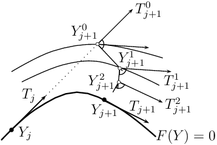
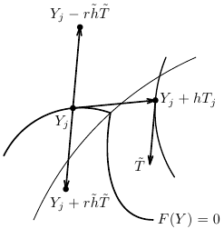
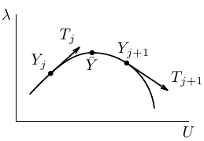

.. $Id: model.rst 3655 2010-07-17 20:42:08Z renard $

.. include:: ../replaces.txt

.. highlightlang:: c++

.. index:: models, model bricks

.. _ud-model-continuation:

Numerical continuation and bifurcation
--------------------------------------

Let an algebraic problem coming from discretisation of a FEM-model can be
written in the form

.. math::

   F(U) = 0.

In what follows, we shall suppose that the model depends on an additional scalar
parameter :math:`\lambda` so that :math:`F(U) = F(U, \lambda)`.

Numerical continuation
++++++++++++++++++++++

Methods of numerical continuation serve for tracing solutions of the system

.. math::

   F(U, \lambda) = 0, \quad F\colon \mathbb{R}^{N} \times \mathbb{R} \to \mathbb{R}^{N}.

In |gf|, a continuation technique for piecewise :math:`C^{1}` (:math:`PC^{1}`)
solution curves is implemented (see [Li-Re2014]_ for more details). Since it
does not make an explicit difference between the state variable :math:`U` and
the parameter :math:`\lambda`, we shall denote :math:`Y := (U, \lambda)` for
brevity. Nevertheless, to avoid bad scaling when calculating tangents, for
example, we shall use the following weighted scalar product and norm:

.. math::

   \langle Y, \tilde{Y} \rangle_{w} := \kappa \langle U, \tilde{U} \rangle + \lambda \tilde{\lambda},\quad \lVert Y \rVert_{w} := \sqrt{\kappa \lVert U \rVert^{2} + \lambda^{2}},\qquad Y = (U, \lambda),\, \tilde{Y} = (\tilde{U}, \tilde{\lambda}).

Here, :math:`\kappa` should be chosen so that
:math:`\kappa \langle U, \tilde{U} \rangle` is proportional to the scalar
product of the corresponding space variables, usually in :math:`L^{2}`. One can
take, for example, :math:`\kappa = h^{d}`, where :math:`h` is the mesh size and
:math:`d` stands for the dimension of the underlying problem. Alternatively,
:math:`\kappa` can be chosen as :math:`1/N` for simplicity.

The idea of the continuation strategy is to continue smooth pieces of solution
curves by a classical predictor-corrector method and to join the smooth pieces
continuously.

The particular predictor-corrector method employed is a slight modification of
the *inexact Moore-Penrose* continuation implemented in MATCONT [Dh-Go-Ku2003]_.
It computes a sequence of consecutive points :math:`Y_{j}` lying approximately
on a solution curve and a sequence of the corresponding unit tangent vectors
:math:`T_{j}`:

.. math::

   \lVert F(Y_{j}) \rVert \leq \varepsilon,\quad F'(Y_{j}; T_{j}) = 0,\quad \lVert T_{j} \rVert_{w} = 1,\quad j = 0, 1,\dotsc.

To describe it, let us suppose that we have a couple :math:`(Y_{j}, T_{j})`
satisfying the relations above at our disposal. In the *prediction*, an initial
approximation of :math:`(Y_{j+1}, T_{j+1})` is taken as

.. math::

   Y_{j+1}^{0} := Y_{j} + h_{j} T_{j},\quad T_{j+1}^{0} := T_{j},

where :math:`h_{j}` is a step size. Its choice will be discussed later on.

In the *correction*, one computes a sequence
:math:`\{(Y_{j+1}^{l}, T_{j+1}^{l})\}`, where
:math:`T_{j+1}^{l} := \tilde{T}_{j+1}^{l} / \lVert \tilde{T}_{j+1}^{l} \rVert_{w}`
and the couple :math:`(Y_{j+1}^{l}, \tilde{T}_{j+1}^{l})` is given by one
iteration of the Newton method applied to the equation :math:`F^{l}(Y, T) = 0`
with

.. math::

   F^{l}(Y, T) := \begin{pmatrix}F(Y)\\ (T_{j+1}^{l-1})^{\top}(Y - Y_{j+1}^{l-1})\\ \nabla F(Y_{j+1}^{l-1})T\\ \langle T_{j+1}^{l-1}, T \rangle_{w} - \langle T_{j+1}^{l-1}, T_{j+1}^{l-1} \rangle_{w}\end{pmatrix}

and the initial approximation :math:`(Y_{j+1}^{l-1}, T_{j+1}^{l-1})`. Due to the
potential non-differentiability of :math:`F`, a piecewise-smooth variant of the
Newton method is used (Algorithm 7.2.14 in [Fa-Pa2003]_).

.. _ud_fig_correction:

   Correction.

A couple :math:`(Y_{j+1}^{l}, T_{j+1}^{l})` is accepted for
:math:`(Y_{j+1}, T_{j+1})` if
:math:`\lVert F(Y_{j+1}^{l})\rVert \leq \varepsilon`,
:math:`\lVert Y_{j+1}^{l} - Y_{j+1}^{l-1}\rVert_{w} \leq \varepsilon'`, and the
cosine of the angle between :math:`T_{j+1}^{l}` and :math:`T_{j}` is greater or
equal to :math:`c_{\mathrm{min}}`. Let us note that the partial gradient of
:math:`F` (or of one of its selection functions in the case of the
non-differentiability) with respect to :math:`U` is assembled analytically
whereas the partial gradient with respect to :math:`\lambda` is evaluated by
forward finite differences with an increment equal to 1e-8.

The step size :math:`h_{j+1}` in the next prediction depends on how the Newton
correction has been successful. Denoting the number of iterations needed by
:math:`l_{\mathrm{it}}`, it is selected as

.. math::

   h_{j+1} := \begin{cases}\max\{h_{\mathrm{dec}} h_{j}, h_{\mathrm{min}}\}& \text{if no new couple has been accepted},\\ \min\{h_{\mathrm{inc}} h_{j}, h_{\mathrm{max}}\}& \text{if a new couple has been accepted and } l_{\mathrm{it}} < l_{\mathrm{thr}},\\ h_{j}& \text{otherwise},\end{cases}

where :math:`0 < h_{\mathrm{dec}} < 1 < h_{\mathrm{inc}}`,
:math:`0 < l_{\mathrm{thr}}` and
:math:`0 < h_{\mathrm{min}} < h_{\mathrm{max}}` are given constants. At the
beginning, one sets :math:`h_{1} := h_{\mathrm{init}}` for some
:math:`h_{\mathrm{min}} \leq h_{\mathrm{init}} \leq h_{\mathrm{max}}`.

Now, let us suppose that we have approximated a piece of a solution curve
corresponding to one sub-domain of smooth behaviour of :math:`F` and we want to
recover a piece corresponding to another sub-domain of smooth behaviour. Let
:math:`(Y_{j},T_{j})` be the last computed couple.

.. _ud_fig_transition:

   Transition between smooth pieces of a solution curve.

To approximate the tangent to the other smooth piece, we first take a point
:math:`Y_{j} + h T_{j}` with :math:`h` a bit greater than
:math:`h_{\mathrm{min}}` so that this point belongs to the interior of the other
sub-domain of smooth behaviour. Then we find :math:`\tilde{T}` such that

.. math::

   \nabla F(Y_{j} + h T_{j}) \tilde{T} = 0,\quad \lVert \tilde{T} \rVert_{w} = 1,

and it remains to determine an appropriate direction of this vector. This can be
done on the basis of the following observations:  First, there exists
:math:`r \in \{\pm 1\}` such that :math:`Y_{j} - r \tilde{h} \tilde{T}` remains
in the same sub-domain as :math:`Y_{j}` for any :math:`\tilde{h}` positive.
This is characterised by the fact that
:math:`\frac{\lvert T_{-}^{\top} \tilde{T}\rvert}{\lVert T_{-} \rVert \lVert \tilde{T} \rVert}`
is significantly smaller than 1 for :math:`T_{-}` with
:math:`\nabla F(Y_{j} - r \tilde{h} \tilde{T}) T_{-} = 0`. Second,
:math:`Y_{j} + r \tilde{h} \tilde{T}` appears in the other sub-domain for
:math:`\tilde{h}` larger than some positive threshold, and, for such values,
:math:`\frac{\lvert T_{+}^{\top} \tilde{T}\rvert}{\lVert T_{+} \rVert \lVert \tilde{T} \rVert}`
is close to 1 for :math:`T_{+}` with
:math:`\nabla F(Y_{j} + r \tilde{h} \tilde{T}) T_{+} = 0`.

This suggests the following procedure for selecting the desired direction of
:math:`\tilde{T}`: Increase the values of :math:`\tilde{h}` successively from
:math:`h_{\mathrm{min}}`, and when you arrive at :math:`\tilde{h}` and
:math:`r \in \{\pm 1\}` such that

.. math::

   \frac{\lvert T^{\top} \tilde{T}\rvert}{\lVert T \rVert \lVert \tilde{T} \rVert} \approx 1\quad \text{if}\ \nabla F(Y_{j} + r \tilde{h} \tilde{T}) T = 0,

take :math:`r \tilde{T}` as the approximation of the tangent to the other smooth
piece.

Having this approximation at our disposal, we restart the predictor-corrector
with :math:`(Y_{j}, r \tilde{T})`.

In |gf|, the continuation is implemented for two ways of parameterization of the
model:

1. The parameter :math:`\lambda` is directly a scalar datum, which the model
   depends on.

2. The model is parametrised by the scalar parameter :math:`\lambda` *via* a
   vector datum :math:`P`, which the model depends on. In this case, one takes
   the linear path

   .. math::

      \lambda \mapsto P(\lambda) := (1 - \lambda)P^{0} + \lambda P^{1},

   where :math:`P^{0}` and :math:`P^{1}` are given values of :math:`P`, and one
   traces the solution set of the problem

   .. math::

      F(U, P(\lambda)) = 0.

Detection of limit points
+++++++++++++++++++++++++

When tracing solutions of the system :math:`F(U,\lambda) = 0`, one may be
interested in *limit points* (also called fold or turning points), where the
number of solutions with the same value of :math:`\lambda` changes. These points
can be detected by a sign change of a test function :math:`\tau_{\mathrm{LP}}`:

   .. math::

      \tau_{\mathrm{LP}}(T_{j}) \tau_{\mathrm{LP}}(T_{j+1}) < 0,

where :math:`\tau_{\mathrm{LP}}` is defined by

   .. math::

      \tau_{\mathrm{LP}}(T) := T_{\lambda},\quad T = (T_{U},T_{\lambda}) \in \mathbb{R}^{N} \times \mathbb{R}.

.. _ud_fig_limitpoint:

   Limit point.

Numerical bifurcation
+++++++++++++++++++++

A point :math:`\bar{Y}` is called a *bifurcation point* of the system
:math:`F(Y) = 0` if :math:`F(\bar{Y}) = 0` and two or more distinct solution
curves pass through it. The following result gives a test for *smooth*
bifurcation points (see, e.g., [Georg2001]_):

Let :math:`s \mapsto Y(s)` be a parameterization of a solution curve and
:math:`\bar{Y} := Y(\bar{s})` be a bifurcation point. Moreover, let
:math:`T^{\top} \dot{Y}(\bar{s}) > 0`,
:math:`B \notin \mathrm{Im}(J(\bar{Y}))`,
:math:`C \notin \mathrm{Im}(J(\bar{Y})^{\top})`, :math:`d \in \mathbb{R}` and

   .. math::

      J(Y) := \begin{pmatrix}\nabla F(Y)\\ T^{\top}\end{pmatrix}.

Define :math:`\tau_{\mathrm{BP}}(Y)` via

   .. math::

      \begin{pmatrix}J(Y)& B\\ C^{\top}& d\end{pmatrix} \begin{pmatrix}V(Y)\\ \tau_{\mathrm{BP}}(Y)\end{pmatrix} = \begin{pmatrix}0\\ 1\end{pmatrix}.

Then :math:`\tau_{\mathrm{BP}}(Y(s))` changes its sign at :math:`s = \bar{s}`.

Obviously, if one takes :math:`B`, :math:`C` and :math:`d` randomly, it is
highly possible that they satisfy the requirements above. Consequently, the
numerical continuation method is able to detect bifurcation points by
taking the vectors :math:`Y` and :math:`T` supplied by the correction at each
continuation step and monitoring the signs of :math:`\tau_{\mathrm{BP}}`.

Once a bifurcation point :math:`\bar{Y}` is detected by a sign change
:math:`\tau_{\mathrm{BP}}(Y_{j}) \tau_{\mathrm{BP}}(Y_{j+1}) < 0`, it can be
approximated more precisely by the predictor-corrector steps described above
with a special step-length adaptation (see Section 8.1 in [Al-Ge1997]_). Namely,
one can take the subsequent step lengths as

   .. math::

      h_{j+1} := -\frac{\tau_{\mathrm{BP}}(Y_{j+1})}{\tau_{\mathrm{BP}}(Y_{j+1}) - \tau_{\mathrm{BP}}(Y_{j})}h_{j}

until :math:`\lvert h_{j+1} \rvert < h_{\mathrm{min}}`, which corresponds to the
secant method for finding a zero of the function
:math:`s \mapsto \tau_{\mathrm{BP}}(Y(s))`.

Finally, it would be desirable to switch solution branches. To this end, we
shall consider the case of the so-called *simple bifurcation point*, where only
two distinct solution curves intersect.

Let :math:`\tilde{Y}` be an approximation of :math:`\bar{Y}` that we are given
and :math:`V(\tilde{Y})` be the first part of the solution of the augmented
system for computing the test function :math:`\tau_{\mathrm{BP}}(\tilde{Y})`. As
proposed in [Georg2001]_, one can take :math:`V(\tilde{Y})` as a predictor
direction and do one continuation step starting with
:math:`(\tilde{Y}, V(\tilde{Y}))` to obtain a point on a new branch. After this
continuation step has been performed successfully and a point on the new branch
has been recovered, one can proceed with usual predictor-corrector steps to
trace this branch.

Recently, tools for numerical :math:`PC^{1}`-bifurcation have been developed in
|gf|. Let :math:`J` be a matrix function of a real parameter now defined by

   .. math::

      J(\alpha) := (1-\alpha)\begin{pmatrix}\nabla F(Y_{j})\\ T_{j}^{\top}\end{pmatrix} + \alpha\begin{pmatrix}\nabla F(Y_{j+1})\\ T_{j+1}^{\top}\end{pmatrix}.

As proposed in [Li-Re2014hal]_, the following test can be used for detection of
a :math:`PC^{1}` bifurcation point between :math:`Y_{j}` and :math:`Y_{j+1}`:

   .. math::

      \det J(0) \det J(1) < 0.

To perform this test numerically, introduce

   .. math::

      M(\alpha) := \begin{pmatrix}J(\alpha)& B\\ C^{\top}& d\end{pmatrix}

and :math:`\tau_{\mathrm{BP}}(\alpha)` analogously as above via

   .. math::

      M(\alpha) \begin{pmatrix}V(\alpha)\\ \tau_{\mathrm{BP}}(\alpha)\end{pmatrix} = \begin{pmatrix}0\\ 1\end{pmatrix}.

It follows from Cramer's rule that

   .. math::

      \tau_{\mathrm{BP}}(\alpha) = \frac{\det J(\alpha)}{\det M(\alpha)}

provided that :math:`\det M(\alpha)` is non-zero. Hence if :math:`B`, :math:`C`
and :math:`d` are chosen so that :math:`\det M(\alpha)` is non-zero whenever
:math:`\det J(\alpha)` is zero, then the sign changes of :math:`\det J(\alpha)`
are characterised by passings of :math:`\tau_{\mathrm{BP}}(\alpha)` through 0
whereas the sign changes of :math:`\det M(\alpha)` by sign changes of
:math:`\tau_{\mathrm{BP}}(\alpha)` caused by singularities. To conclude, the
sign of :math:`\det J(0)\det J(1)` is determined by following the
behaviour of :math:`\tau_{\mathrm{BP}}(\alpha)` and monitoring the sign changes
of :math:`\det J(\alpha)` when :math:`\alpha` passes through :math:`[0,1]`.

As justified in [Li-Re2014hal]_, :math:`B`, :math:`C` and :math:`d` can be
chosen randomly again. The increments :math:`\delta` of the current values of
:math:`\alpha` are changed adaptively so that singularities of
:math:`\tau_{\mathrm{BP}}` are treated effectively. After each calculation of
:math:`\tau_{\mathrm{BP}}(\alpha)`, :math:`\delta` is set as follows:

   .. math::

      \delta := \begin{cases}\min\{2\delta, \delta_{\mathrm{max}}\}& \text{if $\lvert \tau_{\mathrm{BP}}(\alpha) - \tau_{\mathrm{BP}}(\alpha - \delta) \rvert < 0.5 \tau_{\mathrm{fac}} \tau_{\mathrm{ref}}$,}\\ \max\{0.1\delta, \delta_{\mathrm{min}}\}& \text{if $\lvert \tau_{\mathrm{BP}}(\alpha) - \tau_{\mathrm{BP}}(\alpha - \delta) \rvert > \tau_{\mathrm{fac}} \tau_{\mathrm{ref}}$,}\\ \delta& \text{otherwise},\end{cases}

where :math:`\delta_{\mathrm{max}} > \delta_{\mathrm{min}} > 0` and
:math:`\tau_{\mathrm{fac}} > 0` are given constants and
:math:`\tau_{\mathrm{ref}} := \max\{\lvert \tau_{\mathrm{BP}}(1) - \tau_{\mathrm{BP}}(0) \rvert, 10^{-8}\}`.

When a :math:`PC^{1}` bifurcation point is detected between :math:`Y_{j}` and
:math:`Y_{j+1}`, it is approximated more precisely by a bisection-like
procedure. The obtained approximation lies on the same smooth branch as
:math:`Y_{j},` and the corresponding unit tangent that points out from the
corresponding region of smoothness is calculated too.

Contrary to the smooth case, it is not clear how many branches can emanate from
the :math:`PC^{1}` bifurcation point and in which directions they could be
sought. For this reason, continuation steps for a whole sequence of predictor
directions are tried out for finding points on new branches.

Denoting :math:`\tilde{Y}`, :math:`\tilde{T}` the approximation of the
bifurcation point and the corresponding tangent, respectively, the predictor
directions are taken as follows: For a couple of reference vectors
:math:`\tilde{V}_{1}` and :math:`\tilde{V}_{2}`, one takes :math:`\pm V` with
:math:`V` satisfying

   .. math::

      \nabla F(\tilde{Y}+h_{\mathrm{min}}\tilde{V}) V = 0, \quad \lVert V \rVert_{w} = 1,

where :math:`\tilde{V}` passes through a set of linear combinations of
:math:`\tilde{V}_{1}` and :math:`\tilde{V}_{2}`. The total number of the linear
combinations is given by :math:`n_{\mathrm{dir}},` and the reference vectors are
chosen successively according to the following strategy:

1. One takes :math:`\tilde{V}_{1} := -\tilde{T}` and :math:`\tilde{V}_{2}` such
   that

   .. math::

      \nabla F(\tilde{Y}+h_{\mathrm{min}}\tilde{T}) \tilde{V}_{2} = 0, \quad \lVert \tilde{V}_{2} \rVert_{w} = 1.

2. Let :math:`\{\tilde{T}_{1},\dotsc\tilde{T}_{n_{\mathrm{br}}}\}` denote the
   set of unit tangents that correspond to the points from the branches found so
   far and that are oriented in the directions of branching from the bifurcation
   point. Then :math:`\tilde{V}_{1}` and :math:`\tilde{V}_{2}` are taken
   successively as different combinations from
   :math:`\{\tilde{T}_{1},\dotsc\tilde{T}_{n_{\mathrm{br}}}\}`.

3. If all combinations that are available so far have already been used, let
   :math:`\tilde{V}_{1}` be unchanged and take
   :math:`\tilde{V}_{2} := \tilde{V}_{2}^{+}` with :math:`\tilde{V}_{2}^{+}`
   satisfying

   .. math::

      \nabla F\Bigl(\tilde{Y}+h_{\mathrm{min}}\Bigl(\tilde{V}_{2}^{-} + 0.1\frac{\tilde{V}_{3}}{\lVert \tilde{V}_{3} \rVert_{w}}\Bigr)\Bigr) \tilde{V}_{2}^{+} = 0, \quad \lVert \tilde{V}_{2}^{+} \rVert_{w} = 1.

   Here, :math:`\tilde{V}_{2}^{-}` equals the vector :math:`\tilde{V}_{2}`
   employed previously and :math:`\tilde{V}_{3}` is chosen randomly.

The total number of selections of :math:`\tilde{V}_{1}` and
:math:`\tilde{V}_{2}` is given by :math:`n_{\mathrm{span}}`.

More details on :math:`PC^1` numerical branching can be found in
[Li-Re2015hal]_.

Approximation of solution curves of a model
+++++++++++++++++++++++++++++++++++++++++++

The numerical continuation is defined in ``getfem/getfem_continuation.h``. In
order to use it, one has to set it up via the corresponding object first::

  getfem::cont_struct_getfem_model S(model, parameter_name, sfac, ls, h_init, h_max, h_min, h_inc, h_dec,
				     maxit, thrit, maxres, maxdiff, mincos, maxres_solve, noisy, singularities,
				     non-smooth, delta_max, delta_min, thrvar, ndir, nspan);

where ``parameter_name`` is the name of the model datum representing
:math:`\lambda`, ``sfac`` represents the scale factor :math:`\kappa`, and ``ls``
is the name of the solver to be used for the linear systems incorporated in the
process (e.g., ``getfem::default_linear_solver<getfem::model_real_sparse_matrix, getfem::model_real_plain_vector>(model)``). The real numbers ``h_init``,
``h_max``, ``h_min``, ``h_inc``, ``h_dec`` denote :math:`h_{\mathrm{init}}`,
:math:`h_{\mathrm{max}}`, :math:`h_{\mathrm{min}}`, :math:`h_{\mathrm{inc}}`,
and :math:`h_{\mathrm{dec}}`, the integer ``maxit`` is the maximum number of
iterations allowed in the correction and ``thrit``, ``maxres``, ``maxdiff``,
``mincos``, and ``maxres_solve`` denote :math:`l_{\mathrm{thr}}`,
:math:`\varepsilon`, :math:`\varepsilon'`, :math:`c_{\mathrm{min}}`, and the
target residual value for the linear systems to be solved, respectively. The
non-negative integer ``noisy`` determines how detailed information has to be
displayed in the course of the continuation process (the larger value the more
details), the integer ``singularities`` determines whether the tools for
detection and treatment of singular points have to be used (0 for ignoring them
completely, 1 for detecting limit points, and 2 for detecting and treating
bifurcation points, as well), and the boolean value of ``non-smooth`` determines
whether only tools for smooth continuation and bifurcation have to be used
or even tools for non-smooth ones do. The real numbers ``delta_max``,
``delta_min`` and ``thrvar`` represent :math:`\delta_{\mathrm{max}}`,
:math:`\delta_{\mathrm{min}}` and :math:`\tau_{\mathrm{fac}}`, and the integers
``ndir`` and ``nspan`` stand for :math:`n_{\mathrm{dir}}` and
:math:`n_{\mathrm{span}}`, respectively.

Optionally, parameterization by a vector datum is then declared by::

  S.set_parametrised_data_names(initdata_name, finaldata_name, currentdata_name);

Here, the data names ``initdata_name`` and ``finaldata_name`` should represent
:math:`P^{0}` and :math:`P^{1}`, respectively. Under ``currentdata_name``, the
values of :math:`P(\lambda)` have to be stored, that is, actual values of the
datum the model depends on.

Next, the continuation is initialised by::

  S.init_Moore_Penrose_continuation(U, lambda, T_U, T_lambda, h);

where ``U`` should be a solution for the value of the parameter :math:`\lambda`
equal to ``lambda`` so that :math:`Y_{0}=` (\ ``U``\ ,\ ``lambda``\ ). During
this initialisation, an initial unit tangent :math:`T_{0}` corresponding to
:math:`Y_{0}` is computed in accordance with the sign of the initial value
``T_lambda``, and it is returned in ``T_U``, ``T_lambda``. Moreover, ``h`` is
set to the initial step size ``h_init``.

Subsequently, one step of the continuation is called by ::

  S.Moore_Penrose_continuation(U, lambda, T_U, T_lambda, h, h0);

After each call, a new point on a solution curve and the corresponding tangent
are returned in the variables ``U``, ``lambda`` and ``T_U``, ``T_lambda``. The
step size for the next prediction is returned in ``h``. The size of the
current step is returned in the optional argument ``h0``. According to the
chosen value of ``singularities``, the test functions for limit and bifurcation
points are evaluated at the end of each continuation step. Furthermore, if a
smooth bifurcation point is detected, the procedure for numerical bifurcation
is performed and an approximation of the branching point as well as tangents to
both bifurcating curves are saved in the continuation object ``S``. From
there, they can easily be recovered with member functions of ``S`` so that one
can initialise the continuation to trace either of the curves next time.

Complete examples of use on a smooth problem are shown in the test programs
``tests/test_continuation.cc``, ``interface/tests/matlab/demo_continuation.m``
and ``interface/src/scilab/demos/demo_continuation.sce``, whereas
``interface/src/scilab/demos/demo_continuation_vee.sce`` and
``interface/src/scilab/demos/demo_continuation_block.sce`` employ also
non-smooth tools.
